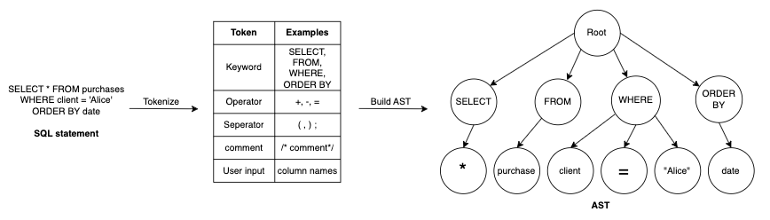
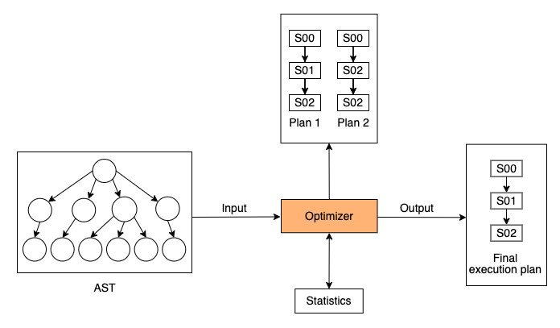
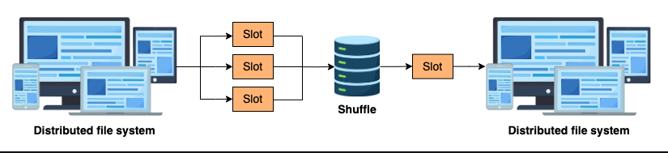

# Query Life Cycle

Both data engineers and data users write queries every day, but not everyone is familiar with how query works internally.
While we trust the database engine to do all the magic and return us the expected result, it's still worth understanding what goes on behind the scenes, and the knowledge can further help us enhance query performance.

## Imperative Language vs. Declarative Language

There are two programming paradigms: imperative and declarative.
The most commonly used programming languages, like Python and Java, are imperative.

> They instruct the computer on how the code should run by giving a sequence of steps.

On the other hand, when using a declarative programming language like SQL, we instruct the computer what kind of result we expect, such as the conditions and transformation tasks that need to be performed, and the language figures out how to execute the operations to achieve that result.

## The Life Cycle of a query

1. A SQL statement is submitted to the database via a transport layer protocol such as TCP.
2. To proceed, some kind of API requests must occur, such as authenticating and authorizing the request.
3. Next, the SQL statement is sent to a query parser that analyzes the syntactic and semantic meaning. As a result, a query tree is generated.
4. Once the query is parsed, it is sent to a query optimizer that looks for the most efficient way to execute the query, and a query execution plan is generated afterward.
5. Once the plan is in place, the database will walk through it and execute each stage in the plan.
6. Finally, when the query has finished execution, the result will be sent back to users.

## Query Parser

The query parser first performs lexical analysis where it scans the raw SQL statement and converts it into a series of tokens.
It extracts relevant information such as keywords, operators, separators, literals, and comments.
Then, the parser consumes those tokens and builds an Abstract Syntax Tree (AST).

## Query execution plan

A query execution plan is a set of steps employed by a database to retrieve data in an efficient way.
The plan outlines the sequence of operations that the database will follow to retrieve, manipulate, and present the requested data.
The plan includes decisions on how to access tables, how to join multiple tables, and any optimizations to enhance performance.

> When receiving AST from the query parsers, the query optimizer comes up with multiple strategies and selects the one that offers the best performance in terms of time and resources, and it is the final query execution plan.

## Query processing in BigQuery

BigQuery is a fully managed, serverless, cloud-based data warehouse, meaning that users can offload a lot of operational work that we normally do in the on-premise data warehouse to BigQuery.

Steps:

1. BigQuery allocates a set of slots to access the distributed storage and read data from the table.
   BigQUery uses columnar storage, meaning that each column's data resides within one or multiple files in the distributed file system.
   When running the query, only the columns needed for the query will be selected, which minimizes I/O operations.

> Besides, columnar storage allows for better compression, resulting in reduced storage space and improved data retrieval speed.

2. A slot is a virtual CPU used by BigQuery to execute queries.
   In this example, each slot reads one input file, applying filters on `start_station_name` and subsequently, append the count of the valid records in this file to the shuffle

3. Next, a separate slot reads from the shuffle and aggregates the counts from different input files together as the final count.
   Ultimately, this result is written into an output file that is accessible to the user.

### Benefits

BigQuery has tons of internal optimization strategies to optimize query cost and performance.
This can include using cached results and rewriting queries to use different algorithms. However, it doesn't optimize everything.
A query execution plan can help us understand which stage uses the most resources so that we can optimize it ourselves.

> For example, in a JOIN statement, it's wiser to do the filter before the join, instead of after the join. If there are a lot of CPU-intensive tasks, it's recommended to use BigQuery approximate aggregate functions, APPROX_COUNT_DISTINCT which are often within 1% of the exact function.
