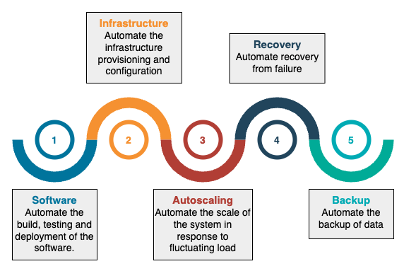
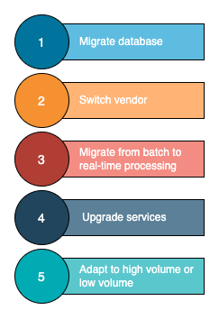

# Data Architecture

We will look at two widely-used cloud data architecture frameworks:

- [**Lambda architecture**](framework-architecture/README.md/#lambda-architecture)
- [**Kappa architecture**](framework-architecture/README.md/#kappa-architecture)

The list can still grow, but it encourages us to do a trade-off analysis before choosing the right cloud data architecture.

Cloud data architecture, by design, handles the ingestion, transformation, and analysis of data that is too large or complex for traditional data architectures.

Then, we will take a look into 2 popular data storage architecture:

- [**Data Lake**](storage-architecture/README.md/#data-lake)
- [**Data Mesh**](storage-architecture/README.md/#data-mesh)

## Patterns of Good Cloud Data Architecture

Let's learn about 5 principles for cloud-native data architecture that are useful for designing and operating reliable, cost-effective and efficient systems in the cloud.

Cloud offers incredible capabilities, but without deliberate design decisions, the architecture can become fragile, expensive, and challenging to maintain.
Most cloud environments have not just one application but several technologies that need to be integrated.

The overarching goal of cloud architecture is to connect the dots to provide customers with a valuable online platform.

### 5 cloud-native architecture principles

This is essential for creating a good design:

- **Reliable**: The system should continue to work correctly regardless of system faults or human errors.

- **Efficient**: The system must use computing resources efficiently to meet system requirements and maintain efficiency as the business grows.

- **Maintainable**: The world is fluid. Good data architecture should be able to respond to changes within the business and new technologies to unlock more possibilities in the future.

- **Cost-optimized**: The system should leverage various payment options to achieve cost efficiency.

- **Secure**: The system should be hardened to avoid insider attacks.

### Principle 1: Have an automation mindset

Automation has always been good practice for software systems.
In traditional environments, automation refers to building, testing, and deploying software through continuous integration/continuous delivery (CI/CD) pipelines.

A good cloud architecture takes a step ahead by automating the infrastructure as well as the internal components.

The five common areas for automation are shown below:

#### Software

Software has been the most common area for automation regardless of the environment.
Automation happens throughout the software's life cycle, from coding and deployment to maintenance and updates.

#### Infrastructure

In the cloud, we can apply the same engineering principles we use for applications to the entire environment.
This implies the ability to create and manage infrastructure through code.

!!! note

    **Infrastructure as Code (IaC)** is a process that enables us to manage infrastructure provisioning and configuration in the same way as we handle application code.

!!! example

    we first provision a VM in the dev environment and then decide to create the same one in the production environment.

    Provisioning a server manually through a graphic interface often leads to mistakes.

    IaC means storing infrastructure configurations in a version-control environment and benefiting from CI/CD pipelines to ensure consistency across environments.

#### Autoscaling

The world is fluctuating, and a reliable system must handle the fluctuation in the load accordingly.
Autoscaling helps the applications handle traffic increases and reduce costs when the demand is low without disrupting business operations.

#### Recovery

According to Google SRE philosophy, building a system with 100% availability is almost impossible and unnecessary.
The team should, instead, embrace the risk and develop mechanisms to allow systems to recover from the failure quickly.

!!! tip

    Automatic recovery works by monitoring workloads for key indicators and triggering operations when specific thresholds are reached.

!!! example

    In the event of full memory or disk, the cloud will automatically request more resources and scale the system vertically, instead of just throwing an error and disrupting the system.

#### Backup

A backup strategy guarantees the business won't get interrupted during system failure, outage, data corruption, or natural disaster.
Cloud backup operates by copying and storing data in a different physical location.

### Principle 2: Outsource with caution

Most cloud providers offer different abstract levels of services, namely IaaS, PaaS, and SaaS.
Their ever-growing features help us offload day-to-day management to the vendors.
However, some organizations are concerned with giving providers access to their internal data for security reasons.

!!! warning

    The decision of whether or not to use managed services comes down to operational overhead and security.

!!! tip

    The best practice is to find a cloud provider with a high reputation, express our concerns, and find a solution together.
    Even if the provider can't solve the problem immediately, the discussion might open the door to future possibilities.

### Principle 3: Keep an eye on the cost

Cost control isn’t a prominent concern in traditional architecture because the assets and costs are pretty much fixed.
However, in the cloud, the cost can be highly dynamic, and the team might surprisingly end up with a high bill.

!!! warning

    Implementing cloud financial management is vital, and the organization must allocate time and resources to build knowledge around it and share the best practices with the teams.

    Fortunately, most cloud providers offer a centralized cost-monitoring tool that helps the team analyze and optimize the costs.

A few quick wins on saving the cost:

- **Only pay what you need**. Turn off stale servers and delete stale data.

- **Enable table expiration on temporary data** so they won't cost money after the expiration date.

- **Maximize utilization**. Implement efficient design to ensure high utilization of the underlying hardware.

- **Query optimization**. Learn different query optimization strategies such as incremental load, partitioning, and clustering.

### Principle 4: Embrace changes

The world is constantly evolving, and that's true for cloud architecture.
As the business changes, the landscape of systems also needs to change.
Good architecture doesn't stay in the existing state forever.
Instead, they are very agile and can respond to business changes and adapt to them with the least effort.

Example changes in cloud architecture, as below

### Principle 5: Do not neglect security

Last but not least, implementing a strong identity foundation becomes a huge responsibility of the data team.

!!! tip

    Traditional architectures place a lot of faith in perimeter security, crudely a hardened network perimeter with "trusted" things inside and "untrusted" things outside. Unfortunately, this approach has always been vulnerable to insider attackers, as well as external threats such as spear phishing.

In the cloud environment, all assets are connected to the outside world to some degree.
**Zero Trust architecture** has been created to eliminate the risk from both outside and inside.
**Zero Trust** is a strategy that secures an organization by eliminating implicit trust and validating every stage of digital interaction.

Google offers BeyondCorp, an implementation of the **zero trust model**.

Another important concept in terms of security is the **shared responsibility model**.
It divides security into the security of the cloud and security in the cloud.
Most cloud providers are responsible for the security of the cloud, and it's the user's responsibility to design a custom security model for their applications.
Users are responsible for managing sensitive data, internal access to data and services, and ensuring GDPR compliance.
