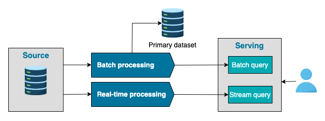
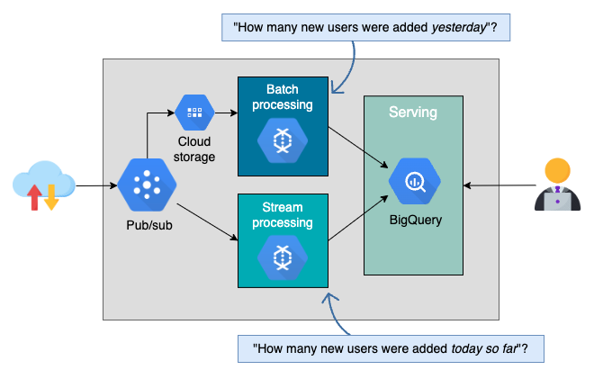
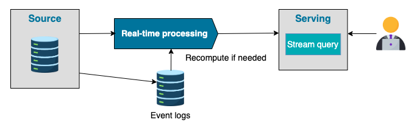

# Data Architecture

We will look at two widely-used cloud data architecture frameworks:

- [**Lambda architecture**](#lambda-architecture)
- [**Kappa architecture**](#kappa-architecture)

The list can still grow, but it encourages us to do a trade-off analysis before choosing the right cloud data architecture.

Cloud data architecture, by design, handles the ingestion, transformation, and analysis of data that is too large or complex for traditional data architectures.

## Lambda Architecture

In the mid-2010s, the rise of Apache Kafka as a stream-processing platform empowered companies to apply real-time algorithms to data, generating quicker and better insights.
Given this real-time data processing trend, data engineers must figure out how to combine batch and streaming processes into one unified data architecture.

**Lambda architecture** is designed to handle massive data arriving through both batch and stream processes.
The approach tries to balance accuracy, latency, and throughput by using batch data to provide comprehensive and accurate views, while simultaneously using stream data to provide a real-time view of the most recent data.

### How it works

- The system will dispatch all incoming data to batch and streaming layers.
- The batch layer will maintain an append-only primary dataset and precompute the batch views
- The streaming layer will only handle the most recent data to achieve low latency.
- Both batch and stream views are served in the serving layer to be queried.
- The result of merging batch and real-time results can answer any incoming query.

### Challenges

- Complexity and cost of running 2 parallel systems instead of 1.
- This approach often uses systems with different software ecosystems, making it challenging to replicate the business logic across the systems.
- It's also quite difficult to reconcile the outputs of 2 pipelines at the end.

## Cloud solution

Cloud vendors have developed solutions to improve the traditional lambda architecture.
Google introduced **DataFlow**, proposing a unified approach for both batch and streaming processes, and particularly mentioning the exactly-once processing to enhance the accuracy of streaming views.

!!! note

    The Lambda architecture typically addresses time-related requestions. For instance:

    - How many new users did we have yesterday?

    - How many new users did we have today so far?

    The daily batch processing can respond to the first question but not the second one unless the job is manually triggered.

    On the other hand, the streaming layer aggregates user data for the current date, providing more real-time views.

## Kappa Architecture

a drawback of Lambda architecture is its complexity.
**Kappa architecture**, proposed by _Jay Kreps_, is a simplified version of Lambda architecture.

In this architecture, the streaming service serves as the only primary data source, thus paving the way for an event-based architecture.

### Advantages

In Kappa architecture, a streaming processing engine continuously processes real-time data and ingests it into long-term storage.
When code changes occur, developers can recompute using the raw data stored in the event logs database.

### Challenges

- Streaming remains a challenge for many companies due to its complexity and most likely high cost and maintainance.
- Managing duplicates and preserving order, for instance, can be more challenging than batch processing.
- data replay is often trickier than it may seem.
