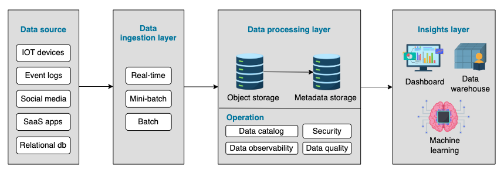
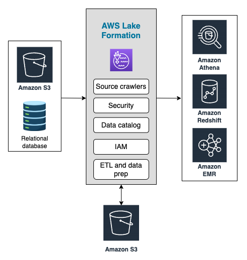
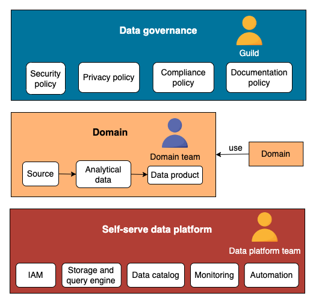
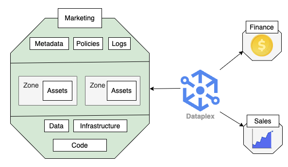

# Storage Architecture

## Data Lake

A data lake is a popular data architecture comparable, to a data warehouse.
It’s a storage repository that holds a large amount of data, but unlike a data warehouse where data is structured, data in a data lake is in its raw format.

| Topic        | Data Lake                                                                                                                                               | Data Warehouse                                                                   |
| ------------ | ------------------------------------------------------------------------------------------------------------------------------------------------------- | -------------------------------------------------------------------------------- |
| Data Format  | Store unstructured, semi-structured and structured data in its raw format.                                                                              | Store only structured data after the transformation.                             |
| Schema       | Schema-on-read: Schema is defined after data is stored.                                                                                                 | Schema-on-write: Schema is predefined prior to when data is stored.              |
| Usecase      | Data exploration: Unstructured data opens more possibilities for analysis and ML algorithms, A landing place before loading data into a data warehouse. | Reporting: Reporting tools and dashboards prefer highly coherent data.           |
| Data Quality | Data is in its raw format without cleaning, so data quality is not ensured.                                                                             | Data is highly curated, resulting in higher data quality.                        |
| Cost         | Both storage and operational costs are lower.                                                                                                           | Storing data in the data warehouse is usually more expensive and time-consuming. |

The following graph illustrates the key components of a data lake

- **Ingestion layer**: The ingestion layer collects raw data and loads them into the data lake. The raw data is not modified in this layer.

- **Processing layer**: Data lake uses object storage to store data. Object storage stores data with metadata tags and a unique identifier, making searching and accessing data easier. Due to the variety and high volume of data, a data lake usually provides tools for features like data catalog, authentication, data quality, etc.

- **Insights layer**: The insights layer is for clients to query the data from the data lake. Direct usage could be feeding the reporting tools, dashboards, or a data warehouse.

### Example: AWS data lake

AWS data lake uses Simple Storage Service (S3) as the data lake foundation.
We can set up a secure data lake in days with AWS Lake Formation.

Users can use tools like **AWS Glue**, a serverless data integration service, to discover, prepare, and combine data for analysis and machine learning algorithms.

Other tools like Amazon Athena (an interactive query service), Amazon EMR (big data platform), Amazon Redshift (cloud data warehouse), etc., are also available for users.

## Data Mesh

The term **data mesh** was coined by _Zhamak Dehghani_ in 2019 and created the idea of domain-oriented decentralization for analytical data.
Centrally managed architectures tend to create data bottlenecks and hold back analytics agility.
On the other hand, completely decentralized architectures create silos and duplicates, making management across domains very difficult.

### How it works

- The data mesh architecture proposes distributed data ownership, allowing teams to own the entire life cycle of their domains and deliver quicker analyses.
- The organization's IT team is responsible for the overall infrastructure, governance, and efficiency without owning any domain-related business.
- Adopting data mesh requires some pretty cultural and organizational changes.
- Currently, no template solutions for a data mesh, so many companies are still trying to figure out if it's a good fit for their organizations.

- Each domain team is responsible for ingesting the operational data and building analytics models.
- The domain team agrees with the rest on global policies to safely and efficiently interact with the other domains within the mesh.
- A centralized data platform team builds infrastructures and tools for domain teams to build data products and perform analysis more effectively and quickly.

### Principles

- **Domain ownership**: Each domain team takes responsibility for the entire data life cycle.

- **Data as a product**: Treat provided data as a high-quality product, like APIs to other domains.

- **Self-serve data platform**: Build an effective data platform for domain teams to build data products quickly.

- **Federated governance**: Standardize data policies to create a healthy data ecosystem for domain interoperability.

### Example: Google Dataplex

Dataplex is a data management platform that can quickly build data domains within a data mesh. It allows teams to create data domains while maintaining central controls on monitoring and governance.

Domain-related assets, such as BigQuery tables, code, logs, pipelines, etc., can be logically grouped in a so-called Dataplex lake without physically moving data assets into a separate storage system.

The lakes enable engineers to standardize data, which builds the foundation for managing metadata and setting up policies and monitoring tools.

!!! note

    Data architectures have more variations, such as event-based architecture, data lakehouse, modern data stack, etc.

    As data engineers, we learn new trends in data architecture and help organizations move faster and save time, effort, and money in a sustainable way.
