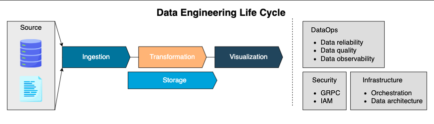

# Data Engineering Life Cycle

Data engineering is a broad domain. Data engineers are responsible for developing and maintaining end-to-end systems that involve various technologies and require considerable engineering skills.
Given the continuous emergence of new technologies, keeping pace with every tool can be challenging.

## What is the data engineering life cycle?

The data engineering life cycle involves a series of processes, which can be categorized into five groups:

- [Ingestion](ingestion/)
- [Transformation](transformation/)
- [Visualization](visualization/)
- [Storage](storage/)
- [DataOps/security/infrastructure](dataops/)

Overview:

1. The life cycle begins with getting data from multiple sources and ingesting it into the storage.
2. Next, data is transformed from its original format into a format for the downstream use cases.
3. Last, the transformed data is fed into different business intelligence (BI) tools to draw business insights.

!!! info

    Reference: [Educative - Data Engineering Life Cycle](https://www.educative.io/courses/data-engineering-foundations/introduction-to-data-engineering-life-cycle)
