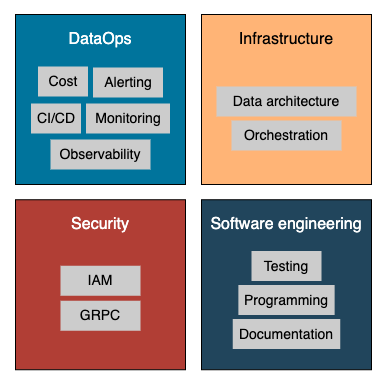

# DataOps/Security/Infrastructure

To support all the above activities, we must have a solid infrastructure foundation.
Moreover, the field of data engineering is quickly growing with new concepts like data contracts and data products.
So, we shouldn't only be concerned with basic infrastructure areas such as CI/CD, architecture, and orchestration, but also new areas like DataOps, data lineage, data catalog, cost optimization, and more.

## DataOps

DataOps is a methodology that combines automation and a process-oriented perspective to deliver high-quality and on-demand data to the organization.
It extends the principles of DevOps, including agile methodology, continuous delivery, and automation to data-related tasks.

## Security

Since 2016, the EU has adopted the General Data Protection Regulation (GDPR) and recognized it as a law across the EU.
In summary, GDPR gives individuals more control over how their personal data can be used by third parties.

!!! example

    Examples of personal data are name, location, IP address, biometric data, and any other data that can lead to the identification of a person.

Under GDPR law, individuals have more rights over their data: the right to be informed, the right to be erased, the right to restrict processing, the right to object, and more.

But for data engineers, the main challenges come from three aspects of GDPR:

- **Data privacy**: Personally identifiable information (PII) data must be treated as sensitive data. A series of security measures need to be in place to protect PII data from unauthorized access.

- **Right to be forgotten**: Users can request the company to delete all the users' data at any time they want. The data team needs to establish a guideline for processing erasure requests on time.

- **Right to request**: Users can retrieve all the information the company collected at any time they want. Similarly, a standard procedure needs to be in place for managing such requests.

## Infrastructure

Infrastructure is the backbone of everything.
A robust infrastructure includes but is not limited to networks, virtual machines, load balancers, IAM roles, and more.

!!! info

    As the number of cloud resources continues to grow, there arises a need for more efficient and automated ways to manage and deploy infrastructure.
    In recent years, infrastructure as code (IaC) tools like Ansible and Terraform have been invented to define and manage infrastructure components using code.
    It ensures consistent deployment of infrastructure across environments and accelerates the deployment process.
