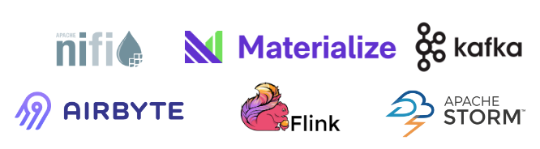

# Ingestion

**Data ingestion** is the process of importing data from one or more source systems into the storage layer.
The following code from the Google Analytics example creates a BigQuery job to create a table from the raw CSV file:

```py title="load_to_bigquery.py"
# Ingestion - load raw data into BigQuery
with open("ga.csv", "rb") as source_file:
    job = client.load_table_from_file(
        source_file,
        src_table_id,
        job_config=job_config,
    )
job.result()
src_table = client.get_table(src_table_id)
print("Loaded {} rows and {} columns to {}".format(src_table.num_rows, len(src_table.schema), src_table_id))
```

!!! tip

    Ingestion is a critical and challenging step because source systems and their data quality are typically out of data engineers' direct control.
    Therefore, establishing good collaboration with the source table and implementing data quality checks is essential for ensuring smooth integration with the other systems.

## SaaS

Applications like Workday, Asana, Google Ads, and HubSpot have become valuable data sources for businesses.
Instead of manually fetching the data, many data teams use tools like Stitch, Fivetran, and Segment, which offer out-of-the-box data connectors.
These platforms are generally designed with low-code or no-code functionalities and are user-friendly for engineers and non-engineers.


## Open-source tools

Another type of ingestion tool is open-sourced tools, such as Python client, Airbyte, Kafka, Flink, Materialize, etc.
Compared to SaaS tools, they require more engineering skills for development and maintenance, but they are cost-effective and scalable.
As the business grows, the number of data sources will increase exponentially, and open-sourced tools can be easily scaled on-demand and effectively handle fluctuating workloads.
Besides, many of them support both batch ingestion and streaming ingestion.


