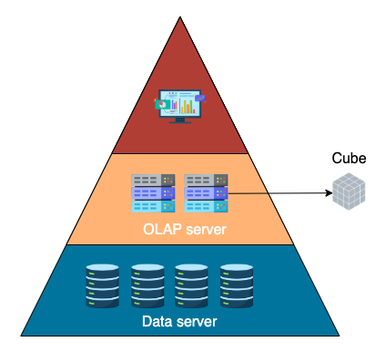
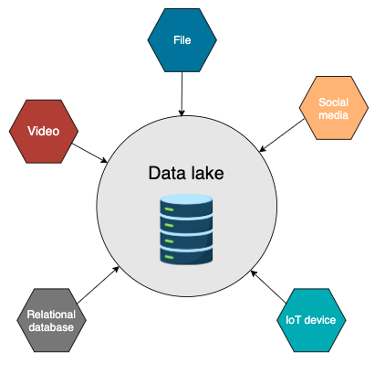
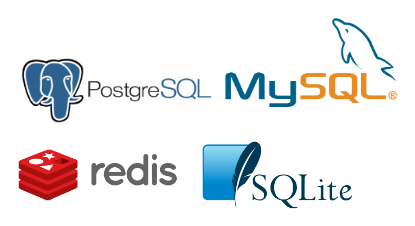
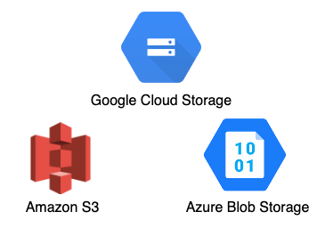

# Storage

In many ways, how data is stored determines how it is used.
For example, data in a data warehouse is typically used by batch processes and analytics, while frameworks like Apache Kafka facilitate real-time use cases.
They offer not only storage capabilities but also function as an ingestion and query system.

!!! info

    Generally speaking, there are 4 standard storage systems.

## Data Warehouse

A traditional **data warehouse** is a central data hub for reporting and analytics.
Data in the data warehouse is generally structured and formatted for analytical purposes.
Data flows into the data warehouse from transactional systems and other sources regularly.

A typical data warehouse has 3 tiers:

- database server (where data is loaded and stored)
- analytics engine (where data is transformed for analytics usage, OLAP)
- Front-end client as BI tools

!!! note

    OLAP uses multidimensional database structures, known as cubes, to answer complex business questions by preaggregating underlying datasets.

## Data lake

Another comparable storage type is data lake. Rather than only storing structured data, a data lake is capable of storing both structured and unstructured data at any scale.
Data can come from applications, IoT devices, mobile apps, and social media in any format.
This open format gives data engineers greater flexibility, leading to faster decision-making.

### Drawbacks

However, data lake comes with its own challenges. Due to the free format, data in data lake can easily get “messy” without good data management strategies, such as data catalog and data security.
Therefore, it’s important to keep data organised to avoid turning the lake into a “data swamp.”

!!! tip

    Data lakes and data warehouses are not mutually exclusive.
    In many organizations, raw data first lands in the lake. After some exploration and preparation, selected data will be transformed and loaded into the data warehouse for reporting and analysis.

## Database

Every storage type we have discussed so far is a database. But the database in this category refers to an OLTP (online transactional processing) database.

OLTP databases are application databases that process day-to-day operations in real-time, such as creating a new booking record.
It’s well known for its speed. Data engineers would choose OLTP databases as an internal database for orchestration tools like Airflow or data science applications.

!!! note

    Let’s make sure we understand the difference between OLTP and OLAP databases.
    OLTP is designed for managing transactional data and is better at handling a high volume of short and frequent transactions, while OLAP is better at handling complex queries involving joins and aggregations.
    Choosing an OLAP database as the application's backend will significantly decrease application performance.

## Object Storage

With the rise of cloud computing, object storage gained popularity as a scalable and flexible solution for storing and accessing data across distributed environments.
In this context, object refers to files, images, videos, and audio.
Each object is a distinct unit bundled with metadata and a unique identifier to locate and retrieve each data unit across regions.

