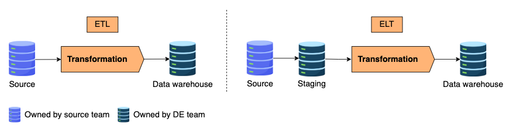
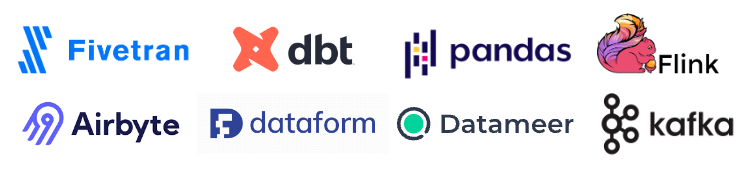

# Transformation

The data from the source system is typically considered raw and requires transformation, enrichment, and aggregation before it can serve downstream use cases.

In traditional settings, developers build data pipelines in the order of extract, transform, and load (ETL).
In the ETL process, data transformation is performed outside the data warehouse, usually in the source database.
The data must be standardized before being loaded into the data warehouse.

In recent years, the computational power of cloud data warehouses has increased, promoting a shift toward a different pattern: ELT (extract, load, transform).
Unlike the traditional ETL approach, where data is transformed externally, ELT involves pushing raw data directly to the data warehouse and performing transformations within the warehouse itself.
The scalability and strong computational power of the data warehouse make these internal data processing and transformations much more efficient.
As a result, ELT approach has become more widespread than ETL approach.

## Data tools

Data transformation tools have grown in popularity in recent years.
They help data engineers automate and simplify the transformation process.
One such tool is dbt, which enables data engineers and analytics engineers to transform data by simply writing SQL-like statements.
It also follows software engineering best practices like testing, CI/CD, and documentation, making it fast and high-quality.
Streaming frameworks like Apache Kafka and Flink support real-time transformation.
They immediately process data when it reaches the system.

