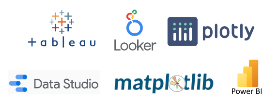

# Visualization

Once the data has been transformed into the desired format, the next step is creating visual representations that are more easily understood by stakeholders.

> Typically, data analysts are responsible for this.

As data engineers, we are often involved in setting up the visualization platforms and ensuring the freshness and availability of the dashboards and reports.

## Data tools

There are many data visualization tools available.
These tools can vary considerably. They range from software like Tableau and Looker that emphasizes simplicity and variety of visualizations to more complex frameworks like Plotly and Matplotlib that require higher technical skills.



Example using `matplotlib`

```python title="aggregation.py"
# Transformation - perform aggregation
df = pd.read_gbq(query="SELECT * FROM ga.google_analytics_agg", project_id=PROJECT_ID)
df.plot.bar(x='date', y='num_visitors', rot=0)
plt.xticks(rotation=90)
plt.savefig('output/graph.png')
```
