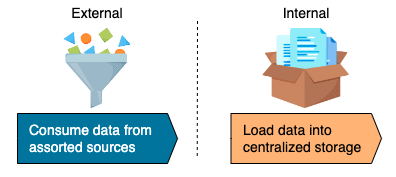

# Data Ingestion

**Data Ingestion** is the first stage in most data architecture designs. The process has 2 steps.
First, it consumes data from assorted sources.
Second, it loads data into centralized storage, which can be accessed and used by the organization.

!!! warning

    it's a critical component in the data engineering because downstream systems rely entirely on the ingestion layer's output.

The ingestion layer works with various data sources, which data engineers typically don't have full control of.

!!! note

    A good practice is building a layer of data quality checks and a self-healing system to react to unexpected situations, such as data loss, corruption, system failure, etc.

Generally, there are several types of data ingestion, as below:

- [Batch Ingestion](batch/README.md)
- [Streaming Ingestion](streaming/README.md)
- [Push vs. Pull](push-pull/README.md)

Various methods to perform data ingestion:

- [Secure File Transfer Protocol (SFTP)](methods/sftp.md)
- [Application Programming Interface (API)](methods/api.md)
- [Object Storage](methods/object-storage.md)
- [Change Data Capture (CDC)](methods/cdc.md)
- [Streaming Platform](methods/streaming-platform.md)

Reference: [Educative - Data Ingestion](https://www.educative.io/courses/data-engineering-foundations/batch-ingestion)
