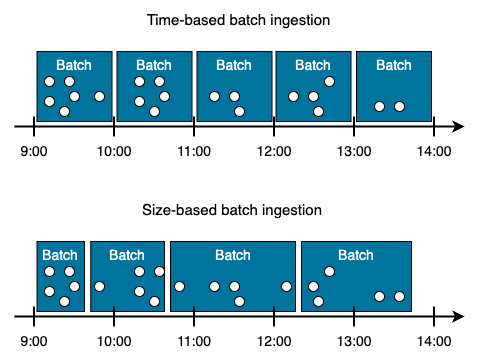
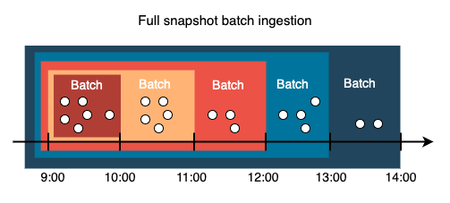
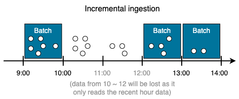
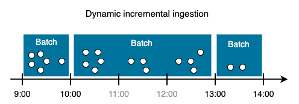

# Batch Ingestion

**Batch Ingestion** is a commonly used way to ingest data.
It processes data in bulk, meaning that a subset of data from the source system is extracted and loaded into the internal data storage based on the time interval or the size of accumulated data.

## Time-based vs. size-based batch ingestion

**Time-based batch ingestion** often processes data on a fixed time interval (e.g., once a day) to provide periodic reporting.
It's often used in traditional business ETL or ELT for data warehousing, such as getting daily transactions from a payment provider.

**Size-based batch ingestion** is used when the time interval doesn't really matter, but the size of bulk or the number of records in the batch matters.
It ensures a consistent load on the internal storage, reducing the risk of overloading the database with a huge bulk.

## Full snapshot vs. Incremental load

When consuming data from the source, we can choose whether we want to take full snapshot of the source each time or consume only the difference.

Taking a **full snapshot** means extracting the entire current state of the source system.

!!! note

    A benefit is ensuring data completeness and simple application logic.

    However, the downside would be the resource-intensive operations as the data grows.

On the other hand, **incremental load** only consumes a subset of source data, which minimizes resource usage.
One implementation method is to load the data from the last interval.

!!! example

    Extracting the transactions that happened in the last hour.

!!! warning

    There's 1 caveat. If the ingestion code didn't run last time, we would lose the data in that hour because we only look at the recent/last hour.

!!! success

    An improved version is to look at the target system's latest timestamp and use it as the starting point of the new incremental window.

    In the previous diagram, the code didn't run from 10 a.m. to 12 p.m.

    Therefore, the latest timestamp in the target systems is somewhere around 10 a.m.

    When the schedule runs at 1 p.m., it will read data all the way from 10 a.m. to fill the gap

This approach mitigates the risk of losing data, but it comes with the complexity of finding out the latest timestamp in the target system.

!!! tip

    Finding the maximum value of a column can be quite expensive because it has to scan the entire column.

    A tip is to sort the column or partition the table on that column.

Batch ingestion is the most widely used form of data ingestion when real-time data is not required.

An example is the payroll and billing systems that need to be processed monthly or quarterly.

!!! warning

    Keep in mind that batch ingestion requires more hardware resources to process large data batches and has hours or days latency depending on the time interval.
