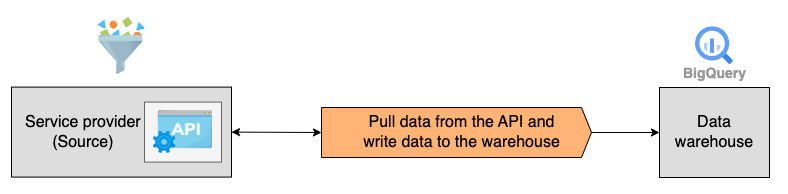
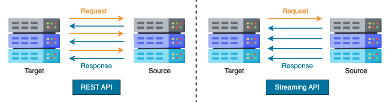

# Application Programming Interface (API)

An **Application Programming Interface (API)** is a way for a service to communicate with other services without knowing how they are implemented.

API works as a contract, an agreement between the service provider and the client.
If the client sends a request in a particular format, the provider will respond in the agreed way.
Such an agreement helps the provider and client collaborate and simplifies the ingestion process.



!!! note

    The above diagram shows a pull-based API ingestion solution in which the client uses the HTTP `GET` method to fetch data from the provider.

## **Challenge**: Ingest Bitcoin price data into Google BigQuery from CoinDesk API

This example creates a data ingestion pipeline using free CoinDesk API.
The pipeline pulls real-time Bitcoin price data in JSON format from CoinDesk API and writes into BigQuery table.

!!! warning

    You need to have Google Cloud Platform account to run below code.
    You can create [here](https://cloud.google.com/?hl=en)

```python title="requests.py"
import requests
import pandas as pd
import pandas_gbq

# Setup code is hidden
table_id = f"{dataset_id}.bitcoin_price"
try:
    res = requests.get("https://api.coindesk.com/v1/bpi/currentprice.json")
    res.raise_for_status()
    price = res.json()
    df = pd.json_normalize(res.json(), sep="_")
    pandas_gbq.to_gbq(df, table_id, project_id=PROJECT_ID, if_exists="append")
    print(f"Data has been loaded to table {table_id}.")
except Exception as e:
    raise SystemExit(e)
```

!!! danger

    if you notice the code above, it's on `append` mode instead of `overwrite`.

    In `append` mode, a new row is added to the table every time the code runs. With the `append` mode, deduplication is essential due to possible retries during the ingestion.

## Client library: CoinDesk

Most modern service providers like Meta, Yelp, and Stripe offer APIs to access their data efficiently.
However, writing an API client from scratch requires advanced engineering skills and a huge amount of time.

To not reinvent the wheel, the community has developed client libraries in different languages that hide complex API implementation details, making API interaction easy and efficient.

```python title="coindesk.py"
# Library https://pypi.org/project/coindesk/
from coindesk.client import CoinDeskAPIClient
api_client = CoindeskAPIClient.start('currentprice')
response = api_client.get(raw=True)
```

## Streaming API

What we've seen before is REST API, a client-server architecture.
This comes down to the flow of "request and response".

The client sends a request, and the server responds.
The operation is repeated and independent for every data request.



On the other hand, **Streaming API** is a subscription mechanism that allows the real-time streaming of event messages.

The client only needs to send one request, and the server continues to push data in a single long-lived connection.
An advantage of Streaming API is receiving events in near real-time.
Applications that constantly do long polling, consuming unnecessary API calls and processing time, would benefit from Streaming API because it reduces the number of calls that return nothing.

!!! example

    A well-known use case of the Streaming API is Twitter (now known as X).
    X’s Streaming API allows developers to stream public tweets with different filters in real-time.

    To connect to the streaming API, developers need to form a HTTP request and read stream as long as it’s valid.
