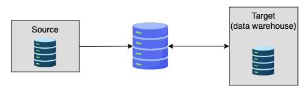
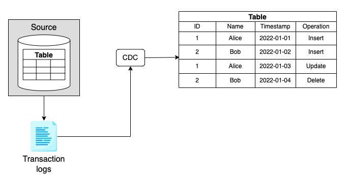

# Change Data Capture (CDC)

The process of ingesting changes from a source database. It provides real-time or near real-time data movement by moving data continuously as new database events occur.

CDC is a very efficient way to move data across a wide area network, perfect for the cloud.

Here are a few examples:

- **Load real-time data into a data warehouse**

  Operational databases are not good for heavy analytical workloads.
  Therefore, operational data should be moved to a data warehouse to perform analysis.
  The traditional batch-based ETL has a latency issue.
  But with CDC, we can capture source data changes as they occur and deliver them to the data warehouse in real time.

- **Load real-time data into real-time frameworks**

  Database events can be delivered to real-time process engines like Apache Kafka and Apache Flink to apply transformations and provide real-time insights.

- **Data replication/synchronization**

  The source database might be located on an on-premises server. We can use CDC to capture and propagate every data change to the cloud. It can also be used to sync servers within the cloud.



## Implementations

### Time-based

Every row in the source has a timestamp column named `update_timestamp` (or other similar names), which stores the timestamp of when the record was recently updated.

Every update on the row will overwrite the `update_timestamp` column.

The target system polls on an interval and updates the target database accordingly.

3 steps of the time-based CDC approach are:

- Get the maximum value of `update_timestamp` in the target system. This was when the last sync happened.
- Select all the rows from the source with `update_timestamp > the target's maximum timestamp`.
- Insert or modify existing rows in the target system.

#### Pros

- The logic can be implemented purely in SQL.
- No external tool is required.

#### Cons

- DML statements such as `DELETE` won't propagate to the target system because there's no `updated_timestamp` for a deleted row.
- For a wide table, the `SELECT *` statement may scan irrelevant data if only a few columns get updated.
  It requires extra hardware resources to update the entire rows in the target table.

### Trigger-based

With a trigger-based approach, three triggers are created for each source table, listening to the `INSERT`, `UPDATE`, and `DELETE` events respectively.

For each event, the corresponding trigger inserts one row into a changelog table.

The changelog table is stored in the database itself and is a sequence of state-changing events.

3 steps of the trigger-based CDC approach:

- Create 3 triggers for each source table.
- Whenever a row's state changes, a corresponding trigger appends a new row to the changelog table.
- The changelog table propagates the changes to the target table instantly.

#### Pros

- We can define the trigger function and log table schema as we wish.
- The changes can be captured almost as soon as they are made.

#### Cons

- Transactions can be slowed by the extra triggers.
- Moreover, triggers must be defined for each table, which can cause overhead if the source table is replicated multiple times.

#### **Challenge**: Build a postgres audit trigger

A use case of the database event trigger is sending changes to an audit log table.
The table records the old and new records, the user who made the change, and a timestamp of the change.

In this example, we will build a Postgres audit trigger in the GCP environment with its Cloud SQL service

!!! warning

    You need to have Google Cloud Platform account to run below code.
    You can create [here](https://cloud.google.com/?hl=en)

- Create a postgres instance

```bash
gcloud sql instances create my-db \
--database-version=POSTGRES_9_6 --cpu=1 \
--memory=3840MiB --zone=us-central1-a \
--root-password=admin
```

- Connect to the Postgres instance
  After few minutes, the Postgres database will be created.
  Next, let's connect to the database using the `gcloud` command.

```bash
apt-get update
apt-get install postgresql-client
gcloud sql connect my-db --user=postgres
```

- Run SQL to create source table, audit table and triggers

```sql
-- createa audit table
CREATE SCHEMA audit;
CREATE TABLE audit.logged_actions (
    op CHAR(1) NOT NULL,
    stamp TIMESTAMP NOT NULL,
    user_id CHAR(20) NOT NULL,
    first_name VARCHAR(20),
    last_name VARCHAR(20),
    salary INT
);

-- create source table
DROP TABLE IF EXISTS employees;
CREATE TABLE employees(
   first_name VARCHAR(40) NOT NULL,
   last_name VARCHAR(40) NOT NULL,
   salary INT
);

-- create function
CREATE OR REPLACE FUNCTION audit_employee_change() RETURNS TRIGGER AS $employee_audit$
BEGIN
    IF (TG_OP = 'DELETE' ) THEN INSERT INTO audit.logged_actions SELECT 'D', now(), user, OLD.*;
    ELSIF (TG_OP = 'UPDATE') THEN INSERT INTO audit.logged_actions SELECT 'U', now(), user, NEW.*;
    ELSIF (TG_OP = 'INSERT') THEN INSERT INTO audit.logged_actions SELECT 'I', now(), user, NEW.*;
    END IF;
    RETURN NULL;
END;
$employee_audit$
LANGUAGE plpgsql;

-- create trigger using the function
CREATE TRIGGER employee_audit_trigger AFTER INSERT OR UPDATE OR DELETE ON employees
FOR EACH ROW EXECUTE PROCEDURE audit_employee_change();
```

- Let's perform the `INSERT`, `UPDATE`, and `DELETE` operations in the `employees` table

```sql
INSERT INTO employees values ('Alice','Liu',5000);
INSERT INTO employees values ('Bob', 'Li', 7000);
UPDATE employees SET salary=8000 WHERE first_name='Alice';
DELETE FROM employees where first_name='Bob';
```

- Finally, let's check the audit table.

```sql
SELECT * FROM audit.logged_actions;
```

- After finishing the Postgres exercise, run this command to delete the instance

```bash
gcloud sql instances delete my-db
```

### Log-based

Most online transaction processing (OLTP) uses a transaction log to record all the data changes in the database.
In case of a database crash, the transaction log will be used to fully recover the system.
With log-based CDC, events are directly read from the source database's native transaction logs instead of creating a separate log table like a trigger-based approach.



#### Pros

- It doesn't add additional tables or require additional queries for each transaction, thus having no impact on the data model.

#### Cons

- Parsing transaction logs is a challenge.

Most databases have different log formats, sometimes they don't document them very well.
This would potentially require us to change log parsing logic whenever a new database version is released.

- Adding an additional log level can increase performance overhead
