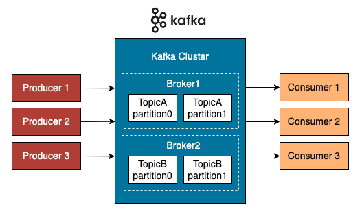
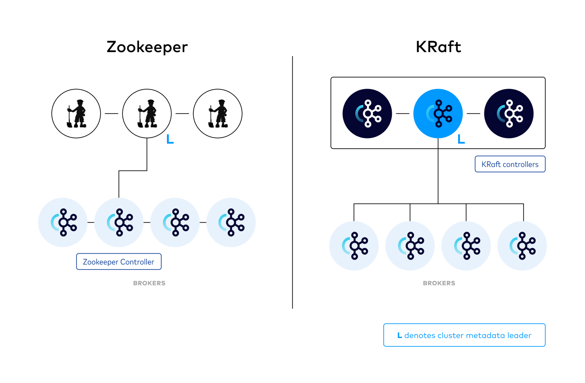
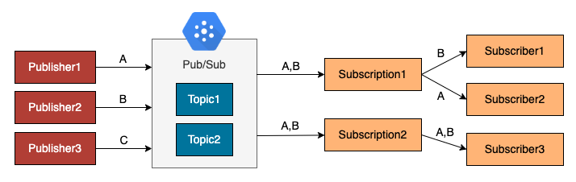

# Streaming Platform

Streaming platforms are widespread ways to ingest real-time data.
Compared to the CDC, where the data source is mostly databases, a **streaming platform** is a more universal solution to receive real-time events such as data from IoT sensors, retail, web, and mobile applications.
Data is continuously generated by data sources in small batches.

## Apache Kafka

**Apache Kafka** is a popular distributed streaming platform for building real-time data pipelines.
It's well known for its high throughput, high scalability, high availability, fault tolerance, and low latency.
Kafka has a variety of use cases, including real-time fraud detection, online activity tracking, and operational metrics collection.

Kafka consists of a **storage layer** and a **compute layer**.
It supports a large number of external data sources such as AWS S3, BigQuery Sink, Github source, etc., and the data is stored as **topics**.
Each **topic** can be split into several **partitions** for parallel processing across the cluster.

Next to the cluster, there are **producers** and **consumers**

!!! info

    **producer** act as an interface between data source and topics.

    **consumer** read and process data in the topics.



### **Challenge**: Streaming data ingestion pipeline using WebSocket and Apache Kafka

Kafka producer listens to the Websocket and ingests messages to the topic in real time.

- Start a cluster with one ZooKeeper node a one Kafka node in terminal tab 1.
  Download the Apache Kafka binary and start the cluster in the background.

```bash
# download Apache Kafka
wget https://archive.apache.org/dist/kafka/3.4.0/kafka_2.12-3.4.0.tgz
tar -xvzf kafka_2.12-3.4.0.tgz
cd kafka_2.12-3.4.0
nohup ./bin/zookeeper-server-start.sh config/zookeeper.properties > zookeeper.log &
nohup ./bin/kafka-server-start.sh config/server.properties > kafka.log &
# press ctrl C to exit
```

- Check if the ZooKeeper 2181 and Kafka port 9092 are in use

```bash
netstat -tulpn | grep LISTEN
# tcp        0      0 0.0.0.0:9092            0.0.0.0:*               LISTEN      2661/java
# tcp        0      0 0.0.0.0:2181            0.0.0.0:*               LISTEN      2660/java
```

!!! note

    Since Apache Kafka 3.3.1, we can deploy a kafka cluster without ZooKeeper and use KRaft.

    **KRaft** is a consensus protocol developed to manage metadata directly in Kafka.

    Reference: [KRaft: Apache Kafka Without ZooKeeper](https://developer.confluent.io/learn/kraft/)



- Create a Kafka topic

Create Kafka topic `websocket-events` in terminal tab 1.
By default, the topic only has 1 partition and 1 replication. They can be configured via flag `--partitions` and `--replication-factor`.

```bash
./bin/kafka-topics.sh --create --topic websocket-events --bootstrap-server localhost:9092
# Created topic websocket-events.
```

- Create a WebSocket and produce messages

Open a new tab, terminal tab 2, and start a WebSocket connection.

```bash
wget -qO /usr/local/bin/websocat https://github.com/vi/websocat/releases/latest/download/websocat.x86_64-unknown-linux-musl
chmod a+x /usr/local/bin/websocat
websocat --version
websocat -s 1234
```

- Create a Kafka producer that sends WebSocket messages to the topic

```python title="producer.py"
from kafka import KafkaProducer
from websocket import create_connection
producer = KafkaProducer(bootstrap_servers='localhost:9092')

def websocket_source():
    """
    1. Connect to websocket stream and get live data as json.
    2. Receives the stream.
    3. Sends the stream as a producer.
    """
    ws = create_connection('ws://127.0.0.1:1234/')
    while True:
        try:
            messages = ws.recv()
            if messages:
                producer.send("websocket-events", messages.encode('utf-8'))
        except Exception as e:
            print(e);
            websocket_source()

if __name__ == '__main__':
    websocket_source()
```

- Open a new tab, terminal tab 3, and execute the following command

```bash
python /usercode/producer.py
```

- Read messages from the topic

Finally, let's check the messages on the topic. Go to terminal tab 1, and run the following command to start a Kafka console consumer.
We should see the messages from the WebSocket in real time.
`--from-beginning` means that the consumer always starts reading from the first message in the topic. Otherwise, it will start from where it left off last time.

```bash
./bin/kafka-console-consumer.sh --topic websocket-events --from-beginning --bootstrap-server localhost:9092
```

## Other open-source streaming platforms

In fact, Apache Kafka is a message queue with a couple of twists.
Other similar message queues are:

- **RabbitMQ**: A push-based message-queueing system. It can be used when web servers need to quickly respond to requests.

- **ActiveMQ**: A push-based message-queueing system. It's mostly used in enterprise projects to store multiple instances and support clustering environments.

- **KubeMQ**: A Kubernetes native message queue broker. Following the container architecture best practices, KubeMQ nodes are stateless and ephemeral.


## Google Cloud Pub/Sub

The concept of Pub/Sub is very similar to Apache Kafka, where the data is stored in topics.

A **subscription** is a named entity that is interested in receiving messages on a particular topic.
It's similar to the concept of the consumer group in Kafka.
**Subscribers** are consumers who receive part or all of the messages on a specific subscription.



!!! info

    Pub/Sub has native integration with other GCP services, such as BigQuery and DataFlow.

## Amazon Kinesis

An AWS service to process large-scale data streams from multiple sources in real time.
With Amazon Kinesis, we can ingest real-time data such as video, audio, text, application logs, website clickstreams, IoT devices for analytics, and other use cases.

## Azure Event Hubs

Big data streaming platform and event ingestion service in Microsoft Azure


!!! tip

    When it comes to choosing a streaming platform, there are plenty of options, each with its advantages and disadvantages.

    The key performance indicators for streaming platforms are throughput, latency, availability, and reliability.

    Client language support can be another factor because developers can build applications in different languages.

    maintainability should also be considered to have a hassle-free management experience.
