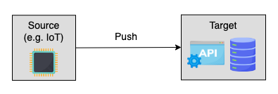
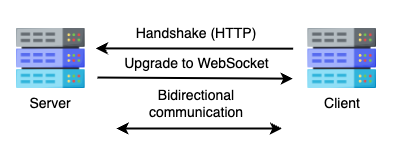
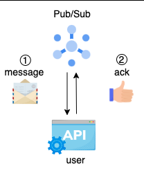
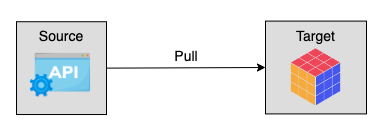
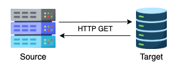
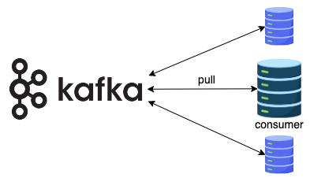

# Push vs. Pull

When looking at ingestion from a network communication perspective, there are two main strategies:

- **push** strategy involves a source system sending data to a target.
- **pull** strategy involves a target reading data directly from a source.

## Push

In **push-based ingestion**, data is pushed from the source to the target as soon as it becomes available.
The source can be an active source generating a huge amount of data, like an IoT device, or a less active source, like a chat application.



### Advantages

- **Real time**: Whenever the source receives new data, it immediately pushes it to the destination, and no request is needed.
  Push ingestion is more efficient for sources that constantly produce data.

- **Immutable data**: With a push-based solution, data is always immutable, which is suitable for auditing purposes.

- **Security**: Source systems are more secure in push-based solutions because they don't listen for network connection.
  All the requests are authenticated on the consumer side, so there is less chance for the source system to get attacked.

### Disadvantages

- **Replayability**: The source system will only publish each message once.
  If the consumer misses some messages, it’s hard to get them back.

- **Difficult flow control**: In a push system, the source or the intermediate engine controls the flow rate.
  Consumers might be overwhelmed if the consumption rate falls far behind the production rate.
  It’s also tricky for producers to fine-tune every consumer’s flow rate.

- **Passive consumer**: The fact that consumers are not able to control how they receive data introduces other inconveniences like not being able to define batch size.
  The producer lacks the knowledge of whether data should be sent one-by-one or batched first.

### Implementations

#### WebSocket

A bidirectional connection through which both the server and client can push data.
It facilitates the real-time transfers from the source to the target and vice versa.
It is underlying technology of many chat applications and real-time platforms.



A WebSocket connection is established by an HTTP handshake request from the client to the server.
Once the server accepts it, a long-lived bidirectional TCP connection is established.
In real time, messages are pushed from one side to the other until one party closes the connection.

!!! example

    we will build a WebSocket connection between a **server** and a **client** inside the terminal.

    This simplified example demonstrates how the server and client interact.

!!! danger

    This example is compatible to run only on `Linux`

1. Download the `websocat` package with the following commands.

```bash
sudo wget -qO /usr/local/bin/websocat https://github.com/vi/websocat/releases/latest/download/websocat.x86_64-unknown-linux-musl
sudo chmod a+x /usr/local/bin/websocat
websocat --version
```

2. Open a new terminal tab, run

```bash
websocat -s 1234
```

it will start a server on the port `1234`

3. Open another a new terminal tab, run

```bash
websocat ws://127.0.0.1:1234/
```

it will create a client listening to port `1234`

4. Now the connection has been established between server and client, you can type anything on either side and should receive them on other other side.


!!! info

    WebSocket is a simple but powerful technology.

    Many financial data providers share real-time stock prices through a WebSocket.

##### Example use case

Ingest real-time stock prices or bitcoin prices from Twelve Data, a financial data provider, into a database.
The following pseudocode implements a client using Twelve Data python client.
It opens a socket connection to Twelve Data, consumes data, and ingests into a database through callback function `on_event`.
Inside `on_event` function, we can batch records before inserting them into database.

```python title="client.py"
from twelvedata import TDClient

def on_event(event):
    print(event)
    # code to insert records into DB

td = TDClient(apikey="TWELVE_DATA_APIKEY")
ws = td.websocket(symbols=["BTC/USD", "ETH/USD"], on_event=on_event)
ws.connect()
ws.keep_alive()
```

#### HTTP `POST/PUT`

WebSocket is a bidirectional protocol supporting continual data transmission, and it's mainly used in real-time applications.
However, WebSocket shouldn't be taken on board if the source generates data only once or in a non-real-time manner.

An alternative is the HTTP protocol, specifically the POST and PUT methods.

HTTP is a unidirectional protocol functioning above the TCP protocol. In WebSocket, communication occurs on both ends, making it a faster protocol.
In HTTP, the connection is only built on one side, making it slower than WebSocket.
Another difference is that WebSocket maintains an active connection until one party drops, while HTTP needs to build a distinct connection for separate requests.

However, WebSocket is more complex than HTTP. HTTP is a better option if the client only wants to receive updates every 30 minutes or so.

HTTP offers different methods, among which the POST and PUT methods are push-style.
Although the target can't control the speed of the source, it can set a rate limit not to overload the system.
There are endless use cases for using HTTP to ingest data.

!!! example

    BigQuery offers the `POST` and `PUT` endpoints for creating tables and inserting data.

!!! example

    In a push subscription, the target is an HTTP endpoint.

    When Pub/Sub delivers a message to the push endpoint, it puts the message in the body of a POST request.

    After the consumer receives the message, it will return a status code `200` to acknowledge the message.



## Pull

In **pull-based ingestion**, the target system sends a request to the source or an intermediary and gets a response with data or without any.
Unlike push-based solutions, where the target can't control the flow rate, the pull mechanism allows the consumer to fetch data in a controlled manner.

The consumer can fall behind and catch up whenever they want.



There are two pull styles with some nuances: poll and pull.

**Polling** is a quick request that periodically checks whether new information can be pulled.

**Pulling** is a slower request that moves data from the source to the target.

In many cases, the client first polls the server and quickly finds out whether new data can be pulled. If so, it will pull the data.

### Advantages

- **Scalability**: Pull-based solution allows consumers to easily start a new instance as needed, e.g., on our own laptop.
  To not overload the source system, we can set up an intermediate queuing system, such as Redis, Pub/Sub, and Apache Kafka, to handle read requests from multiple consumers.

- **Flexible consumer**: Each consumer can pull data at their own pace.
  They can also have diverse requirements on batch size, time interval, etc.

### Disadvantages

- **Less real-time**: Pull is a bidirectional communication.
  The process of making requests and pulling data can use more bandwidth, resulting in a long waiting time.

- **Operational complexity**: Firewalls must be configured to allow bidirectional communication between the consumer and producer.
  Besides, authentication happens on the source system, so it's critical to set up a strong security layer to protect source data.

### Implementations

#### HTTP `GET`

The HTTP `GET` method is a common way to pull data from the source.
The consumer initiates a request to the source. After the source processes the request, it replies with the result to the consumer.



!!! warning

    Establishing an HTTP connection each time creates an overhead, so it's mostly used by consumers who want less frequent updates than WebSocket.

#### Apache Kafka

Like most messaging systems, Apache Kafka chooses to pull data from brokers to consumers.
Consumers request the brokers for all available messages from their current position.
In case of falling behind, it will catch up.

!!! note

    Kafka supports multiple consumers for each topic (queue), and each consumer won’t affect the performance of the other consumers.



##### Example use case

Kafka consumer using the `confluent_kafka` python library.
The consumer is a long-running application that continuously polls kafka for more data.
`timeout` is a timeout interval that controls how long the `poll()` will block if data is unavailable. If it's set to zero, `poll()` will immediately return.

```python title="consumers.py"
from confluent_kafka import Consumer, TopicPartition

consumer = Consumer(
    {
        'bootstrap.servers': 'localhost:9092',
        'group.id': 'mygroup',
        'auto.offset.reset': 'earliest',
    }
)

# indefinite loop to pull data from brokers
def consume(consumer, timeout):
    while True:
        message = consumer.poll(timeout)
        if message is None:
            continue
        if message.error():
            print("Consumer error: {}".format(msg.error()))
            continue
        yield message
    consumer.close()

consumer.subscribe(['topic1'])
for msg in consume(consumer, 1.0):
    print(msg)
```

!!! note

    Apache Kafka uses a variance of pull mechanism called long pulling.
    The client polls the server requesting new information. The server holds the request until new data is available.

    Once available, the server sends the new data.

    When the client receives it, it immediately makes a new request and repeats the process.
