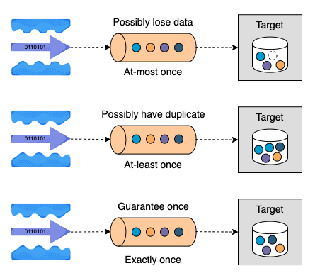
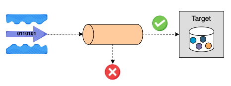
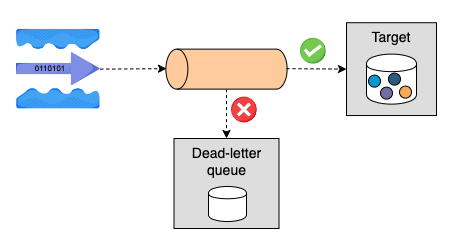

# Streaming Ingestion

As opposed to batch ingestion, stream ingestion handles real-time events. Data is consumed and loaded as soon as it's created from the source.
**Streaming** solutions are booming in the market because more companies want real-time insights.

!!! example

    an online retail company wants to provide a personalized user experience by using users' online activities.

    As users browse the website, we can ingest real-time activities into a streaming framework and show useful and relevant recommendations to users during their online shopping.

## Drawbacks

However, ingesting streaming data can be pretty challenging.

- There is no staging area as in the batch solution.
- Data is brought to the consumer instantly, so it’s hard to ensure consistency.
- After the source generates an event, it may never get to the destination due to network issues, causing data loss.
- There can also be a scenario where an event is retried multiple times, causing duplication.

## Message delivery semantics

Streaming platforms like Apache Kafka and Google Pub/Sub support three message delivery semantics:

- [at-most-once](#at-most-once)
- [at-least-once](#at-least-once)
- [exactly-once](#exactly-once)

Their main difference is the way to handle **failures** caused by communication errors or other disruptions, which has an impact on the level of data integrity, performance, implementation and cost.

### at-most-once

**at-most-once** means a message is delivered zero or at most one time.

!!! danger

    data might be lost.

This semantic is the cheapest, and it has high throughput, and low latency due to its fire-and-forget nature, meaning the transport layer doesn't keep any state.
At-most-once is best for applications that need high performance and accept small amounts of data loss, such as monitoring metrics.

### at-least-once

**at-least-once** allows multiple attempts in case of failure, so at least one attempt is successful.

It works by maintaining the message state on the producer side, waiting on acknowledgment from the target, and possibly retrying if the message is not successfully delivered, but the same message might be delivered multiple times, and the performance is limited.

!!! danger

    at-least-once is the default setting of many streaming systems because deduplication is often possible on the target side.

Common use cases are chat applications, real-time machine learning models, etc.

### exactly-once

**exactly-once** is the most difficult delivery semantic to implement.

With exactly-once, a message will always be delivered only one time, meaning no data loss or duplicate. In addition to maintaining the state on the producer side, exactly-once generates a unique ID for each message and maintains a state on the target side to filter out duplicates.

!!! warning

    exactly-once carries the highest implementation overhead and possibly the worst performance of all the delivery semantics.

That being said, exactly-once is necessary for many financial-related use cases, such as payment, trading, and downstream services that don't support deduplication and idempotency.

### Comparison of Delivery Semantics

|                 |    at-most-once    |    at-least-once    |                   exactly-once                   |
| :-------------: | :----------------: | :-----------------: | :----------------------------------------------: |
| **Performance** |     Very high      |        High         |                      Medium                      |
| **Duplication** |         No         |      Possible       |                        No                        |
|  **Data Loss**  |      Possible      |         No          |                        No                        |
|  **Use case**   | Monitoring metrics | Chat app, ML models | Financial-related (payment, trading, accounting) |

## Error Handling

Most batch-based ingestion performs data transactions, serving as a single unit of work, meaning the entire batch is ingested as a whole or not at all.
Any error record will block the entire batch, so there's never a case that part of the records is ingested.
In other words, we must fix the data issue before ingesting the batch.

!!! tip

    However, we don't want a single failure to block streaming ingestion.

    Messages that cannot be ingested for whatever reason should be rerouted and possibly stored in a separate location.

    Invalid schema, message size, communication errors, etc cause common ingestion errors.

### Drop the error records

The simplest solution is to drop any messages that couldn't be ingested.
This is preferred when we handle a high volume of data and don't want to store useless messages.

!!! warning

    However, rejecting records is risky because the error detection mechanism can be faulty.
    If so, useful data will be lost forever.

### Send error records to a dead-letter queue

One industry-standard approach is sending error records to a dead-letter queue.
A dead-letter queue receives messages that meet one or more of the following criteria:

- The target system doesn't exist
- The queue is full
- The message size exceeds the limit
- The message is expired due to TTL (time to live)
- The message cannot be processed due to an invalid format or wrong values

Dead-letter queues isolate messages that can't be processed, allowing engineers to investigate why ingestion errors occur and solve pipeline problems if necessary.
With at-least-once delivery semantics, the system will retry rejected messages a few attempts before sending them to the dead-letter queue.

!!! note

    The benefits brought by the streaming pipeline attract many organizations, but it's considerably challenging to develop and maintain.

    To simplify the architecture and reduce the burden of engineers, many cloud providers have developed out-of-the-box solutions like BigQuery subscription and Dataflow, helping engineers focus on the core business values.
