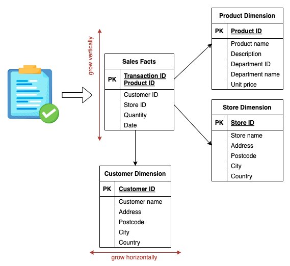
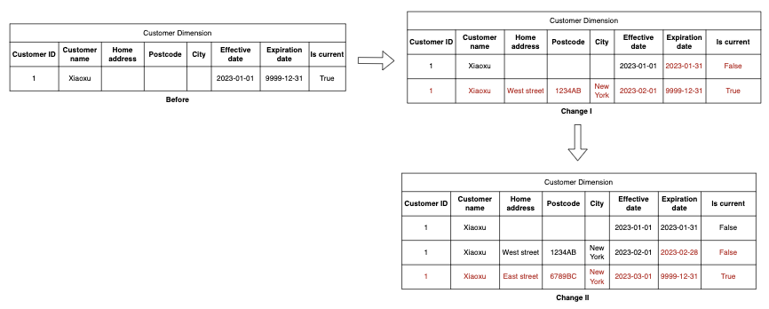
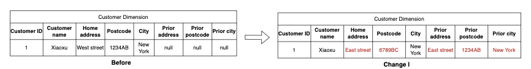
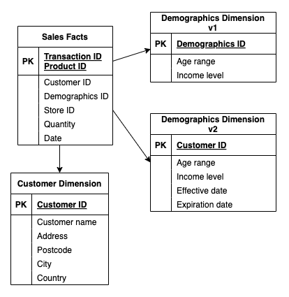

# Dimensional Modeling

## Operational database

In every organization, information serves two purposes: operational record-keeping and analytical decision-making.
**Operational systems** store operational data, such as taking online orders, resolving customer tickets, and collecting website traffic.
Data is generated and continually updated in real-time as the business proceeds.

**Operational databases**, also known as Online transaction processing databases (OLTP), are optimized for processing transactions and providing the best application performance to users.

!!! info

    Additionally, operational database extensively use normalized structure because an update or insert transaction only affects one table in a database.

### Drawbacks

- While operational databases prioritize performance, they are not the optimal choice for facilitating decision-making.
- Business users often deal with multiple transactions at once, for instance, comparing data from different time periods and manipulating it in various ways.
- Using normalized data models only introduces unnecessary complexity because users must navigate and remember all the models and build complicated join logic themselves, which can hinder efficiency and impede company growth.

## Analytical Database

known as online analytical processing (OLAP) database, are optimized for handling complex SQL logic. This capability is a result of the underlying parallel processing engines, query optimization and elastic hardware resources.

In contrast to OLTP, which only preserve the latest object state, OLAP databases maintain the historical data to support various analysis spanning an extended timeframe.

!!! info

    Moreover, external-facing tables are typically denormalized in OLAP databases because we want to provide an efficient and simplified way for users to retrieve data.

## Kimball's Dimensional Modeling

Raplh Kimball introduced the concept of dimensional modeling in the 1980s.
Due to its star-like structure, it is also referred as the _star_ schema.
The center of the star is the fact table, surrounded by dimension tables.

### Fact table

The **fact table** stores the measurements or metrics from the business process.
For instance, in the sales example, the business wants to measure the sales units and sales dollars.
Typically, these facts are numeric and additive because downstream users rarely look at a single fact.
Instead, they add up hundreds, or even millions, of rows.

### Dimension table

The **dimension table** contains the context associated with a business process, referring as `attributes`.
They describe the "who, what, where, when, how, and why" associated with the event.
These dimension attributes determine the ways users can segment the data, and therefore, they often appear in the `GROUP BY` query.

!!! info

    Dimension tables tend to have fewer rows than fact tables, but can be wide with text columns. As the business evolves, dimension tables can grow horizontally.

## Snowflake schema

Reference: [Databricks - Snowflake Schema](https://www.databricks.com/glossary/snowflake-schema)

A **snowflake schema** is a multi-dimensional data model that is an extension of a star schema, where dimension tables are broken down into subdimensions.
Snowflake schemas are commonly used for business intelligence and reporting in OLAP data warehouse, data marts, and relational databases.

In a snowflake schema, engineers break down individual dimension tables into logical subdimensions. This makes the data model more complex, but it can be easier for analyst to work with, especially for certain data types.

!!! note

    the main difference is that snowflake schemas are more normalized than star schemas

### Benefits

- Fast data retrieval for specific data/tables.
- Enforces data quality, avoiding duplication by normalizing each of dimension tables further.
- Simple, common data model for data warehousing.

### Drawbacks

- Lots of overhead upon initial setup, lot of tables will be built and normalized.
- Rigid data model, need to JOIN multiple tables by use cases.
- High maintenance cost, it will require more storage to save more tables.

## Slowly Changing Dimension (SCD)

Slowly Changing Dimension (SCD) is an important concept in dimensional modeling.
It's a strategy to handle attribute changes in the operational world.
For example, when a customer changes their home address, how do we represent the information? Do we always store the latest one? Or do we keep history? It's a question for both engineers and business users.

There are five ways to handle those changes. Let's check them out.

### Type 0: Retain the original

With SCD type 0, the dimension attribute value never changes.
For example, when a customer registers for a membership, their registration attributes, such as registration date and registration place, should never change over time.

### Type 1: Overwrite

With SCD type 1, the old attribute value is overwritten by the current value.
The attribute always reflects the most recent state.
For example, when a customer just registers the membership, not all the fields are filled in, so there will be empty values in the dimension table.
Later, when the customer updates their data, these empty values will be overwritten by the actual values.

### Type 2: Add a new row

SCD type 2 is the most popular type used in the data warehouse.
It solves the problem of SCD type 1 by tracking attribute changes.
With the type 2 approach, when the customer changes their home address, a new row will be inserted to reflect the new address value.

### Type 3: Add new attribute(s)

With SCD type 3, history is maintained in an extra column.
In type 2, each row exclusively holds valid values for that period of time, which is what we want in most cases.
However, sometimes, we want to know how the business would perform under the old attribute value for the entire period.

### Type 4: Add mini-dimension

SCD type 2 maintains the history by adding a new row to the dimension table.
However, if the changes are rapid, SCD type 2 won’t be scalable within a multimillion-row dimension table.
Imagine that the company has 1 million users, and some user attributes change frequently, such as age range and income level.
In this context, we don't want to continually add rows to the customer dimension table.

With SCD type 4, we break off frequently changing attributes into a separate dimension, called a mini-dimension.

In the first variation, each row in the Demographics table has age range and income range. We use a range instead of a specific value to limit the rows in the mini-dimension.
Every time a sale occurs, the demographics ID in the fact table represents the customer demographic profile at the time of the event.

In the second variation, we maintain a mini SCD type 2 table for the same attributes and link it to the fact table using customer id.
All the attributes in the table must be rapidly changing.

!!! note

    Either way, the goal is to ensure the query performance by separating slowly changing or static attributes from rapidly changing attributes.
    When users retrieve static attributes, the performance won't be impacted by the rapidly changing attributes.

!!! example

    For further ilustration on how to build dimensional modeling, please go to [Challenge](challenge.md).
    I will explain clearly step by step.
