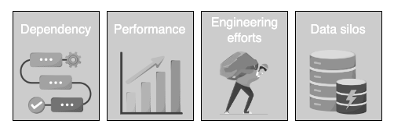
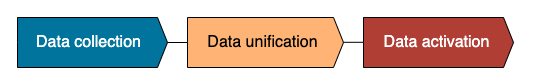
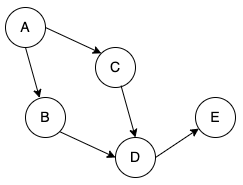

# Data Orchestration

To support business continuity, data models need to be regularly refreshed.
In the past, engineers used the cron tool in Linux systems to schedule ELT jobs.

However, as data volume and system complexity increase exponentially, creating cron jobs becomes a bottleneck and eventually hits the limitation of scalability and maintainability.

To be more specific, the problems are:

- **Dependencies between jobs**: In a large-scale data team, it's expected to have many dependencies between data models.

!!! example

    updating the revenue table should be done only after the sales table has been updated.

    In more complicated scenarios, a table can have multiple upstream dependencies, each with a different schedule.
    Managing all these dependencies manually is time-consuming and error-prone.

- **Performance**: If not managed well, cron jobs can consume a significant amount of system resources such as CPU, memory, and disk space. With the ever-increasing volume of data, performance can quickly become an issue.

- **Engineering efforts**: To maintain the quality of dozens of cron jobs or apps and process a variety of data formats, data engineers have to spend a significant amount of time writing low-level code rather than creating new data pipelines.

- **Data silos**: Scattered cron jobs can easily lead to data silos, resulting in duplicated efforts, conflicting data, and inconsistent data quality. Enforcing data governance policies can also be difficult, leading to potential security issues.

The emergence of data orchestration marks a significant step in the evolution of modern data stacks.

**Data orchestration** is an automated process that combines and organizes data from multiple sources, making it ready for use by data consumers.
Orchestrators ease the workload of data engineering teams by providing prebuilt solutions for scheduling, monitoring, and infrastructure setup.

## Tasks of data orchestration

The actual tasks of data orchestration can vary from system to system, but essentially it consists of 3 parts as described:

- [**Data collection**](#data-collection)
- [**Data unification**](#data-unification)
- [**Data activation**](#data-activation)

!!! note

    it's worth noting that data orchestration is not a database engine.

    It's a platform that schedules different jobs to run at the **right time**, in the **right order** and in the **right way**.

It's common for a company to use multiple data orchestration platforms.
This is because each platform may perform different tasks and target different users.

!!! example

    For instance, tools like **Airflow** and **Prefect** are used for creating and managing complex workflows and are, therefore, mostly used by data engineers.

    On the other hand, **dbt* is focused on the data unification stage and is heavily adopted by data analysts and data scientists.

!!! note

    One of the challenges of using multiple data orchestration platforms is managing the dependency and lineage between the platforms, if any exist.

    Fortunately, tool integration is becoming increasingly common.

### Data collection

Within an organization, data may come from multiple sources and in various formats.
Adapting every single format from every single source can be time-consuming. Data orchestration automates the process of collecting data from disparate sources with little to no human effort.

!!! example

    Many data orchestration platforms have easy integration with various tools such as Google Sheets, CSV files, BigQuery, Zendesk support, which speeds up the onboarding process of a new data source.

    This is expandable to other complex data format, such as Parquet, Avro, ORC, or delta format.

Data orchestration provides the additional advantage of reducing data silos.
The platform can swiftly access data from anywhere, whether it's from legacy systems, data warehouses, or the cloud.

This prevents data from being trapped in a single location and makes it easily accessible.

### Data unification

Data inevitably needs to be unified and converted into a standard format.

There are three types of platforms in this category, and all the platforms allow users to schedule jobs.

- **Platforms that don't interfere with the data transformation logic.**
  Users can use any method to transform data, such as SQL, Python, or Bash scripts.

!!! example

    Airflow is only responsible for submitting the data transformation job created by the user to a data warehouse and waiting for the result. It doesn't care how the user implements the job.

- **Platforms that manage the data transformation logic.**
  Platforms like dbt define their own way of transforming data and managing model dependency within the tool. They guide users to use optimized methods to transform data.

- **Platforms that manage the data transformation logic through UI.**
  Certain low-code or no-code tools only require users to define transformation logic through user-friendly UI. These tools open the doors to non-engineers, but their functionalities may be limited.

### Data activation

Business users who use the dashboards can define **Service Level Agreements (SLA)**, meaning that the data must be ready before a certain time.

!!! note

    If not, the orchestrator will notify the stakeholders through one of the communication channels.

In addition to the above steps, orchestration platforms monitor the data life cycle in real time through a UI, where users can manually intervene with the process if needed.

Another critical feature is **dependency management**.
Before going into specific platforms, it's important to understand an important concept in data orchestration: **directed acyclic graph (DAG)**.

## Directed Acyclic Graph (DAG)

DAG is the bedrock of managing dependencies between different tasks.

A **DAG** is a graphical representation of a series of tasks in the data pipeline.
By its name, we can tell that it is a graph, but with two conditions:

- **Directed**: Every edge in the graph points in one direction.

- **Acyclic**: The graph doesn't have directed cycles.

Considered the DAG below. In this DAG, data can go from A to B, but **never from B to A**. Nodes from which an edge extends are upstream nodes, while nodes at the receiving end of the edge are downstream nodes. In a DAG, nodes can have multiple upstream and downstream nodes.

!!! danger

    In addition, **nodes can never inform themselves because this could create an infinite loop**.

    For example, data cannot go from E to A. Otherwise, A becomes the downstream of E as well as the upstream.

### Advantages

DAG is a fundamental concept in data orchestration for a few reasons:

- It ensures that there is no infinite loop in the data pipeline. The scenario where the pipeline could run forever will not happen.

- It ensures the consistent execution order of tasks. Tasks will be executed in the same order every day.

- The graph helps us to visualize the dependencies in a user-friendly way. We can break down a complex task into smaller subtasks, making it easier to debug and maintain.

- It opens the possibility of parallelism. Independent tasks can be executed in parallel. For example, nodes B and C can run simultaneously.

!!! info

    In general, data orchestration connects the dots and enables data to flow in a consistent and manageable way.

    With a solid orchestration platform in place, organizations can quickly and efficiently scale their data volumes and deliver high-quality data to stakeholders for better decision-making.
