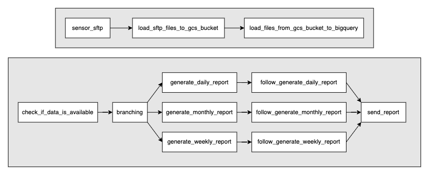
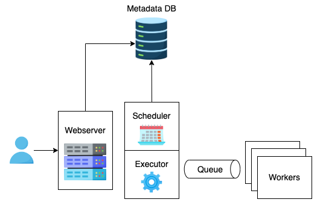
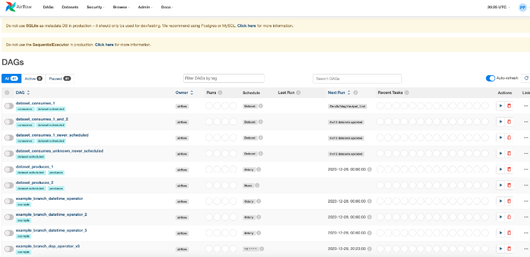

# Airflow

We will learn about most famous data orchestration platform in nowadays: **Airflow**.

When it comes to learning data orchestration tools, Airflow is a must-have.
Airflow is a widely recognized open-source workflow management tool for data engineering pipelines.
It has become the go-to choice for many data teams to streamline their data orchestration processes.

## History

- In 2014, Airflow was started at Airbnb as a solution to manage Airbnb’s increasingly complex data workflows.
- In 2015, Airbnb open-sourced Airflow. Since then, it has gained significant popularity among data engineering teams looking for a reliable workflow management solution.
- In 2019, the Apache Software Foundation officially adopted Airflow as an incubation project and in 2020, it became a top-level project with a stable codebase and a strong community.


## Architecture

At its core, **Airflow** creates workflows in the form of **DAGs**.

Each DAG consists of individual units of work called **Tasks**, each representing a single unit of work that needs to be performed.

The DAG also declares the **dependencies** between tasks to ensure they are executed in the correct order.

In general, a DAG is a workflow or a process such as:

- **ETL pipeline**: Perform the ETL process to extract data from different databases, transform it into a unified format, and load it into a data warehouse for further analysis.

- **Machine learning pipeline**: Perform the entire process of model training, evaluation, and deployment.

Here are two examples.

The first DAG involves loading files from a remote SFTP server to a GCS bucket, followed by ingestion into BigQuery.

The second DAG generates various types of reports depending on the date and sends them out.



## Infrastructure



When working with Airflow, it's important to understand the underlying infrastructure components and their functions.

This knowledge can help us develop DAGs efficiently and troubleshoot issues.

Airflow architecture consists of the following components:

- **Scheduler**: The Airflow scheduler continuously scans a designated DAG folder to identify any new or modified DAG files and processes them.
  Once parsed, the scheduler determines whether any active DAGs can be triggered at any moment.
  The scheduler also keeps track of task status until the end of the life cycle and triggers a new task once all the dependencies have been met.

- **Executor**: Once a task is ready, the scheduler uses an executor to run the task.
  Airflow provides two types of executors: **local executors for single-machine installations** and **remote executors for a multi-machine installation**.
  CeleryExecutor is a popular remote executor that works as a distributed task queue, executing tasks in parallel across multiple worker nodes.

- **Workers**: A worker node is responsible for pulling the task from the queue and executing it.
  The more worker nodes we have, the more tasks can be executed in parallel. The type of worker node depends on the executor.

!!! example

    the local executor executes tasks on the same node as the scheduler, while the Kubernetes executor executes tasks in containers.

- **Metadata database**: The metadata database is a relational database that stores the state and metadata of DAGs and their tasks, including the start time, end time, and duration of each task to identify errors during execution.
  It also stores Airflow's operational configuration, available connections, pools, variables, and other settings.

- **Webserver**: The web server is a web-based interface for users to interact with their workflows.



## Task level: **Operator**

In Airflow, there's a task which perform 1 unique job across the DAG, the task is usually calling Airflow **Operator**.

- An operator is essentially a Python class that defines what a task should do and how it should be executed within the context of the DAG.
- Operators can perform a wide range of tasks, such as running a Bash script or Python script, executing SQL, sending an email, or transferring files between systems.
- Operators provide a high-level abstraction of the tasks, letting us focus on the logic and flow of the workflow without getting bogged down in the implementation details.

!!! tip

    While Airflow provides a wide variety of operators out of the box, we may still need to create custom operators to address our specific use cases.

    All operators are extended from `BaseOperator` and we need to override two methods: `__init__` and `execute`.

    The `execute` method is invoked when the runner calls the operator.

The following example creates a custom operator `DataAnalysisOperator` that performs the requested type of analysis on an input file and saves the results to an output file.

!!! warning

    It's advised not to put expensive operations in `__init__` because it will be instantiated once per scheduler cycle.

```python
from airflow.models import BaseOperator
from airflow.utils.decorators import apply_defaults
import pandas as pd
import numpy as np
import matplotlib.pyplot as plt

class DataAnalysisOperator(BaseOperator):
    @apply_defaults
    def __init__(self, dataset_path, output_path, analysis_type, *args, **kwargs):
        super().__init__(*args, **kwargs)
        self.dataset_path = dataset_path
        self.output_path = output_path
        self.analysis_type = analysis_type

    def execute(self, context):
        # Load the input dataset into a pandas DataFrame.
        data = pd.read_csv(self.dataset_path)

        # Perform the requested analysis.
        if self.analysis_type == 'mean':
            result = np.mean(data)
        elif self.analysis_type == 'std':
            result = np.std(data)
        else:
            raise ValueError(f"Invalid analysis type '{self.analysis_type}'")

        # Write the result to a file.
        with open(self.output_path, 'w') as f:
            f.write(str(result))
```

The extensibility of the operator is one of many reasons why Airflow is so powerful and popular.

### Sensor Operator

A special type of operator is called a sensor operator.
It's designed to wait until something happens and then succeed so their downstream tasks can run.
The DAG has a few sensors that are dependent on external files, time, etc.

Common sensor types are:

- **TimeSensor**: Wait for a certain amount of time to pass before executing a task.

- **FileSensor**: Wait for a file to be in a location before executing a task.

- **HttpSensor**: Wait for a web server to become available or return an expected result before executing a task.

- **ExternalTaskSensor**: Wait for an external task in another DAG to complete before executing a task.

We can create a custom sensor operator by extending the `BaseSensorOperator` class and overriding two methods: `__init__` and `poke`.

The `poke` method performs the necessary checks to determine whether the condition has been satisfied.
If so, return `True` to indicate that the sensor has succeeded. Otherwise, return `False` to continue checking in the next interval.

Here is an example of a custom sensor operator that pulls an endpoint until the response matches with `expected_text`.

```python
from airflow.sensors.base_sensor_operator import BaseSensorOperator
from airflow.utils.decorators import apply_defaults
import requests

class EndpointSensorOperator(BaseSensorOperator):

    @apply_defaults
    def __init__(self, url, expected_text, *args, **kwargs):
        super().__init__(*args, **kwargs)
        self.url = url
        self.expected_text = expected_text

    def poke(self, context):
        response = requests.get(self.url)
        if response.status_code != 200:
            return False
        return self.expected_text in response.text
```

#### Poke mode vs. Reschedule mode

There are two types of modes in a sensor:

- **poke**: the sensor repeatedly calls its `poke` method at the specified `poke_interval`, checks the condition, and reports it back to Airflow.
  As a consequence, the sensor takes up the worker slot for the entire execution time.

- **reschedule**: Airflow is responsible for scheduling the sensor to run at the specified `poke_interval`.
  But if the condition is not met yet, the sensor will release the worker slot to other tasks between two runs.

!!! tip

    In general, poke mode is more appropriate for sensors that require short run-time and `poke_interval` is less than five minutes.

    Reschedule mode is better for sensors that expect long run-time (e.g., waiting for data to be delivered by an external party) because it is less resource-intensive and frees up workers for other tasks.

### Backfilling

**Backfilling** is an important concept in data processing.
It refers to the process of populating or updating historical data in the system to ensure that the data is complete and up-to-date.

This is typically required in two use cases:

- **Implement a new data pipeline**: If the pipeline uses an incremental load, backfilling is needed to populate historical data that falls outside the reloading window.

- **Modify an existing data pipeline**: When fixing a SQL bug or adding a new column, we also want to backfill the table to update the historical data.

!!! warning

    When backfilling the table, we must ensure that the new changes are compatible with the existing data; otherwise, the table needs to be recreated from scratch.

    Sometimes, the backfilling job can consume significant resources due to the high volume of historical data.

    It's also worth checking any possible downstream failure before executing the backfilling job.

Airflow provides the backfilling process in its cli command.

```bash
airflow backfill [dag name] -s [start date] -e [end date]
```

For better understanding of Airflow, lets deep dive into [Airflow DAG Design](airflow-dag-design.md)
