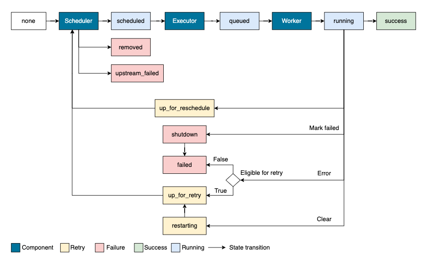
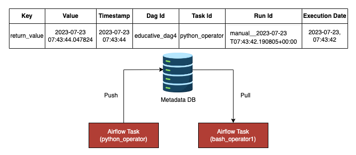

# Airflow DAG Design

To create DAGs, we just need basic knowledge of Python.
However, to create efficient and scalable DAGs, it's essential to master Airflow's specific features and nuances.

## Create a DAG object

A DAG file starts with a `dag` object. We can create a `dag` object using a context manager or a decorator.

```python
from airflow.decorators import dag
from airflow import DAG
import pendulum

# dag1 - using @dag decorator
@dag(
    schedule="30 4 * * *",
    start_date=pendulum.datetime(2023, 1, 1, tz="UTC"),
    catchup=False,
    tags=["random"]
)
def random_dag1():
    pass

random_dag1()

# dag2 - using context manager
with DAG(
    dag_id="random_dag2",
    schedule="@daily",
    start_date=pendulum.datetime(2023, 1, 1, tz="UTC"),
    catchup=False,
    tags=["random"]
) as dag2:
    pass
```

Either way, we need to define a few parameters to control how a DAG is supposed to run.

Some of the most-used parameters are:

- **start_date**: If it's a future date, it's the timestamp when the scheduler starts to run. If it's a past date, it's the timestamp from which the scheduler will attempt to backfill.

- **catch_up**: Whether to perform scheduler catch-up. If set to true, the scheduler will backfill runs from the start date.

- **schedule**: Scheduling rules. Currently, it accepts a cron string, time delta object, timetable, or list of dataset objects.

- **tags**: List of tags helping us search DAGs in the UI.

## Create a task object

A DAG object is composed of a series of dependent tasks. A task can be an operator, a sensor, or a custom Python function decorated with `@task`.
Then, we will use `>>` or the opposite way, which denotes the **dependencies** between tasks.

```python
# dag3
@dag(
    schedule="30 4 * * *",
    start_date=pendulum.datetime(2023, 1, 1, tz="UTC"),
    catchup=False,
    tags=["random"]
)
def random_dag3():

    s1 = TimeDeltaSensor(task_id="time_sensor", delta=timedelta(seconds=2))
    o1 = BashOperator(task_id="bash_operator", bash_command="echo run a bash script")
    @task
    def python_operator() -> None:
        logging.info("run a python function")
    o2 = python_operator()

    s1 >> o1 >> o2

random_dag3()
```

A task has a well-defined life cycle, including 14 states, as shown in the following graph:



## Pass data between tasks

One of the best design practices is to split a heavy task into smaller tasks for easy debugging and quick recovery.

!!! example

    we first make an API request and use the response as the input for the second API request.
    To do so, we need to pass a small amount of data between tasks.

**XComs (cross-communications)** is a method for passing data between Airflow tasks.
Data is defined as a key-value pair, and the value must be serializable.

- The `xcom_push()` method pushes data to the Airflow metadata database and is made available for other tasks.

- The `xcom_pull()` method retrieves data from the database using the key.



Every time a task returns a value, the value is automatically pushed to XComs.

We can find them in the Airflow UI `Admin` -> `XComs`. If the task is created using `@task`, we can retrieve XComs by using the object created from the upstream task.

In the following example, the operator `o2` uses the traditional syntax, and the operator `o3` uses the simple syntax:

```python
@dag(
    schedule="30 4 * * *",
    start_date=pendulum.datetime(2023, 1, 1, tz="UTC"),
    catchup=False,
    tags=["random"]
)
def random_dag4():

    @task
    def python_operator() -> None:
        logging.info("run a python function")
        return str(datetime.now()) # return value automatically stores in XCOMs
    o1 = python_operator()
    o2 = BashOperator(task_id="bash_operator1", bash_command='echo "{{ ti.xcom_pull(task_ids="python_operator") }}"') # traditional way to retrieve XCOM value
    o3 = BashOperator(task_id="bash_operator2", bash_command=f'echo {o1}') # make use of @task feature

    o1 >> o2 >> o3

random_dag4()
```

!!! warning

    Although nothing stops us from passing data between tasks, the general advice is to not pass heavy data objects, such as pandas DataFrame and SQL query results because doing so may impact task performance.

## Use Jinja templates

!!! info

    Jinja is a templating language used by many Python libraries, such as Flask and Airflow, to generate dynamic content.

    It allows us to embed variables within the text and then have those variables replaced with actual values during runtime.

Airflow's Jinja templating engine provides built-in functions that we can use between double curly braces, and the expression will be evaluated at runtime.

Users can also create their own macros using user_defined_macros and the macro can be a variable as well as a function.

```python
def days_to_now(starting_date):
    return (datetime.now() - starting_date).days

@dag(
    schedule="30 4 * * *",
    start_date=pendulum.datetime(2023, 1, 1, tz="UTC"),
    catchup=False,
    tags=["random"],
    user_defined_macros={
        "starting_date": datetime(2015, 5, 1),
        "days_to_now": days_to_now,
    })
def random_dag5():

    o1 = BashOperator(task_id="bash_operator1", bash_command="echo Today is {{ execution_date.format('dddd') }}")
    o2 = BashOperator(task_id="bash_operator2", bash_command="echo Days since {{ starting_date }} is {{ days_to_now(starting_date) }}")

    o1 >> o2

random_dag5()
```

!!! note

    The full list of built-in variables, macros and filters in Airflow can be found in the [Airflow Documentation](https://airflow.apache.org/docs/apache-airflow/stable/templates-ref.html)

Another feature around templating is the `template_searchpath` parameter in the DAG definition.

It's a list of folders where Jinja will look for templates.

!!! example

    A common use case is invoking an SQL file in a database operator such as BigQueryInsertJobOperator. Instead of hardcoding the SQL query, we can refer to the SQL file, and the content will be automatically rendered during runtime.

```python
@dag(
    schedule="30 4 * * *",
    start_date=pendulum.datetime(2023, 1, 1, tz="UTC"),
    catchup=False,
    tags=["random"],
    template_searchpath=["/usercode/dags/sql"])
def random_dag6():

    BigQueryInsertJobOperator(
        task_id="insert_query_job",
        configuration={
            "query": {
                "query": "",
                "useLegacySql": False,
            }
        }
    )

random_dag6()
```

## Manage cross-DAG dependencies

In principle, every DAG is an independent workflow.
However, sometimes, it's necessary to create **dependencies** between DAGs.

!!! example

    a DAG performs an ETL job that produces a table sales. The sales table is the source of two downstream DAGs, where one generates revenue reports, and the other one uses it to train a machine learning model.

There are several ways to implement cross-DAG dependencies in Airflow.

- `TriggerDagOperator` is an operator that triggers a downstream DAG from any point in the DAG. It's similar to a push mechanism where the producer decides when to notify the consumers.

```python
from airflow.operators.trigger_dagrun import TriggerDagRunOperator

@dag(
    schedule="30 4 * * *",
    start_date=pendulum.datetime(2023, 1, 1, tz="UTC"),
    catchup=False,
    tags=["random"]
)
def random_dag7():

    TriggerDagRunOperator(
        task_id="trigger_dagrun",
        trigger_dag_id="random_dag1",
        conf={},
    )

random_dag7()
```

- `ExternalTaskSensor` is a sensor operator for downstream DAGs to pull states of the upstream DAG, similar to a pull mechanism. The downstream DAG will wait until the task is completed in the upstream DAG.

```python
from airflow.sensors.external_task import ExternalTaskSensor

@dag(
    schedule="30 4 * * *",
    start_date=pendulum.datetime(2023, 1, 1, tz="UTC"),
    catchup=False,
    tags=["random"]
)
def random_dag8():

    ExternalTaskSensor(
        task_id="external_sensor",
        external_dag_id="random_dag3",
        external_task_id="python_operator",
        allowed_states=["success"],
        failed_states=["failed", "skipped"],
    )

random_dag8()
```

Another method introduced in `version 2.4` uses datasets to create data-driven dependencies between DAGs.

An Airflow dataset is a logical grouping of data updated by upstream tasks. The upstream task defines the output dataset via `outlets` parameter. The completion of the task means the successful update of the dataset.

In downstream DAGs, instead of using a time-based schedule, the DAG refers to the corresponding dataset produced by the upstreams.
Therefore, the downstream DAG will be triggered in a data-driven manner rather than a scheduled-based manner.

```python
dag1_dataset = Dataset("s3://dag1/output_1.txt", extra={"hi": "bye"})

@dag(
    schedule="30 4 * * *",
    start_date=pendulum.datetime(2023, 1, 1, tz="UTC"),
    catchup=False,
    tags=["random"]
)
def random_dag9_producer():
    BashOperator(outlets=[dag1_dataset], task_id="producer", bash_command="sleep 5")

random_dag9_producer()

@dag(
    schedule=[dag1_dataset],
    start_date=pendulum.datetime(2023, 1, 1, tz="UTC"),
    catchup=False,
    tags=["random"]
)
def random_dag9_consumer():
    BashOperator(task_id="consumer", bash_command="sleep 5")

random_dag9_consumer()
```

## Best practices

When working with Airflow, there are several best practices to keep in mind that help ensure our pipelines run smoothly and efficiently.

### Idempotency

**Idempotency** is a fundamental concept for data pipelines. In the context of Airflow, idempotency means running the same DAG Run multiple times has the same effect as running it only once.
When a DAG is designed to be idempotent, it can be executed repeatedly without causing unexpected changes to the pipeline's output.

This is especially necessary when a DAG Run might be rerun due to failures or errors in the processing.

!!! example

    An example to make DAG idempotent is to use templates such as variable `{{ execution_date }}`.

    It's associated with the expected scheduled time of each run, and the date won't be changed even if we rerun the DAG Run a few hours later.

### Avoid top-level code in the DAG file

By default, Airflow reads the dag folder every 30 seconds, including the top-level code that is outside of DAG context.

Because of this, having expensive top-level code, such as making requests to external APIs, can cause performance issues because they are called every 30 seconds rather than only when DAG is scheduled.

The general advice is to limit the amount of top-level code in the DAG file and move it within the DAG context or operators.

This can help reduce unnecessary overheads and allow Airflow to focus on executing the right things.

The following example shows both good and bad ways of making an API request:

```python
# Bad example - requests will be made every 30 seconds instead of everyday at 4:30am
res = requests.get("https://api.sampleapis.com/coffee/hot")

@dag(
    schedule="30 4 * * *",
    start_date=pendulum.datetime(2023, 1, 1, tz="UTC"),
    catchup=False,
    tags=["random"]
)
def random_dag7():

    @task
    def python_operator() -> None:
        logging.info(f"API result {res}")
    python_operator()

random_dag7()

# Good example

@dag(
    schedule="30 4 * * *",
    start_date=pendulum.datetime(2023, 1, 1, tz="UTC"),
    catchup=False,
    tags=["random"]
)
def random_dag7():

    @task
    def python_operator() -> None:
        res = requests.get("https://api.sampleapis.com/coffee/hot") # move API request within DAG context
        logging.info(f"API result {res}")
    python_operator()

random_dag7()
```

Reference: [Airflow Documentation](https://airflow.apache.org/docs/)
