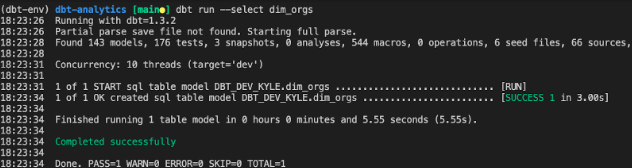
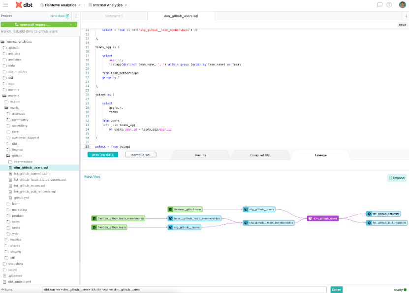
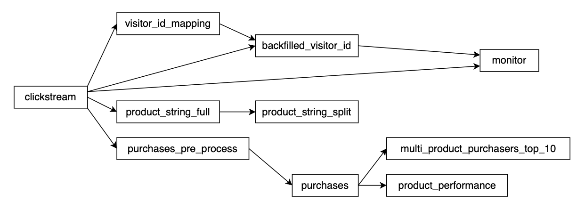

# Data Build Tool (dbt)

Airflow is great data orchestration tools, but it requires significant engineering efforts. It can become a bottleneck for data analysts and analytics engineers to build data transformation pipelines using SQL as the primary language.

!!! info

    To some extent, `dbt` is a transformation workflow, rather than a pure orchestration tool.

## History

- In 2016, Dbt was created by Tristan Handy while he was working as a data analyst at RJMetric, a SaaS-based data analytics company.
  He built dbt, which was an internal tool back then to address complex data transformation pipelines.
- In 2018, Handy founded Fishtown Analytics, a data engineering and analytics consulting company, with the goal of helping other organizations improve data analytics workflows.
- Since then, dbt has become a widely adopted open-source tool, with a growing community of users and contributors.
  It has been used by companies of all sizes to manage their data transformation pipelines and improve their data analytics workflows.

## Dbt products

At the time of writing this, dbt offers two types of products: dbt Core and dbt Cloud.

- The first product, **dbt Core**, is an open-source tool enabling data teams to transform data using best engineering practices.
  We can install dbt Core with its database adapter using command `pip install dbt-<adapter>`.

!!! example

    we can use the `dbt-bigquery` adapter.



- On the other hand, **dbt cloud** is a cloud environment that deploys dbt in a reliable and low-maintenance way.
  We can develop, test, and schedule data models all in one web-based UI.
  While dbt Core is a free and open-source tool, dbt Cloud is a paid service that offers additional features and support for enterprise-level data teams.



## Features

Unlike Airflow, whose main programming language is Python, dbt is a tool that is centered around SQL.
It opens the door to many data analysts who have been working with SQL for decades.

As a dbt user, the primary focus will be on writing models in SQL using `SELECT` statements that reflect business logic.

There is no need to write boilerplate code to create tables, update tables, which is normally the trickiest part, or define the order of model execution.

### Avoid writing boilerplate SQL using materialization

**Materialization** is a key concept in dbt that refers to the process of persisting data transformations in a database.

In other words, materialization determines how dbt converts a `SELECT` statement into a physical table or view.
It avoids boilerplate SQL around table creation and update.

!!! info

    In contrast, to build a table in Airflow, we need to manage a few process-related SQL.

    This includes writing SQL statements such as `CREATE OR REPLACE` and `MERGE` (a complex one), as well as maintaining table schema and incremental logic.

    This can create maintenance overhead for nontechnical users who may not have a deep understanding of SQL and data engineering, making it more difficult and time-consuming to manage data transformations.

Dbt streamlines this part by providing materialization types through a config section in each data model.

```sql
{{ config(materialized='table') }}

select *
from ...
```

- **Table**: The model is rebuilt as a table each time. Under the hood, dbt runs the `CREATE TABLE AS` statement.

- **View**: The model is rebuilt as a view each time. Under the hood, dbt runs the `CREATE VIEW AS` statement.

- **Incremental**: Dbt inserts or updates records into a table since the last time.
  It's useful for big tables where recreating the table each time is time-consuming and expensive. For BigQuery, under the hood, dbt runs the `MERGE` statement.

- **Ephemeral**: The model is not built into the database.
  Instead, dbt interpolates the code into the dependent model as a CTE. The ephemeral model is a powerful type for resuing CTEs across multiple data models.

### Determine the order of model execution

When referring to another model within dbt, dbt uses `ref` keyword instead of referencing the physical table name in the data warehouse.

!!! example

    instead of referencing a physical table like `my_database.my_schema.my_table`, it's better to use `ref('my_table')` and `my_table` as the model name.

This is because using `ref` allows dbt to automatically manage the dependencies between models and ensures that they are executed in the correct order.

Another advantage is that using `ref` makes the dbt project more modular and easier to maintain because we can update the underlying physical table names without having to update all the downstream models.

Dbt Cloud offers the dependency graph, which is useful for understanding how our models are related to each other and for easy debugging.
It also helps us to ensure that our models are executed in the correct order.



### Use Jinja to create reusable SQL

Another great feature that makes dbt a productive tool is its use of Jinja templates. Similar to Airflow, dbt utilizes Jinja to enable dynamic SQL generation and create reusable code snippets in macros.

Here is an example of a dbt model that uses Jinja with the `if` and `for` loops:

```sql


select
    date,
    
        SUM(case when product = '{{ product }}' then quantity * price else 0 end) as {{ product }}_revenue,
    
    SUM(quantity * price) AS total_revenue
    from {{ ref('table_sales') }}
group by 1
```

That model will be compiled into an executable query:

```sql
select
  date,
  SUM(case when product = 'apple' then quantity * price else 0 end) as apple_revenue,
  SUM(case when product = 'pear' then quantity * price else 0 end) as pear_revenue,
  SUM(case when product = 'banana' then quantity * price else 0 end) as banana_revenue,
  SUM(quantity * price) AS total_revenue
  from `your_project_id`.`your_dataset_id`.`table_sales`
group by 1
```

Apart from built-in Jinja templates, we can create macros to generate customized SQL code that can be shared across multiple data models.

This approach helps standardize best practices within our data team, much like creating utility functions in Python.

```sql

  CONCAT(EXTRACT(YEAR from {{ column_name }} at time zone "UTC"), '-', EXTRACT(MONTH from {{ column_name }} at time zone "UTC"))

```

Then, the macro is used in the data model like this:

```sql
{{ config(materialized='table') }}

SELECT
  {{ convert_date('date') }} as date
FROM my_table
```

### Other features

- In addition to the above, even seemingly minor features in dbt can have a big impact on the data team's workflow.

!!! example

    package management in dbt allows us to install packages like [dbt_utils](https://hub.getdbt.com/dbt-labs/dbt_utils/latest/) from the community as well as create and distribute packages to other teams.

- Working with external data in CSV or JSON in a common scenario.
  With dbt's seed functionality, we can quickly and easily load small CSV or JSON files into the data warehouse using the `dbt seed` command.
  This can be particularly useful for populating small tables with test data, for quickly prototyping a new data model, or storing a config file coming from an external system.
