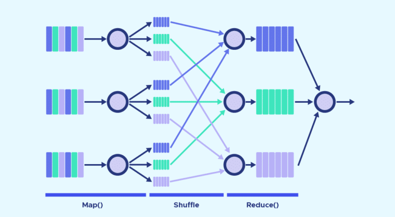
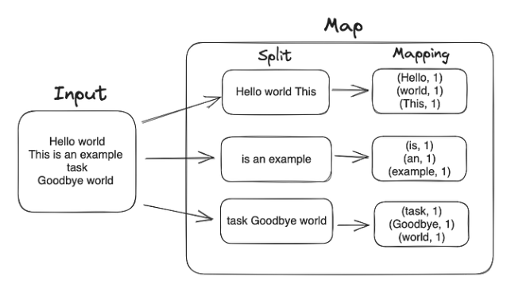
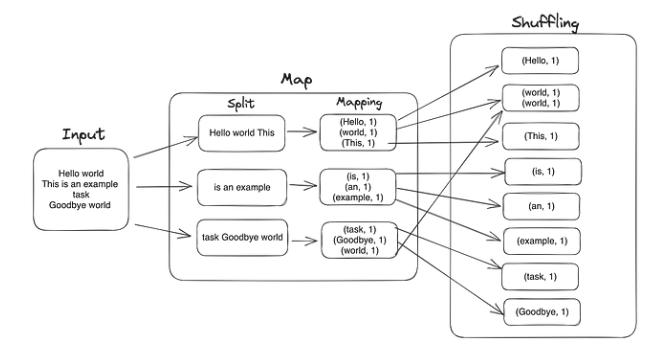
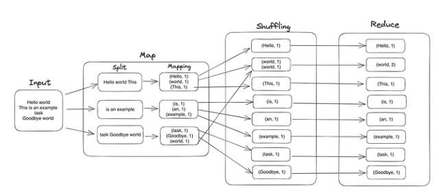

# Data Processing

Over past few decades, numerous programming models have emerged to address the challenge of processing big data at scale.
Undoubtedly, MapReduce stands out as one of the most popular and effective approaches.

## What is MapReduce

MapReduce is a distributed programming framework originally developed at Google by Jeffrey Dean and Sanjay Ghemawat, back in 2004 and was inspired by fundamental concepts of functional programming.

Their proposal invloved a parallel data processing model consisting of two steps; **map** and **reduce**.

In simple terms,

- **map** involves the division of the original data into small chunks such that transformation logic can be applied to individual data blocks.
- Data processing can therefore be applied in parallel across the created chunks.
- Finally, **reduce** will then aggregate/consolidate the processed blocks and return the end result back to the caller.

## How does MapReduce work?

A MapReduce system is usually composed of 3 steps (even though it's generalized as the combination of Map and Reduce operations/functions).

The MapReduce operations are:

### Map

The input data is first split into smaller blocks. The Hadoop framework then decides how many mappers to use, based on the size of the data to be processed and the memory block available on each mapper server.

Each block is then assigned to a mapper for processing. Each `worker` node applies the map function to the local data, and writes the output to temporary storage.

The primary (master) node ensures that only a single copy of the redundant input data is processed.

### Shuffle, combine and partition

worker nodes redistribute data based on the output keys (produced by the map function), such that all data belonging to one key is located on the same worker node.

As an optional process the combiner (a reducer) can run individually on each mapper server to reduce the data on each mapper even further making reducing the data footprint and shuffling and sorting easier.

Partition (not optional) is the process that decides how the data has to be presented to the reducer and also assigns it to a particular reducer.

### Reduce

A reducer cannot start while a mapper is still in progress. Worker nodes process each group of <key,value> pairs output data, in parallel to produce <key,value> pairs as output.

All the map output values that have the same key are assigned to a single reducer, which then aggregates the values for that key.

Unlike the map function which is mandatory to filter and sort the initial data, the reduce function is optional.

## Some considerations with MapReduce

- **Rigid Map Reduce programming paradigm**

While exposing Map and Reduce interfaces to programmers has simplified the creation of distributed applications in Hadoop,  it is difficult to express a broad range of logic in a Map Reduce programming paradigm.

Iterative process is an example of logic that does not work well in Map Reduce.

- **Read/Write intensive**

MapReduce jobs store little data in memory as it has no concept of a distributed memory structure for user data. Data must be read and written to HDFS.

More complex MapReduce applications involve chaining smaller MapReduce jobs together.

Since data cannot be passed between these jobs, it will require data sharing via HDFS. This introduces a processing bottleneck.

- **Java focused**

MapReduce is Java-based, and hence the most efficient way to write applications for it will be using java.

Its code must be compiled in a separate development environment, then deployed into the Hadoop cluster.

This style of development is not widely adopted by Data Analysts nor Data Scientists who are used to other technologies like SQL or interpreted languages like Python.

MapReduce does have the capability to invoke Map/Reduce logic written in other languages like C, Python, or Shell Scripting.

- **Phased out from big data offerings**

MapReduce is slowly being phased out of Big Data offerings. While some vendors still include it in their Hadoop distribution, it is done so to support legacy applications.

Customers have moved away from creating MapReduce applications, instead adopting simpler and faster frameworks like Apache Spark.

## MapReduce and Hadoop

MapReduce is part of the Apache Hadoop framework that is used to access data stored in Hadoop Distributed File System (HDFS).

Hadoop consists of four basic modules:

- **Hadoop Distributed File System (HDFS)**: This ia a distributed file system that can store large datasets in a fault-tolerant fashion

- **Yet Another Resource Negotiation (YARN)**: This is the node manager that monitors cluster and resources. It also acts as the scheduler of jobs

- **MapReduce**

- **Hadoop Common**: This is a module that provides commonly used Java libraries

## What is MapReduce used for?

Legacy applications and Hadoop native tools like Sqoop and Pig leverage MapReduce today.

There is very limited MapReduce application development nor any significant contributions being made to it as an open source technology.

But, in nowadays, MapReduce is becoming a great breakthrough to the updated data processing framework, such as Apache Spark, Apache Storm, Google BigQuery, etc.

We will deep dive into some updated framework, such as:

- [Apache Spark](apache-spark/README.md)
- [Google BigQuery](bigquery/README.md)

## References

- [MapReduce](https://www.databricks.com/glossary/mapreduce)
- [Processing Data at Scale with MapReduce](https://towardsdatascience.com/mapreduce-f0d8776d0fcf)
- [Apache Hadoop](https://hadoop.apache.org/)
