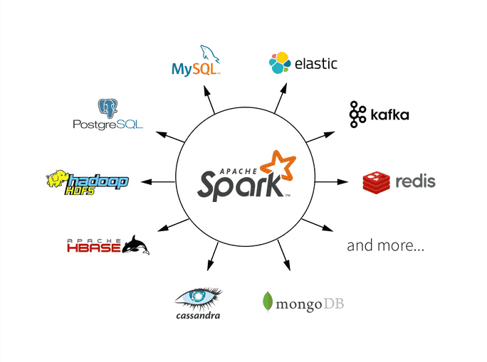

# Apache Spark



Apache Spark is a multi-language engine for executing data engineering, data science, and machine learning on single-node machines or clusters.

Some of the key features:

- **Batch/streaming data**

Unify the processing of data in batches and real-time streaming, using preferred languages: Python, SQL, Scala, Java or R.

- **SQL analytics**

Execute fast, distributed ANSI SQL queries for dashboarding and ad-hoc reporting.

- **Data science at scale**

Perform Exploratory Data Analysis (EDA) on petabyte-scale data without having to resort to downsampling.

- **Machine learning**

Train machine learning algorithms on a laptop and use the same code to scale to fault-tolerant clusters of thousands of machines.

Example in pyspark:

```bash
docker run -it --rm spark:python3 /opt/spark/bin/pyspark
```

```python
df = spark.read.json("logs.json")
df.where("age > 21").select("name.first").show()
```

## How does Apache Spark work?

Hadoop MapReduce is a programming model for processing big data sets with a parallel, distributed algorithm. Developers can write massively parallelized operators, without having to worry about work distribution, and fault tolerance.

However, a challenge to MapReduce is the sequential multi-step process it takes to run a job.

With each step, MapReduce reads data from the cluster, performs operations, and writes the results back to HDFS.

Because each step requires a disk read, and write, MapReduce jobs are slower due to the latency of disk I/O.

Spark was created to address the limitations to MapReduce, by

- doing processing in-memory
- reducing the number of steps in a job
- by reusing data across multiple parallel operations

!!! info

    With Spark, only one-step is needed where data is read into memory, operations performed, and the results written back—resulting in a much faster execution.

Spark also reuses data by using an in-memory cache to greatly speed up machine learning algorithms that repeatedly call a function on the same dataset.

Data re-use is accomplished through the creation of DataFrames, an abstraction over Resilient Distributed Dataset (RDD), which is a collection of objects that is cached in memory, and reused in multiple Spark operations.

This dramatically lowers the latency making Spark multiple times faster than MapReduce, especially when doing machine learning, and interactive analytics.

# What are Apache Spark workloads?

The Spark framework includes:

- Spark Core as the foundation for the platform
- Spark SQL for interactive queries
- Spark Streaming for real-time analytics
- Spark MLlib for machine learning
- Spark GraphX for graph processing


## References

- [Apache Spark](https://spark.apache.org/)
- [AWS - What is Apache Spark?](https://aws.amazon.com/what-is/apache-spark/)
