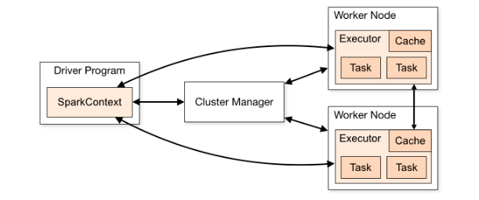

# Apache Spark


Apache Spark is a multi-language engine for executing data engineering, data science, and machine learning on single-node machines or clusters.

Some of the key features:

- **Batch/streaming data**

Unify the processing of data in batches and real-time streaming, using preferred languages: Python, SQL, Scala, Java or R.

- **SQL analytics**

Execute fast, distributed ANSI SQL queries for dashboarding and ad-hoc reporting.

- **Data science at scale**

Perform Exploratory Data Analysis (EDA) on petabyte-scale data without having to resort to downsampling.

- **Machine learning**

Train machine learning algorithms on a laptop and use the same code to scale to fault-tolerant clusters of thousands of machines.

Example in pyspark:

```bash
docker run -it --rm spark:python3 /opt/spark/bin/pyspark
```

```python
df = spark.read.json("logs.json")
df.where("age > 21").select("name.first").show()
```

## How does Apache Spark work?

Hadoop MapReduce is a programming model for processing big data sets with a parallel, distributed algorithm. Developers can write massively parallelized operators, without having to worry about work distribution, and fault tolerance.

However, a challenge to MapReduce is the sequential multi-step process it takes to run a job.

With each step, MapReduce reads data from the cluster, performs operations, and writes the results back to HDFS.

Because each step requires a disk read, and write, MapReduce jobs are slower due to the latency of disk I/O.

Spark was created to address the limitations to MapReduce, by

- doing processing in-memory
- reducing the number of steps in a job
- by reusing data across multiple parallel operations

!!! info

    With Spark, only one-step is needed where data is read into memory, operations performed, and the results written back—resulting in a much faster execution.

Spark also reuses data by using an in-memory cache to greatly speed up machine learning algorithms that repeatedly call a function on the same dataset.

Data re-use is accomplished through the creation of DataFrames, an abstraction over Resilient Distributed Dataset (RDD), which is a collection of objects that is cached in memory, and reused in multiple Spark operations.

This dramatically lowers the latency making Spark multiple times faster than MapReduce, especially when doing machine learning, and interactive analytics.

## What are Apache Spark workloads?

The Spark framework includes:

- Spark Core as the foundation for the platform
- Spark SQL for interactive queries
- Spark Streaming for real-time analytics
- Spark MLlib for machine learning
- Spark GraphX for graph processing


## Spark Architecture



Applications of Spark architecture which exists in above diagram:

### Spark driver

The driver is the program or process responsible for coordinating the execution of the Spark application. It runs the main function and creates the SparkContext, which connects to the cluster manager.

### Spark executors

Executors are worker processes responsible for executing tasks in Spark applications. They are launched on worker nodes and communicate with the driver program and cluster manager. Executors run tasks concurrently and store data in memory or disk for caching and intermediate storage.

### Cluster manager

The cluster manager is responsible for allocating resources and managing the cluster on which the Spark application runs. Spark supports various cluster managers like Apache Mesos, Hadoop YARN, and standalone cluster manager.

### sparkContext

SparkContext is the entry point for any Spark functionality. It represents the connection to a Spark cluster and can be used to create RDDs (Resilient Distributed Datasets), accumulators, and broadcast variables. SparkContext also coordinates the execution of tasks.

### Task

A task is the smallest unit of work in Spark, representing a unit of computation that can be performed on a single partition of data. The driver program divides the Spark job into tasks and assigns them to the executor nodes for execution.

### Useful things to note about this architecture

- **Each application gets its own executor processes, which stay up for the duration of the whole application and run tasks in multiple threads**

This has the benefit of isolating applications from each other, on both the scheduling side (each driver schedules its own tasks) and executor side (tasks from different applications run in different JVMs).

- **Spark is agnostic to the underlying cluster manager**

As long as it can acquire executor processes, and these communicate with each other, it is relatively easy to run it even on a cluster manager that also supports other applications (e.g. Mesos/YARN/Kubernetes).

- **The driver program must listen for and accept incoming connections from its executors throughout its lifetime**

As such, the driver program must be network addressable from the worker nodes.

- **Because the driver schedules tasks on the cluster, it should be run close to the worker nodes, preferably on the same local area network**

If you’d like to send requests to the cluster remotely, it’s better to open an RPC to the driver and have it submit operations from nearby than to run a driver far away from the worker nodes.

## Cluster Manager Types

The system currently supports several cluster managers:

- **Standalone** – a simple cluster manager included with Spark that makes it easy to set up a cluster.
- ~~**Apache Mesos (Deprecated)** – a general cluster manager that can also run Hadoop MapReduce and service applications.~~
- **Hadoop YARN** – the resource manager in Hadoop 3.
- **Kubernetes** – an open-source system for automating deployment, scaling, and management of containerized applications.

## Monitoring


Each driver program has a web UI, typically on port 4040, that displays information about running tasks, executors, and storage usage. Simply go to `http://<driver-node>:4040` in a web browser to access this UI.

## Job Scheduling

Spark gives control over resource allocation both across applications (at the level of the cluster manager) and within applications (if multiple computations are happening on the same **SparkContext**).

## Spark Optimization

There are several techniques to more optimize spark jobs, we can look into [Spark Optimization](spark-optimization.md)

## References

- [Apache Spark](https://spark.apache.org/)
- [AWS - What is Apache Spark?](https://aws.amazon.com/what-is/apache-spark/)
- [Apache Spark - Cluster Overview](https://spark.apache.org/docs/latest/cluster-overview.html)
- [Spark Architecture: A Deep Dive](https://medium.com/@amitjoshi7/spark-architecture-a-deep-dive-2480ef45f0be)
