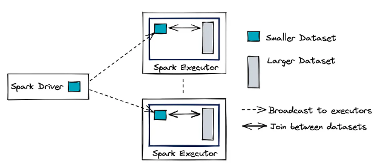

# Spark Optimizations


Spark is commonly used to apply transformations on data, structured in most cases.
There are 2 scenarios in which it is particularly useful.

!!! tip

    When the data to be processed is too large for the available computing and memory resources.

Finally, it is also an alternative when one wants to accelerate calculation by using several machines within the same network.
In both cases, a major concern is to optimize the calculation time of a Spark job.

In response to this problem, we often increase the resources allocated to a computing cluster.

But, in order to avoid an exhaustive search for the best configuration settings, which is naturally very costly, we will exhibit actionable solutions to maximise our chances of reducing computation time.

Each step will be materialized by a recommandation, as justified as possible.

More other table join strategies are available in Spark Databricks, [Optimizing Apache Spark SQL Joins](https://databricks.com/fr/session/optimizing-apache-spark-sql-joins).

## Use the Apache Parquet file format

The [Apache Parquet](https://parquet.apache.org/) format is officially a column-oriented storage. Actually, it's more of a hybrid format between row and column storage.

It's used for tabular data. Data in the same column are stored contiguously.


This format is particularly suitable when performing queries (transformations) on a subset of columns and on a large dataframe. This is because it loads only the data associated with the required columns into memory.

Moreover, as the compression scheme and the encoding are specific to each column according to the typing, it improves the reading / writing of these binary files and their size on disk.

These advantages make it a very interesting alternative to the CSV format. This is the format recommended by Spark and the default format for writing.

## Maximise parallelism in Spark

Spark’s efficiency is based on its ability to process several tasks in parallel at scale.
Therefore, the more we facilitate the division into tasks, the faster they will be completed. This is why optimizing a Spark job often means reading and processing as much data as possible in parallel.

And to achieve this goal, it is necessary to split a dataset into several partitions.

Partitioning a dataset is a way of arranging the data into configurable, readable subsets of contiguous data blocks on disk. These partitions can then be read and processed independently and in parallel. It is this independence that enables massive data processing.

Ideally, Spark organises one thread per task and per CPU core. Each task is related to a single partition. Thus, a first intuition is to configure a number of partitions at least as large as the number of available CPU cores.

All cores should be occupied most of the time during the execution of the Spark job. If one of them is available at any time, it should be able to process a job associated with a remaining partition.

The goal is to avoid bottlenecks by splitting the Spark job stages into a large number of tasks. This fluidity is crucial in a distributed computing cluster.

The following diagram illustrates this division between the machines in the network.


Partitions can be created:

- When reading the data by setting the `spark.sql.files.maxPartitionBytes` parameter (default is 128 MB).

A good situation is when the data is already stored in several partitions on disk. For example, a dataset in parquet format with a folder containing data partition files between 100 and 150 MB in size.

- Directly in the Spark application code using the Dataframe API.

```python
dataframe.repartition(100)
dataframe.coalesce(100)
```

This last method `coalesce` decreases the number of partitions while avoiding a `shuffle` in the network.

!!! warning

    One might be tempted to increase the number of partitions by lowering the value of the `spark.sql.files.maxPartitionBytes` parameter.
    
    However, this choice can lead to the **small file problem**.
    
    There is a deterioration of I/O performance due to the operations performed by the file system (e.g. opening, closing, listing files), which is often amplified with a distributed file system like *HDFS*.
    
    Scheduling problems can also be observed if the number of partitions is too large.

## Beware of Shuffle Operations

There is a specific type of partition in Spark called a **shuffle partition**. 
These partitions are created during the stages of a job involving a shuffle, i.e. when a **wide transformation** (e.g. `groupBy()`, `join()`) is performed.
The setting of these partitions impacts both the network and the read/write disk resources.

The value of `spark.sql.shuffle.partitions` can be modified to control the number of partitions.

!!! info

    By default, this is set to 200, which may be too high for some processing, and results in too many partitions being exchanged in the network between the executing nodes.

    This parameter should be adjusted according to the size of the data.

!!! tip

    An intuition might be to start with a value at least equal to the number of CPU cores in the cluster.

Spark stores the intermediate results of a shuffle operation on the local disks of the executor machines, so the quality of the disks, especially the I/O quality, is really important.

!!! example

    the use of SSD disks will significantly improve performance for this type of transformation.

The table below describes the main parameters that we can also influence.


## Use Broadcast Hash Join

A join between several dataframe is a common operation.

In a distributed context, a large amount of data is exchanged in the network between the executing nodes to perform the join.

Depending on the size of the tables, this exchange causes network latency, which slows down processing.

Spark offers several join strategies to optimise this operation. One of them is particularly interesting if it can be chosen: `Broadcast Hash Join (BHJ)`.

!!! tip

    This technique is suitable when **one of the merged dataframe is “sufficiently” small to be duplicated in memory on all the executing nodes** (broadcast operation). The diagram below illustrates how this strategy works.



By duplicating the smallest table, **the join no longer requires any significant data exchange in the cluster apart from the broadcast of this table beforehand**. 

This strategy greatly improves the speed of the join. The Spark configuration parameter to modify is `spark.sql.autoBroadcastHashJoin`.

!!! tip

    The default value is 10 MB, i.e. this method is chosen if one of the two tables is smaller than this size.
    
    If sufficient memory is available, it may be very useful to increase this value or set it to -1 to force Spark to use it.

## Cache intermediate results

To optimise its computations and manage memory resources, Spark uses *lazy evaluation* and a DAG to describe a job.

This offers the possibility of quickly **recalculating the steps before an action if necessary**, and thus executing only part of the DAG.

To take full advantage of this functionality, it is very wise to **store expensive intermediate results** if several operations use them downstream of the DAG.

Indeed, if an action is run, its computation can be based on these intermediate results and thus only replay a sub-part of the DAG before this action.

following DAG as example


To obtain the results of the 2 actions, the treatments are described in the 2 DAGs below.


In order to speed up the execution, one can decide to cache intermediate results (e.g. the result of a join)


The processing of the second action is now simplified.

!!! note

    During the first action, the results have not yet been stored in memory.


!!! tip

    If this caching can speed up execution of a job, we pay a **cost when these results are written to memory and/or disk**.
    
    It should be tested at different locations in the processing pipeline whether the total time saving outweighs the cost.
    
    This is especially relevant when there are several paths on the DAG.

!!! note

    Caching, like any Spark transformation, is performed when an action is run. 
    
    If the computation of this action involves only a sub-part of the data, then only the intermediate results for that sub-part will be stored.

A table can be cached using the following command

```python
dataframe.persist(storageLevel="MemoryOnly")
```

The different caching options are described in the table below


## Manage the memory of the executor nodes

The memory of a Spark executor is broken down as follows


By default, the `spark.memory.fraction` parameter is set to 0.6.

This means that 60% of the memory is allocated for execution and 40% for storage, once the reserved memory is removed.

This is 300 MB by default and is used to prevent **out of memory (OOM)** errors.

We can modify the following 2 parameters:

- `spark.executor.memory`
- `spark.memory.fraction`

## Partitioning

## Bucketing

## References

- [Recommendations for Optimizing a Spark job](https://towardsdatascience.com/6-recommendations-for-optimizing-a-spark-job-5899ec269b4b)
- [Apache Spark Partitioning and Bucketing](https://medium.com/p/1790586e8917)
