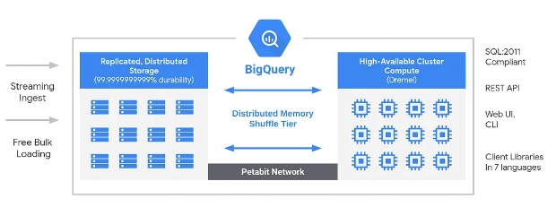

# Google BigQuery


**BigQuery** is a fully managed enterprise data warehouse that helps you manage and analyze your data with built-in features like machine learning, geospatial analysis, and business intelligence.

Its serverless architecture lets you use SQL queries to answer your organization's biggest questions with zero infrastructure management. Federated queries let you read data from external sources while streaming supports continuous data updates.

BigQuery's scalable, distributed analysis engine lets you query terabytes in seconds and petabytes in minutes.

## BigQuery Architecture

BigQuery’s serverless architecture decouples storage and compute and allows them to scale independently on demand.

This structure offers both immense flexibility and cost controls for customers because they don’t need to keep their expensive compute resources up and running all the time.

This is very different from traditional node-based cloud data warehouse solutions or on-premise massively parallel processing (MPP) systems.

This approach also allows customers of any size to bring their data into the data warehouse and start analyzing their data using Standard SQL without worrying about database operations and system engineering.



Under the hood, BigQuery employs a vast set of multi-tenant services driven by low-level Google infrastructure technologies like Dremel, Colossus, Jupiter and Borg.


### Dremel: The Execution Engine

Compute is [Dremel](https://research.google/pubs/dremel-interactive-analysis-of-web-scale-datasets-2/), a large multi-tenant cluster that executes SQL queries

- **Dremel turns SQL queries into execution trees**

The leaves of the tree are called slots and do the heavy lifting of reading data from storage and any necessary computation. The branches of the tree are ‘mixers’, which perform the aggregation.

- **Dremel dynamically apportions slots**

it will dynamically apportions slots to queries on an as-needed basis, maintaining fairness for concurrent queries from multiple users.
A single user can get thousands of slots to run their queries.

### Colossus: Distributed Storage

Storage is [Colossus](https://cloud.google.com/files/storage_architecture_and_challenges.pdf), Google's global storage system.

- **BigQuery leverages the columnar storage format and compression algorithm to store data in Colossus**

It is optimized for reading large amounts of structured data.

- **Colossus also handles replication, recovery (when disks crash) and distributed management (so there is no single point of failure)**

Colossus allows BigQuery users to scale to dozens of petabytes of data stored seamlessly, without paying the penalty of attaching much more expensive compute resources as in traditional data warehouses.

### Borg: Compute

To give you thousands of CPU cores dedicated to processing your task, BigQuery takes advantage of [Borg](https://research.google/pubs/large-scale-cluster-management-at-google-with-borg/), Google’s large-scale cluster management system.

Borg clusters run on dozens of thousands of machines and hundreds of thousands of cores, so your query which used 3300 CPUs only used a fraction of the capacity reserved for BigQuery, and BigQuery’s capacity is only a fraction of the capacity of a Borg cluster.

Borg assigns server resources to jobs; the job in this case is the Dremel cluster.

### Jupiter: The Network

[Jupiter](https://cloudplatform.googleblog.com/2015/06/A-Look-Inside-Googles-Data-Center-Networks.html) networking infrastructure might be the single biggest differentiator in Google Cloud Platform.

It provides enough bandwidth to allow 100,000 machines to communicate with any other machine at 10 Gbs.
The networking bandwidth needed to run our query would use less than 0.1% of the total capacity of the system.

This full-duplex bandwidth means that locality within the cluster is not important. If every machine can talk to every other machine at 10 Gbps, racks don’t matter.

## How you get started with BigQuery?

You can start using BigQuery simply by loading data and running SQL commands. There’s no need to build, deploy, or provision clusters; no need to size VMs, storage, or hardware resources; no need to setup disks, define replication, configure compression and encryption, or any other setup or configuration work necessary to build a traditional data warehouse.

> you can try to play around in [BigQuery Sandbox](https://cloud.google.com/bigquery/docs/sandbox)

!!! example "Query example"

    ```sql
    SELECT 
      EXTRACT(YEAR FROM creation_date) AS year,
      EXTRACT(MONTH FROM creation_date) AS month,
      COUNT(creation_date) AS number_posts
    FROM
      `bigquery-public-data.stackoverflow.stackoverflow_posts`
    WHERE
      answer_count > 0
    GROUP BY year, month
    ORDER BY year ASC, month ASC
    ```

Output


## References

- [Google BigQuery Overview](https://cloud.google.com/bigquery/docs/introduction)
- [BigQuery under the hood](https://cloud.google.com/blog/products/bigquery/bigquery-under-the-hood)
- [Dremel: Interactive Analysis of Web-Scale Datasets](https://research.google/pubs/dremel-interactive-analysis-of-web-scale-datasets-2/)
- [Storage Architecture and Challenges by Google](https://cloud.google.com/files/storage_architecture_and_challenges.pdf)
- [GCP: A look inside Google's Data center networks](https://cloudplatform.googleblog.com/2015/06/A-Look-Inside-Googles-Data-Center-Networks.html)
- [Large-scale cluster management at Google with Borg](https://research.google/pubs/large-scale-cluster-management-at-google-with-borg/)
