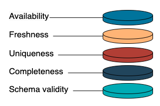

# Data Quality

Data engineering is all about delivering high-quality data to the right people at the right time.

!!! note

    High-quality data is essential for making accurate and reliable decisions.

    Poor data quality can lead to poor business decisions, which can lead to lost revenue, decreased customer satisfaction, increased costs, and damaged reputation.

So, what does high-quality data mean, why is it important, and how to evaluate and measure it?

## What is bad data?

One effective approach to grasping the concept of quality data is to consider its opposite: what is bad data? Which types of data consistently get complaints from stakeholders?

Let's look at a few real-life examples:

- **Data accuracy**: For example, in the computation of net revenue, there's a risk of overlooking a specific cost type, resulting in an inaccurately calculated revenue figure.

- **Data freshness**: Stakeholders engage in daily analyses relying on the previous day's figures. If they discover that the numbers haven't been updated, frustration ensues, causing a delay in their decision-making process.

- **Breaking schema changes**: Data users encounter challenges when a column or table has been deleted or renamed, disrupting the functionality of their scripts.

- **Column description**: The column names or descriptions are not descriptive enough for users to comprehend their meaning effectively.

- **Data duplication**: A bug in the SQL logic can cause duplicates.

- **Data availability**: The table or the database is not reachable.

The list can go on and on, but we can summarize the above examples into the following dimensions of data quality.

## Data quality dimensions

Data quality dimensions can be broadly grouped into 2 categories:

- [**business dimensions**](#business-dimensions)
- [**technical dimensions**](#technical-dimensions)

### Business dimensions

!!! note

    Ultimately, the output of data engineering work is to derive data insights, whether it’s used to generate some metric dashboards, or it is used to directly power some product features, or it is used as input data to machine learning models.

Either way, it must be enriched with a business context that aids downstream users.
Having a business-driven mindset means that we should understand the business problems and ensure that data quality is evaluated from a business perspective before focusing on technical aspects.

#### Descriptive

Having **clear** and **informative** column names and **descriptions** in a data warehouse is more important than most people realize.

!!! danger

    A wrong interpretation of the metric can have serious consequences for decision-making and people would only realize it after some time.

!!! example

    Suppose a company has a metric `ticket_resolved_time` that measures the time it takes for customer support tickets to be resolved.

    Without descriptions, it is difficult to make the correct "guess."

    Some people believe it is the time elapsed between when the customer first opens a ticket and when it is resolved, while others think it should be measured from when the support team picks up the ticket until it is resolved.

**Clear column descriptions** provide rich **context** and **understanding** of the data.
Further down the line, it also facilitates **data governance and management**.

#### User-driven

Any data engineering system is built to solve specific business problems. In a way, the downstream use cases set expectations for the metric's definition and data quality.

It's common that metrics become redundant after a year or so due to decreased demand from the business side.

Therefore, monitoring metric usability to keep metrics as relevant to business as possible is an essential task.

### Technical dimensions

Technical dimensions are a set of measurable dimensions that can be incorporated into data pipelines because, as the saying goes, “what gets measured gets improved.”

These dimensions serve as a blueprint for developing a comprehensive data quality framework across the entire company.

There are several data tools that provide pre-built solutions to ensure the quality of data in these areas.

#### Availability

> High data availability means that the data is easily and readily accessible to authorized users at any time.

If a table is not available, the reason can be attributed to either an issue with the cloud provider, such as BigQuery, or a problem with the data pipeline.
Most cloud providers provide an **SLA (service level agreement)**, a contract that specifies the level of service and performance guarantees that the provider will deliver to its customers.

!!! example

    For instance, BigQuery promises an uptime of 99.99%. Whenever a table is unavailable due to BigQuery issues, as BigQuery users, we can get certain compensation.

#### Freshness

Fresh data refers to the most up-to-date information that is available for analysis.

> This means that the data is as recent as possible and reflects the latest changes that have occurred in the source system.

The freshness of the data is an important factor in making timely and informed business decisions.

!!! example

    In the case of a daily revenue dashboard, missing data from yesterday can cause delays in the financial analysis.

Freshness has become an indispensable measurement as more companies aim to achieve near real-time analysis.

#### Uniqueness

> One of the common issues in the source data is duplication which can lead to misleading analysis.

It is worth noting that the definition of uniqueness varies from case to case.

!!! example

    It could be unique on the column level such as `customer_id`.

    This means each row should have a unique customer ID, while the remaining columns may or may not be the same.
    It could also be unique at the level of a couple of columns such as the combination of `order_id` and `product_id`, sometimes even at the level of the entire row.

#### Completeness

In reality, data points could be missing for many reasons, whether it is caused by a source issue or a bug in the business logic, or an inappropriate join or filter condition.

> Data completeness is a dimension that captures the number of data points containing values.

!!! note

    In certain situations, incomplete data is expected given the nature of the business.

    However, in other cases, incomplete data may be a sign of a data issue that requires attention.

#### Schema validity

> Data schema is a fundamental component in a data warehouse, and is crucial for meeting users' expectations.

Users are typically the first to report the issue when there is a breaking change in the data schema.

Generally, data schema includes a few aspects:

- Format — whether it's a CSV file, JSON file, or BigQuery table
- File/table name
- Column name and column type

!!! tip

    A well-structured data schema communicates the purpose of the data and specifies its constraints.

    The more constraints included in the schema, the less likely inaccurate data will result. Before any major change happens, it's extremely important to communicate effectively with data users.

    Since 2022, data contracts have become a popular technique for ensuring that data always adheres to the schema.

Every company should establish its own data quality framework, including the abovementioned dimensions.

A solid framework standardizes the approach to managing data quality across the company and ensures that everybody has the same understanding of what good data is.

Some open source frameworks can provide data quality based on use cases:

- [dbt test](dbt-test/README.md) from [https://docs.getdbt.com/docs/build/data-tests](https://docs.getdbt.com/docs/build/data-tests)
- [soda.io](https://www.soda.io/)
- [great expectations](https://greatexpectations.io/)
- [open metadata](https://open-metadata.org/)
- many more

Reference: [Educative - Data Quality](https://www.educative.io/courses/data-engineering-foundations)
