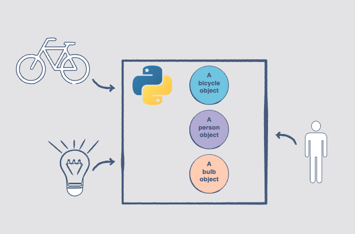

# Object-oriented programming

Object-oriented programming, also referred to as OOP, is a programming paradigm that includes, or relies, on the concept of classes and objects.

!!! note

    The basic entities in object-oriented programming are classes and objects.

Programming isn’t much use if you can’t model real-world scenarios using code, right? This is where object-oriented programming comes.

!!! note

    The basic idea of OOP is to divide a sophisticated program into a number of objects that talk to each other.

Objects in a program frequently represent real-world objects.

It is also possible for objects to serve application logic and have no direct, real-world parallels. They manage things like authentication, templating,
request handling, or any of the other myriad features needed for a practical application.

There are couple of items to completely understand Object Oriented Programming concept in Python:

- [Class](class/README.md)
- [Encapsulation](encapsulation/README.md)
- [Inheritance](inheritance/README.md)
- [Polymorphism](polymorphism/README.md)
- [Object Relationship](object-relationship/README.md)

Reference: [Educative: Learn Object Oriented Programming in Python](https://www.educative.io/courses/learn-object-oriented-programming-in-python)
