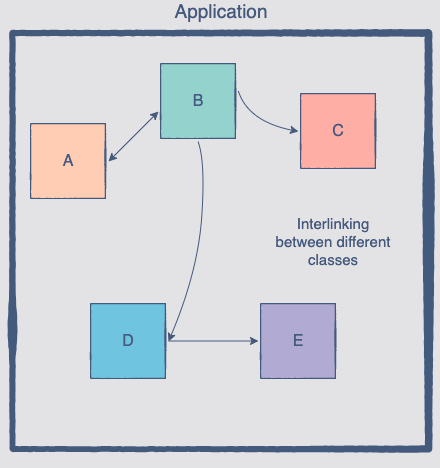

# Object Relationship

## Interaction between class objects

While inheritance represents a relationship between classes, there are situations where there are relationships between objects.

Now we have to use different class objects to create the design of an application. This means that independent class objects will have to find a way to interact with each other.

## Challenges

- Follow on [Task: Implementing Sports team](task.py) for the problem statement and [Solution](solution.py) for the solution
