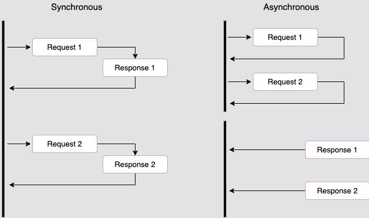
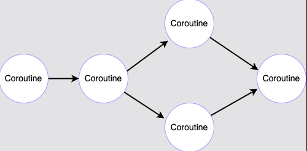

# Async Solution

## Blocking nature of read/write operations

The most used source of events is I/O readiness. Most read and write operations are, by default, blocking in nature which slows down the program execution speed.
If the program has to wait several seconds for a read to be completed, it cannot do anything else during that time.
`read` is a synchronous call and when performed on a file, socket, etc., that has no data ready to be read, it blocks the program.

## Solution: Don't just wait! Use `asyncio`



Asyncio is centered on the concept of event loops. Once `asyncio` has created an event loop, an application registers the functions to call back when a specific event happens:
as time passes, a file descriptor is ready to be read, or a socket is ready to be written.

That type of function is called a `coroutine`. It is a particular type of function that can give back control to the caller so that the event loop can continue running.


```python
import asyncio

async def hello_world():
    print("hello world!")
    return 42

hello_world_coroutine = hello_world()
print(hello_world_coroutine)

event_loop = asyncio.get_event_loop()
try:
    print("entering event loop")
    result = event_loop.run_until_complete(hello_world_coroutine)
    print(result)
finally:
    event_loop.close()
```

Above example shows a very straightforward implementation of an event loop using a coroutine.
The coroutine `hello_word` is defined as a function, except that the keyword to start its definition is `async def` rather than just `def`.
This coroutine just prints a message and returns a result.

## Run `coroutine` cooperatively

We can also run `coroutine` in a flow manner.



```python
import asyncio

async def add_42(number):
    print("Adding 42")
    return 42 + number

async def hello_world():
    print("hello world!")
    result = await add_42(23)
    return result

event_loop = asyncio.get_event_loop()
try:
    result = event_loop.run_until_complete(hello_world())
    print(result)
finally:
    event_loop.close()
```

The `await` keyword is used to run the `coroutine` cooperatively.
`await` gives the control back to the event loop, registering the coroutine `add_42(23)` into it.

## `sleep` and `gather`

- `asyncio.sleep` is the asynchronous implementation of `time.sleep`.

It is a coroutine that sleeps some number of seconds.

- `asyncio.gather` allows you to wait for several coroutines at once using a single `await` keyword.

```python
import asyncio

async def hello_world():
    print("hello world!")

async def hello_python():
    print("hello Python!")
    await asyncio.sleep(0.1)

event_loop = asyncio.get_event_loop()
try:
    result = event_loop.run_until_complete(asyncio.gather(
        hello_world(),
        hello_python(),
    ))
    print(result)
finally:
    event_loop.close()
```

## Async in HTTP call

1 more example of asynchronous process, calling HTTP, it's not depended to each other.
The `aiohttp` library provides an asynchronous HTTP.

```python
import aiohttp
import asyncio

async def get(url):
    async with aiohttp.ClientSession() as session:
        async with session.get(url) as response:
            return response

loop = asyncio.get_event_loop()
coroutines = [get("http://example.com") for _ in range(8)]
results = loop.run_until_complete(asyncio.gather(*coroutines))

print("Results: %s" % results)
```

## Challenges

- Follow on [Task](task.py) for the problem statement.
- Check [Solution](solution.py) for the solution.

run command

```bash
docker build -t async async-solution/ && docker run async
```
