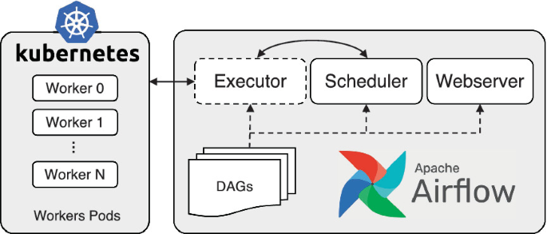
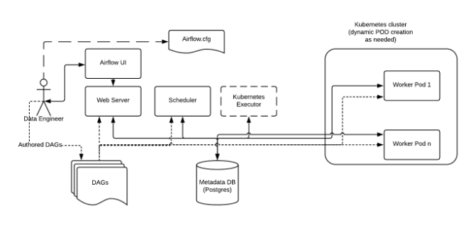
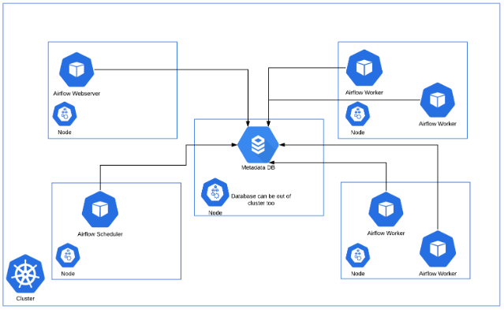
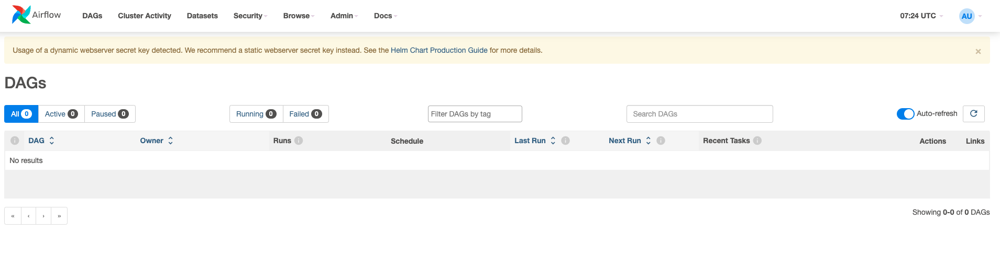

# Deploying and Running Airflow on Kubernetes



## Quickstart about Kubernetes and DevOps

`Kubernetes` is a portable, extensible, open source platform for managing containerized workloads and services, that facilitates both declarative configuration and automation. It has a large, rapidly growing ecosystem. Kubernetes services, support, and tools are widely available.

We enter `container deployments era`. Containers are similar to VMs, but they have relaxed isolation properties to share the Operating System (OS) among the applications. Therefore, containers are considered **lightweight**. Similar to a VM, a container has its own filesystem, share of CPU, memory, process space, and more. As they are decoupled from the underlying infrastructure, they are portable across clouds and OS distributions.

Containers have become popular because they provide extra benefits, such as:

- **Agile application creation and deployment**: increased ease and efficiency of container image creation compared to VM image use.
- **Continuous development, integration, and deployment**: provides for reliable and frequent container image build and deployment with quick and efficient rollbacks (due to image immutability).
- **Dev and Ops separation of concerns**: create application container images at build/release time rather than deployment time, thereby decoupling applications from infrastructure.
- **Observability**: not only surfaces OS-level information and metrics, but also application health and other signals.
- **Loosely coupled, distributed, elastic, liberated micro-services**: applications are broken into smaller, independent pieces and can be deployed and managed dynamically – not a monolithic stack running on one big single-purpose machine.
- **Resource isolation**: predictable application performance.
- **Resource utilization**: high efficiency and density.


### Why you need Kubernetes

Containers are a good way to bundle and run your applications. In a production environment, you need to manage the containers that run the applications and ensure that there is no downtime. 

!!! example

    if a container goes down, another container needs to start. Wouldn't it be easier if this behavior was handled by a system?

What Kubernetes provides:

- **Service discovery and load balancing**

Kubernetes can expose a container using the DNS name or using their own IP address.

- **Storage orchestration**

Kubernetes allows developer to automatically mount any storage systems.

- **Automated rollouts and rollbacks**

Developer can describe the desired state for your deployed containers using Kubernetes, and it can change the actual state to the desired state at a controlled rate.

- **Automatic bin packing**

Developer provides Kubernetes with a cluster of nodes that it can use to run containerized tasks.

- **Self-healing**

Kubernetes restarts containers that fail, replaces containers, kills containers that don't respond to your user-defined health check, and doesn't advertise them to clients until they are ready to serve.\

- **Secret and configuration management**

Kubernetes lets developers store and manage sensitive information, such as passwords, OAuth tokens, and SSH keys.

- **Batch execution**

Kubernetes can manage your batch and CI workloads, replacing containers that fail, if desired.

- **Horizontal scaling**

Scale your application up and down with a simple command, with a UI, or automatically based on CPU usage.

- **Designed for extensibility**

Add features to your Kubernetes cluster without changing upstream source code.

!!! info

    Kubernetes is also equipped with `kubectl` as its CLI command.

    It provides a tool to communicate with a Kubernetes cluster's control plane, using Kubernetes API.

### Advantages

- In contrast to CeleryExecutor, KubernetesExecutor does not require additional components such as Redis, but does require access to Kubernetes cluster.
- Monitoring Pods can be done with the built-in Kubernetes monitoring.
- With KubernetesExecutor, each task runs in its own pod. The pod is created when the task is queued, and terminates when the task completes.
- Resource utilization for each task doesn't need to be worried, because they will spawn each different pods and independent.

!!! tip

    In scenarios, such as burstable workloads, this presented a resource utilization advantage over CeleryExecutor, where you needed a fixed number of long-running Celery worker pods, whether or not there were tasks to run.

### Disadvantages

- Deploying using Kubernetes is very high learning curve to understand completely Kubernetes and you need to pay attention to every detail if you want to deploy it through Production. It's relatively quite complex.
- with KubernetesExecutor, you will have more task latency because worker pod is triggered when Airflow trigger the task, it's not ready yet, it will take time to create the Pods.

## Airflow: Kubernetes Executor

The Kubernetes executor runs each task instance in its own pod on a Kubernetes cluster.

KubernetesExecutor runs as a process in the Airflow Scheduler. The scheduler itself does not necessarily need to be running on Kubernetes, but does need access to a Kubernetes cluster.

KubernetesExecutor requires a non-sqlite database in the backend.

When a DAG submits a task, the KubernetesExecutor requests a worker pod from the Kubernetes API. The worker pod then runs the task, reports the result, and terminates.



This is an example of an Airflow deployment running on a distributed set of Kubernetes nodes and clusters.



Consistent with the regular Airflow architecture, the Workers need access to the DAG files to execute the tasks within those DAGs and interact with the Metadata repository. Also, configuration information specific to the Kubernetes Executor, such as the worker namespace and image information, needs to be specified in the Airflow Configuration file.

## Deploying Airflow on Kubernetes

!!! warning

    This setup is only working on MacOS currently (at this point of time), I will try to develop it in other OS in near future

    you will need to install:
    
    - [Docker](https://docs.docker.com/engine/install/)
     
    - [homebrew](https://brew.sh/)

- First, you need to clone the repo

```bash
git clone git@github.com:karlchris/airflow-k8s.git
```

- run below command to install the prerequisites, such as: Docker, KinD, Kubectl

```bash
make init
```

it will trigger to install these

```bash
#!/bin/bash

echo "Installing Kubectl, KinD, Helm, docker and docker compose ..."

brew install kubectl
brew install kind
brew install helm
brew install docker
brew install docker-compose

echo "It's ready, you can proceed to install Airflow"
```

Output:

```bash
➜  airflow-k8s git:(master) ✗ make init
bash scripts/init.sh
Installing Kubectl, KinD, Helm, docker and docker compose ...
==> Downloading https://formulae.brew.sh/api/formula.jws.json
###################################################################################################################################################################################################################################### 100.0%
==> Downloading https://formulae.brew.sh/api/cask.jws.json
###################################################################################################################################################################################################################################### 100.0%
Warning: kubernetes-cli 1.30.1 is already installed and up-to-date.
To reinstall 1.30.1, run:
  brew reinstall kubernetes-cli
Warning: kind 0.23.0 is already installed and up-to-date.
To reinstall 0.23.0, run:
  brew reinstall kind
Warning: helm 3.15.1 is already installed and up-to-date.
To reinstall 3.15.1, run:
  brew reinstall helm
Warning: Treating docker as a formula. For the cask, use homebrew/cask/docker or specify the `--cask` flag.
Warning: docker 26.1.3 is already installed and up-to-date.
To reinstall 26.1.3, run:
  brew reinstall docker
Warning: docker-compose 2.27.1 is already installed and up-to-date.
To reinstall 2.27.1, run:
  brew reinstall docker-compose
It's ready, you can proceed to install Airflow
```

- create **Kubernetes cluster** by running below command

```bash
make cluster
```

Output:

```bash
➜  airflow-k8s git:(master) ✗ make cluster
bash scripts/cluster.sh
you will create kubernetes cluster and check it ...
Creating cluster "airflow-cluster" ...
 ✓ Ensuring node image (kindest/node:v1.30.0) 🖼 
 ✓ Preparing nodes 📦 📦 📦 📦  
 ✓ Writing configuration 📜 
 ✓ Starting control-plane 🕹️ 
 ✓ Installing CNI 🔌 
 ✓ Installing StorageClass 💾 
 ✓ Joining worker nodes 🚜 
Set kubectl context to "kind-airflow-cluster"
You can now use your cluster with:

kubectl cluster-info --context kind-airflow-cluster

Not sure what to do next? 😅  Check out https://kind.sigs.k8s.io/docs/user/quick-start/
Cluster info
Kubernetes control plane is running at https://127.0.0.1:50484
CoreDNS is running at https://127.0.0.1:50484/api/v1/namespaces/kube-system/services/kube-dns:dns/proxy

To further debug and diagnose cluster problems, use 'kubectl cluster-info dump'.
Nodes info
NAME                            STATUS     ROLES           AGE   VERSION   INTERNAL-IP   EXTERNAL-IP   OS-IMAGE                         KERNEL-VERSION    CONTAINER-RUNTIME
airflow-cluster-control-plane   Ready      control-plane   21s   v1.30.0   172.18.0.5    <none>        Debian GNU/Linux 12 (bookworm)   6.6.26-linuxkit   containerd://1.7.15
airflow-cluster-worker          NotReady   <none>          1s    v1.30.0   172.18.0.3    <none>        Debian GNU/Linux 12 (bookworm)   6.6.26-linuxkit   containerd://1.7.15
airflow-cluster-worker2         NotReady   <none>          1s    v1.30.0   172.18.0.4    <none>        Debian GNU/Linux 12 (bookworm)   6.6.26-linuxkit   containerd://1.7.15
airflow-cluster-worker3         NotReady   <none>          1s    v1.30.0   172.18.0.2    <none>        Debian GNU/Linux 12 (bookworm)   6.6.26-linuxkit   containerd://1.7.15
```

- Create a **Kubernetes namespace**, run below command

```bash
make ns
```

Output:

```bash
➜  airflow-k8s git:(master) ✗ make ns     
bash scripts/namespace.sh
Creating kubernetes namespace Airflow ...
namespace/airflow created
NAME                 STATUS   AGE
airflow              Active   0s
default              Active   57m
kube-node-lease      Active   57m
kube-public          Active   57m
kube-system          Active   57m
local-path-storage   Active   57m
```

- Install airflow Helm chart on Kubernetes cluster, this will take around 5 minutes.

```bash
make install
```

to check if all the Airflow pods are already running

```bash
kubectl get pods -n airflow
```

Output:

```bash
NAME                                    READY   STATUS                            RESTARTS   AGE
airflow-k8-postgresql-0                 1/1     Running                           0          99s
airflow-k8-redis-0                      1/1     Running                           0          99s
airflow-k8-scheduler-d85d89786-6dtml    2/2     Running                           0          99s
airflow-k8-statsd-54b54565c9-xqjgk      1/1     Running                           0          99s
airflow-k8-triggerer-0                  2/2     Running                           0          99s
airflow-k8-webserver-688d4cdb74-6949c   1/1     Running                           0          99s
airflow-k8-worker-0                     2/2     Running                           0          99s
```

since you have forwarded the port to `localhost`, you will be able to see the Airflow UI through `http://localhost:8080`



- By default, airflow will still run `CeleryExecutor`, you can change to `KubernetesExecutor` to run natively on Kubernetes and get more benefits of it.

```bash
# Run this to get and generate values.yaml file
helm show values apache-airflow/airflow > values.yaml
```

Open it and change the `executor` setting

```yaml
# Airflow executor
# One of: LocalExecutor, LocalKubernetesExecutor, CeleryExecutor, KubernetesExecutor, CeleryKubernetesExecutor
executor: "KubernetesExecutor"
```

Then, you need to check your helm install list

```bash
➜ helm list -n airflow

NAME            NAMESPACE       REVISION        UPDATED                                 STATUS          CHART           APP VERSION
airflow-k8      airflow         1               2024-06-05 11:29:33.499928 +0400 +04    deployed        airflow-1.13.1  2.8.3   

# Run this to apply the updated values.yaml to deploy Airflow
➜ helm upgrade --install airflow apache-airflow/airflow -n airflow -f values.yaml --debug

➜ helm list -n airflow

NAME            NAMESPACE       REVISION        UPDATED                                 STATUS          CHART           APP VERSION
airflow-k8      airflow         2               2024-06-05 11:32:33.499928 +0400 +04    deployed        airflow-1.13.1  2.8.3   
```

## Check if the pods are running

```bash
➜  airflow-k8s git:(master) ✗ kubectl get pods -n airflow

NAME                                    READY   STATUS    RESTARTS   AGE
airflow-k8-postgresql-0                 1/1     Running   0          19m
airflow-k8-scheduler-664779678f-wvpbz   2/2     Running   0          2m
airflow-k8-statsd-54b54565c9-xqjgk      1/1     Running   0          19m
airflow-k8-triggerer-0                  2/2     Running   0          118s
airflow-k8-webserver-9b9b95948-gkfkf    1/1     Running   0          2m
```

## Install dependencies on Airflow

In common use cases, we usually want to run `spark` code with help of Airflow as scheduler.

To install dependencies, we can do this as follow:

- create a Dockerfile

```Dockerfile
FROM apache/airflow:2.8.3
RUN pip install apache-airflow-providers-apache-spark==4.8.1
```

- build the custom docker image

```bash
docker build -t airflow-base:1.0.0 .
```

- load that image to kind

```bash
➜  airflow-k8s git:(master) ✗ kind load docker-image airflow-base:1.0.0 --name airflow-cluster

Image: "airflow-base:1.0.0" with ID "sha256:5b938a838c583fb2ec534fb347eb6ceae32d76d3241661de5568803aa7e96de3" not yet present on node "airflow-cluster-worker", loading...
Image: "airflow-base:1.0.0" with ID "sha256:5b938a838c583fb2ec534fb347eb6ceae32d76d3241661de5568803aa7e96de3" not yet present on node "airflow-cluster-worker3", loading...
Image: "airflow-base:1.0.0" with ID "sha256:5b938a838c583fb2ec534fb347eb6ceae32d76d3241661de5568803aa7e96de3" not yet present on node "airflow-cluster-control-plane", loading...
Image: "airflow-base:1.0.0" with ID "sha256:5b938a838c583fb2ec534fb347eb6ceae32d76d3241661de5568803aa7e96de3" not yet present on node "airflow-cluster-worker2", loading...
```

- update `values.yaml`

```yaml
# Default airflow repository -- overridden by all the specific images below
defaultAirflowRepository: airflow-base

# Default airflow tag to deploy
defaultAirflowTag: "1.0.0"
```

- upgrade the helm chart

```bash
helm upgrade --install airflow-k8 apache-airflow/airflow -n airflow -f values.yaml --debug
```

- check the airflow provider list

```bash
kubectl exec <webserver_pod_id> -n airflow --airflow providers list
```

Output:

```bash
➜  airflow-k8s git:(master) ✗ kubectl exec airflow-k8-webserver-678f64d65b-p55rt -n airflow -- airflow providers list
Defaulted container "webserver" out of: webserver, wait-for-airflow-migrations (init)
package_name                             | description                                                                                  | version
=========================================+==============================================================================================+========
apache-airflow-providers-apache-spark    | Apache Spark https://spark.apache.org/                                                       | 4.8.1  
```

## Deploying DAG to Airflow

## Running Spark DAG

## References

- [Airflow - Kubernetes Executor](https://airflow.apache.org/docs/apache-airflow-providers-cncf-kubernetes/stable/kubernetes_executor.html)

- [KinD](https://kind.sigs.k8s.io/)

- [Helm Chart](https://airflow.apache.org/docs/helm-chart/stable/production-guide.html#webserver-secret-key)

- [Kubectl: Kubernetes CLI](https://kubernetes.io/docs/reference/kubectl/)

- [Airflow on Kubernetes by Marc Lamberti](https://marclamberti.com/blog/airflow-on-kubernetes-get-started-in-10-mins/)
