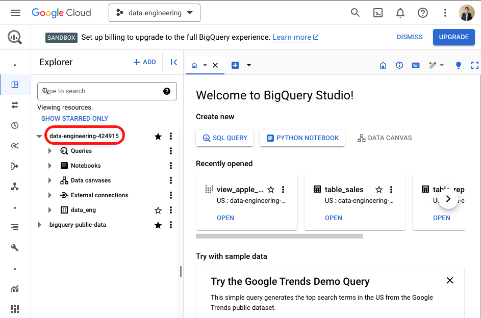
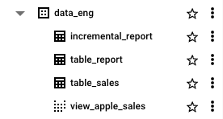
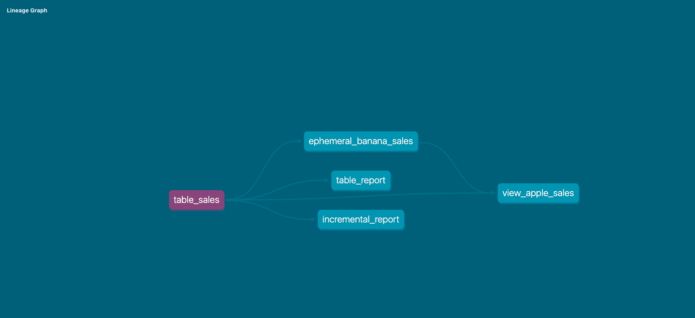
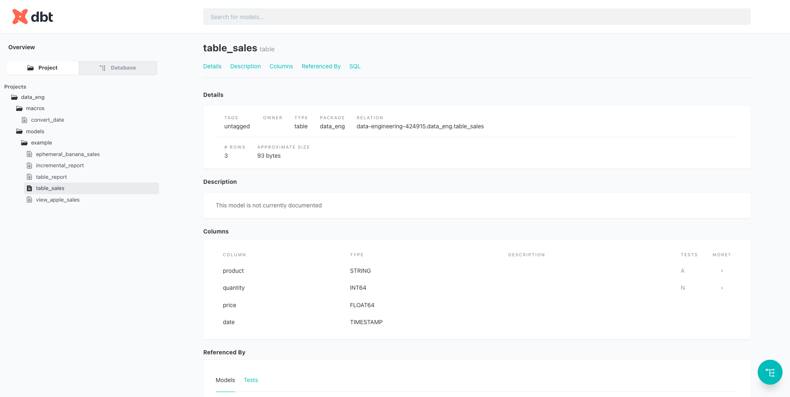

# Running dbt and BigQuery using Docker

!!! warning "must have"

    Before starting this project, you need to install some prerequisites in your laptop:

    - [Docker](https://docs.docker.com/engine/install/)
    - [gcloud CLI](https://cloud.google.com/sdk/docs/install)
    - [GCP console](https://console.cloud.google.com/)

## Interact with Google Cloud Platform

- Create your project, follow this [guidances](https://cloud.google.com/resource-manager/docs/creating-managing-projects).

- Enter your [GCP console](https://console.cloud.google.com/) and go to BigQuery.
  You will find view as below, your **[project name]** is within the **red box**.



- In your GCP project, create dataset name `data_eng`.

- Go to your local terminal and run command below, it will redirect you to browser and login to your google account and create the credentials file to your laptop.

> Credentials saved to file: [~/.config/gcloud/application_default_credentials.json]

```bash
gcloud auth application-default login
```

- Done, your laptop is connected to GCP and you can connect it through container as well.

## Build dbt docker image

- clone the repo first, run this command

```bash
git clone git@github.com:karlchris/dbt-bigquery.git
```

- update your dbt `profiles.yml` with your GCP **[project name]**

```yaml
data-eng:
  target: dev

  outputs:
    dev:
      type: bigquery
      method: oauth
      project: [project name]
      dataset: "data_eng"
      timeout_seconds: 300
      location: US
      priority: interactive
      retries: 0
      threads: 8
```

- make sure you are in `data-engineering directory`, then run this command

```bash
make build-dbt
```

```bash
➜  data-engineering git:(dq1) ✗ make build-dbt
Building dbt image
[+] Building 1.1s (9/9) FINISHED                                 docker:desktop-linux
 => [internal] load build definition from Dockerfile                             0.0s
 => => transferring dockerfile: 264B                                             0.0s
 => [internal] load metadata for docker.io/fishtownanalytics/dbt:1.0.0           1.0s
 => [internal] load .dockerignore                                                0.0s
 => => transferring context: 2B                                                  0.0s
 => [1/4] FROM docker.io/fishtownanalytics/dbt:1.0.0@sha256:4c9462867d2db6869a0  0.0s
 => [internal] load build context                                                0.0s
 => => transferring context: 1.76kB                                              0.0s
 => CACHED [2/4] WORKDIR /dbt                                                    0.0s
 => [3/4] COPY . /dbt/                                                           0.0s
 => [4/4] COPY profiles /root/.dbt                                               0.0s
 => exporting to image                                                           0.0s
 => => exporting layers                                                          0.0s
 => => writing image sha256:03631678cdc560b844f608519ac23cb15d37cab9099feb52075  0.0s
 => => naming to docker.io/library/dbt                                           0.0s
```

- if you see above image, then your dbt image is already built.

## Run dbt image container interactively

- run this command to execute dbt image and enter in `/bin/bash` terminal,

```bash
make run-dbt
```

Output:

```bash
➜  data-engineering git:(dq1) ✗ make run-dbt
Running dbt in container
WARNING: The requested image's platform (linux/amd64) does not match the detected host platform (linux/arm64/v8) and no specific platform was requested
root@d94bac5d04ab:/dbt#
```

- run this command to execute `dbt run` in FULL REFRESH mode.

```bash
dbt run --full-refresh
```

Output:

```bash
root@d94bac5d04ab:/dbt# dbt run --full-refresh
17:25:54  Running with dbt=1.0.0
17:25:54  Partial parse save file not found. Starting full parse.
17:25:54  [WARNING]: Configuration paths exist in your dbt_project.yml file which do not apply to any resources.
There are 1 unused configuration paths:
- models.data-eng.example

17:25:54  Found 5 models, 2 tests, 0 snapshots, 0 analyses, 189 macros, 0 operations, 0 seed files, 0 sources, 0 exposures, 0 metrics
17:25:54
17:25:56  Concurrency: 8 threads (target='dev')
17:25:56
17:25:56  1 of 4 START table model data_eng.table_sales................................... [RUN]
17:26:00  1 of 4 OK created table model data_eng.table_sales.............................. [CREATE TABLE (3.0 rows, 0 processed) in 3.58s]
17:26:00  2 of 4 START incremental model data_eng.incremental_report...................... [RUN]
17:26:00  3 of 4 START table model data_eng.table_report.................................. [RUN]
17:26:00  4 of 4 START view model data_eng.view_apple_sales............................... [RUN]
17:26:02  4 of 4 OK created view model data_eng.view_apple_sales.......................... [OK in 1.84s]
17:26:03  2 of 4 OK created incremental model data_eng.incremental_report................. [CREATE TABLE (1.0 rows, 93.0 Bytes processed) in 3.26s]
17:26:04  3 of 4 OK created table model data_eng.table_report............................. [CREATE TABLE (1.0 rows, 93.0 Bytes processed) in 3.78s]
17:26:04
17:26:04  Finished running 2 table models, 1 view model, 1 incremental model in 9.47s.
17:26:04
17:26:04  Completed successfully
17:26:04
17:26:04  Done. PASS=4 WARN=0 ERROR=0 SKIP=0 TOTAL=4
```

- your models have been run based on the dependencies and SQL models.

- you can check in the BigQuery UI for the created tables.



## Check dbt docs and DAG

- Inside your container, in your terminal, run this command to compile dbt models, etc

```bash
dbt compile --target dev
```

Output:

```bash
root@d94bac5d04ab:/dbt# dbt compile --target dev
17:27:26  Running with dbt=1.0.0
17:27:26  Unable to do partial parsing because config vars, config profile, or config target have changed
17:27:27  [WARNING]: Configuration paths exist in your dbt_project.yml file which do not apply to any resources.
There are 1 unused configuration paths:
- models.data-eng.example

17:27:27  Found 5 models, 2 tests, 0 snapshots, 0 analyses, 189 macros, 0 operations, 0 seed files, 0 sources, 0 exposures, 0 metrics
17:27:27
17:27:28  Concurrency: 8 threads (target='dev')
17:27:28
17:27:28  Done.
```

- run this command to generate docs.

```bash
dbt docs generate --target dev
```

Output:

```bash
root@d94bac5d04ab:/dbt# dbt docs generate --target dev
17:27:48  Running with dbt=1.0.0
17:27:48  [WARNING]: Configuration paths exist in your dbt_project.yml file which do not apply to any resources.
There are 1 unused configuration paths:
- models.data-eng.example

17:27:48  Found 5 models, 2 tests, 0 snapshots, 0 analyses, 189 macros, 0 operations, 0 seed files, 0 sources, 0 exposures, 0 metrics
17:27:48
17:27:49  Concurrency: 8 threads (target='dev')
17:27:49
17:27:49  Done.
17:27:49  Building catalog
17:27:53  Catalog written to /dbt/target/catalog.json
```

- run this command to serve the docs into UI.

```bash
dbt docs serve --target dev
```

Output:

```bash
root@d94bac5d04ab:/dbt# dbt docs serve --target dev
17:28:13  Running with dbt=1.0.0
17:28:13  Serving docs at 0.0.0.0:8080
17:28:13  To access from your browser, navigate to:  http://localhost:8080
17:28:13
17:28:13
17:28:13  Press Ctrl+C to exit.
```

- the UI is accessible in port `8080` inside the container, but in my Makefile, I redirect it to port `8082`, then you can access it in [http://localhost:8082](http://localhost:8082) through your browser.

```makefile
run-dbt:
	@echo "Running dbt in container"
	@docker run \
		-e DESTINATION=${USER} \
		-e DBT_ENV=dev \
		--rm \
		-v ${GCP_AUTH}:/creds -it \
		--entrypoint /bin/bash \
		-p 8082:8080 \
		dbt
```

- you can see the DAG lineage through the URL as below



and you can also see each of dbt models informations, such as: details, descriptions, column and code.



## Testing data quality

- to perform data quality check on dbt, written in `schema.yml`

```yaml
version: 2

models:
  - name: table_sales
    columns:
      - name: quantity
        tests:
          - not_null
      - name: product
        tests:
          - accepted_values:
              values: ["apple", "pear", "banana"]
```

run this

```bash
dbt test
```

Output:

```bash
root@167804cf135d:/dbt# dbt test
05:11:38  Running with dbt=1.0.0
05:11:38  Partial parse save file not found. Starting full parse.
05:11:39  [WARNING]: Configuration paths exist in your dbt_project.yml file which do not apply to any resources.
There are 1 unused configuration paths:
- models.data-eng.example

05:11:39  Found 5 models, 2 tests, 0 snapshots, 0 analyses, 189 macros, 0 operations, 0 seed files, 0 sources, 0 exposures, 0 metrics
05:11:39
05:11:40  Concurrency: 8 threads (target='dev')
05:11:40
05:11:40  1 of 2 START test accepted_values_table_sales_product__apple__pear__banana...... [RUN]
05:11:40  2 of 2 START test not_null_table_sales_quantity................................. [RUN]
05:11:42  2 of 2 PASS not_null_table_sales_quantity....................................... [PASS in 1.75s]
05:11:42  1 of 2 PASS accepted_values_table_sales_product__apple__pear__banana............ [PASS in 1.96s]
05:11:42
05:11:42  Finished running 2 tests in 3.21s.
05:11:42
05:11:42  Completed successfully
05:11:42
05:11:42  Done. PASS=2 WARN=0 ERROR=0 SKIP=0 TOTAL=2
```
