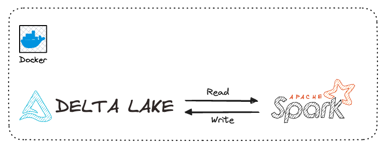
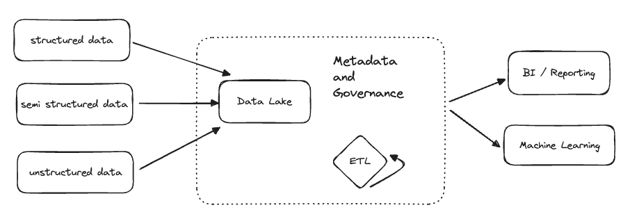
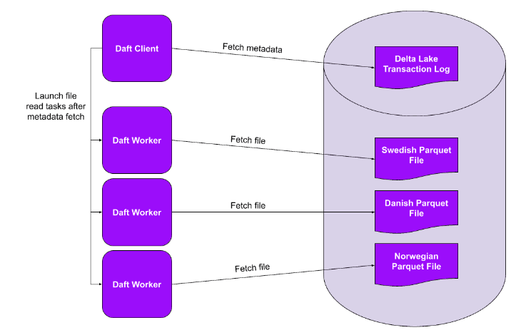
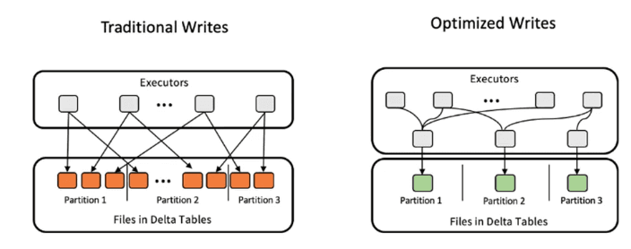
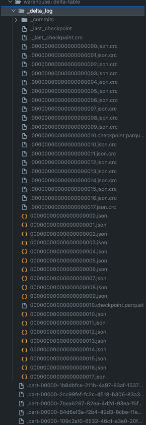
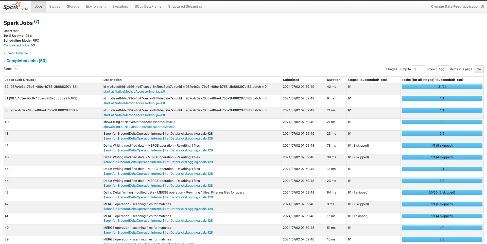
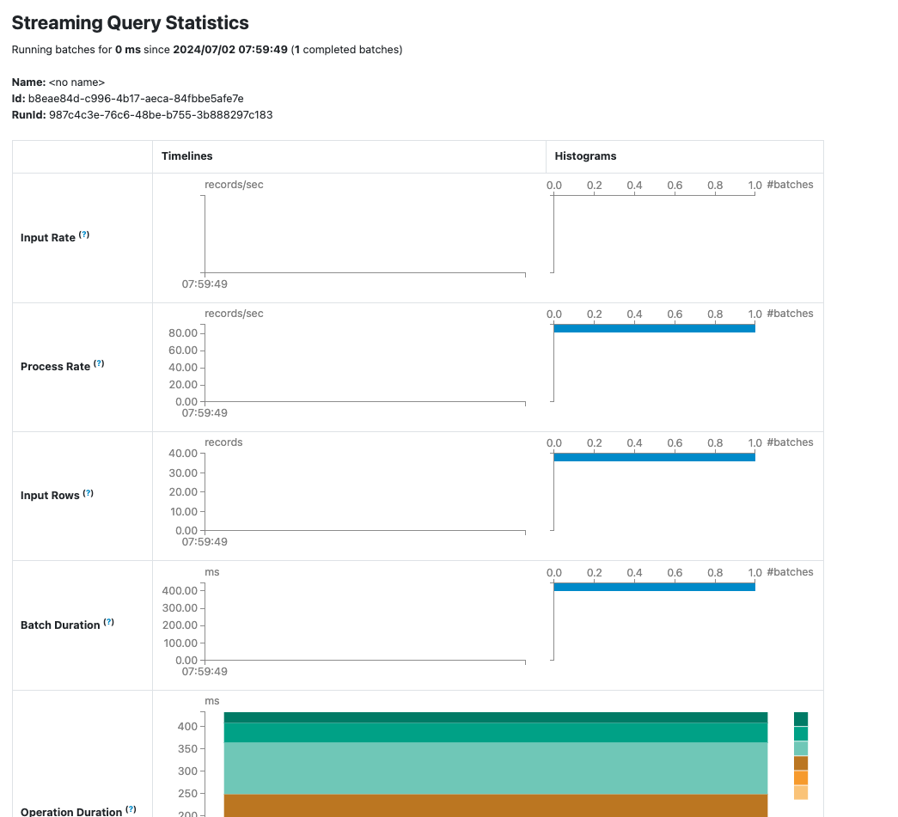

# Delta Lake with Apache Spark



After years of data management, data warehouses reigned supreme with their structured storage and optimized querying.

However, these warehouses struggled when confronted with the deluge of unstructured and semi-structured data, revealing their limitations.
This void led to the emergence of data lakes, offering a promising solution by accommodating diverse data types without immediate structure.

Yet, the initial euphoria surrounding data lakes gave way to challenges of **maintaining data integrity**, **ensuring consistency**, and **handling updates and deletions effectively**.

!!! success

    Enter **Delta Lake**, a technological evolution that seeks to address the shortcomings of traditional data warehouses and data lakes alike.

## What is Delta Lake

**Delta Lake** is an open-source table format for data storage.
Delta Lake improves data storage by supporting ACID transactions, high-performance query optimizations, schema enforcement and evolution, data versioning and many other features.

A Delta table consists of 2 main components:

- **Parquet files** that contain the data, and
- a **transaction log** that stores metadata about the transactions

### Lakehouse Architecture

A **lakehouse** is a new, open architecture that combines the best elements of **data lakes** and **data warehouses**.

Lakehouses are enabled by a new system design: implementing similar data structures and data management features to those in a data warehouse directly on top of low cost cloud storage in open formats.



### Lakehouse Features

- **Transaction support**: many data pipelines will often be reading and writing data concurrently.
- **Schema enforcement and governance**: The Lakehouse should have a way to support the schema enforcement and evolution, supporting DW schema such as star/snowflake-schemas.
- **BI support**: Lakehouses enable using BI tools directly on the source data.
- **Storage is decoupled from compute**: In practice, this means storage and compute use separate clusters, thus these systems are able to scale to many more concurrent users and larger data sizes.
- **Openness**: The storage format they use are open and standardized, such as Parquet, and they provide an API so a variety of tools/engines can efficiently access the data.
- **Support for diverse data types ranging from unstructured and structured data**
- **Support for diverse workloads**: including data science, machine learning, and SQL and analytics.
- **End-to-end streaming**: Real-time reports are the norm in many enterprises. Support for streaming eliminates the need for separate systems dedicated to serving real-time data applications.

## Contents of Delta table


The transaction log enables Delta Lake to optimize the queries, ensure reliable reads and writes, and to store a record of all data transformations.

Delta Lake supports both ETL and ELT workloads.

### Benefits for ETL

Delta Lake is great for **ETL** because of its performance and reliability.

Here are some features that will improve ETL workloads:

#### Query Optimization

Delta Lake makes data transformations faster by:

- storing file paths and metadata in the transaction log
- executing partial reads via file-skipping
- co-locating similar data to allow for better file skipping

!!! tips

    **Transaction logs**
    
    Delta Lake stores all file paths, metadata and data transformation operations in a dedicated transaction log. This makes file listing faster and enables partial data reads.

    **File-skipping**
    
    Delta Lake stores metadata at the file-level in a single transaction log. This way query engines can figure out which data can be skipped using a single network request. Entire files can be skipped this way.

    **Co-locating similar data**
    
    Delta Lake can store similar data close together to improve your query performance, using Z-Ordering or Liquid Clustering.

#### Reliability

Delta Lake makes your ETL workloads more reliable by enforcing ACID transactions. Transactions prevent your data from being corrupted or lost.

!!! example

    Data storage formats without transaction support (like CSV or Parquet) can easily be corrupted. 
    
    For example, if you're writing a large amount of data and your cluster dies then you'll have several partially written files in your table. These partial files will cause downstream read operations to crash.

Delta Lake transactions give you 4 important guarantess:

- **No more failed partial writes**: Every write operation either completes entirely or else it fails entirely and no data gets changed.
- **No more corrupted tables**: If a transaction is going to break any of the pre-defined constraints, the entire transaction is rejected and will not complete.
- **No more conflicting data versions**: Concurrent processes happen in isolation from each other and cannot access each other's intermediate states.
- **No more unintended data loss**: All data changes are guaranteed to never be lost, even in the events of system failures or power outages.

#### Schema Enformement and Evolution

To prevent accidental data corruption, Delta Lake provides schema enforcement.

You cannot write new data to a Delta table if it doesn't match the existing table's schema. It will error out with an `AnalysisException`.

For example, let's create a Delta table with a simple schema:

```python
df = spark.createDataFrame([("bob", 47), ("li", 23), ("leonard", 51)]).toDF(
    "first_name", "age"
)

df.write.format("delta").save("data/toy_data")
```

Now, let's try to write data with a different schema to this same Delta table:

```python
df = spark.createDataFrame([("frank", 68, "usa"), ("jordana", 26, "brasil")]).toDF(
    "first_name", "age", "country"
)

df.write.format("delta").mode("append").save("data/toy_data")
```

Here's the complete error:

```bash
AnalysisException: [_LEGACY_ERROR_TEMP_DELTA_0007] A schema mismatch detected when writing to the Delta table

Table schema:
root
-- first_name: string (nullable = true)
-- age: long (nullable = true)

Data schema:
root
-- first_name: string (nullable = true)
-- age: long (nullable = true)
-- country: string (nullable = true)
```

!!! warning

    Delta Lake does not allow you to append data with mismatched schema by default.

##### Schema Evolution

Of course, ETL workloads evolve over time. Input data may change or your downstream analysis might need a new column. When you need more flexibility in your schema, Delta Lake also supports Schema Evolution.

To update the schema of your Delta table, you can write data with the `mergeSchema` option. Let's try this for the example that we just saw above:

```python
df.write.option("mergeSchema", "true").mode("append").format("delta").save(
    "data/toy_data"
)
```

Here are the contents of your Delta table after the write:

```bash
spark.read.format("delta").load("data/toy_data").show()

+----------+---+-------+
|first_name|age|country|
+----------+---+-------+
|   jordana| 26| brasil| # new
|     frank| 68|    usa| # new
|   leonard| 51|   null|
|       bob| 47|   null|
|        li| 23|   null|
+----------+---+-------+
```

The Delta table now has three columns. It previously only had two columns. Rows that don't have any data for the new column will be marked as null when new columns are added.

#### Time Travel

Nobody is perfect. And no ETL pipeline is perfect, either.

When mistakes happen, you want to be able to roll back your data to a previous version before the mistake. Doing this manually is painful and takes a lot of time. Delta Lake makes this easy by supporting time travel functionality.

Because all of the transactions are stored in the **transaction log**, Delta Lake can always travel back to earlier states of your table.

#### Scalability

ETL workloads often scale up as more data becomes available.
Delta Lake supports both small and very large data workloads.

Delta Lake makes it easier and faster to process large workloads by:

##### Partitioning



File partitioning makes it faster to work with data at scale.

In the Query Optimization example we saw above, we used a smart partitioning strategy to make our query run faster. When you partition a table on a certain column, Delta Lake stores all records with the same column value in the same file. This way it can skip entire files when certain column values are not needed.

Partitioning is especially efficient with parallel query engines. In this case, each process (or “worker”) can read its own partitions in parallel. This speeds up your queries and lets you process more data in less time.

##### Data Clustering

Delta Lake lets you store similar data close together via **Liquid Clustering**, **Z-ordering** and **Hive-style partitioning**. Liquid Clustering is the newest and most performant technique of the three.

Your ETL workload will likely benefit from clustering if:

- You often need to filter by high cardinality columns.
- Your data has significant skew in data distribution.
- Your tables grow quickly and require maintenance and tuning effort.
- Your data access patterns change over time.

##### Query Engine Support

Delta Lake makes it easy to work with lots of different query engines.

You might start working locally with a single-node processing library like polars:

```python
# load data
df = pl.DataFrame(data)

# perform some data operations
...

# write to delta table
df.write_delta("data/delta_table")
```

When your data volume increases, you can switch to a distributed query engine like Spark:

```python
# load delta table created with polars
df = spark.read.format("delta").load("data/delta_table")

# join to much larger dataset
big_df = df.join(new_df, …)

# run big data operations
…

# write to delta table
big_df.write.format("delta").mode("append").option("overwriteSchema", "True").save("data/delta_table")
```

!!! info

    Delta Lake has great interoperability with many query engines.

## Optimizing Delta Lake

How to optimize your Delta Lake table to reduce the number of small files.

Small files can be a problem because they slow down your query reads. Listing, opening and closing many small files incurs expensive overhead. This is called **"the Small File Problem"**. You can reduce the Small File Problem overhead by combining the data into bigger, more efficient files.

The code below runs a query on a Delta table with 2 million rows. The Delta table is partitioned on the `education` column and has 1440 files per partition:

```python
%%time
df = spark.read.format("delta").load("test/delta_table_1440")
res = df.where(df.education == "10th").collect()

CPU times: user 175 ms, sys: 20.1 ms, total: 195 ms
Wall time: 16.1 s
```

Now compare this to the same query on the same 2M-rows of data stored in a Delta table with only 1 optimized file per partition:

```python
%%time
df = spark.read.format("delta").load("test/delta_table_1")
res = df.where(df.education == "10th").collect()

CPU times: user 156 ms, sys: 16 ms, total: 172 ms
Wall time: 4.62 s
```

Storing data in an optimized number of files will improve your out-of-the-box read performance.

There are 3 ways you can optimize your Delta Lake table:

### Offline Optimize

Suppose you have an ETL pipeline that ingests some data every day. The data is streamed into a partitioned Delta table that gets updated every minute.

This means you will end up with 1440 files per partition at the end of every day.

```bash
> # get n files per partition
> !ls test/delta_table/education\=10th/*.parquet | wc -l
1440
```

Running a query on a Delta table with many small files is not efficient, as we saw above.

You can manually run the Delta OPTIMIZE command to optimize the number of files. This is done by compacting all the inefficient small files into larger files that are more efficient to read. The default file size written in each partition after this operation is 1 GB.

You can perform a compaction manually using:

```python
from delta.tables import *
deltaTable = DeltaTable.forPath(spark, "test/delta_table")
deltaTable.optimize().executeCompaction()
```

Downstream queries on this optimized Delta table will now be faster.

### Optimized Write

You don’t have to manually run the OPTIMIZE command. You can also configure optimizations to run automatically on your Delta Table.



**Optimized Write** combines all the small writes to the same partition into a single write command before executing.
This is great when multiple processes are writing to the same partitioned Delta table, i.e. a distributed write operation.

Optimized Write rebalances the data using a data shuffle before writing the files to the table. This way you will reduce the number of small files.

You can enable Optimized Write by setting the optimizeWrite option in your Delta Lake writer:

```python
df.write.format("delta").option("optimizeWrite", "True").save("path/to/delta")
```

You can also enable the Optimized Write functionality:

- for your whole Delta table by setting the `delta.autoOptimize.optimizeWrite` table property.
- for your whole Spark SQL session by setting the `spark.databricks.delta.optimizeWrite.enabled` SQL configuration

!!! warning

    Optimized Writes take a bit longer to execute because of the data shuffle that is performed before the data gets written.
    That’s why the feature is not enabled by default.

### Auto Compaction

Optimized Write is great for distributed write situations with many different processes writing to the same Delta table.

But sometimes that is not enough to solve the Small File Problem, for example when you are writing frequent small updates to a table. In this case, the files will still be small, even after an Optimized Write.

**Auto Compaction** solves this problem by automatically running a small `optimize` command after every write operation. Data from files under a certain threshold size is automatically combined into a larger file. This way, your downstream queries can benefit from a more optimal file size.

You can enable Auto Compaction for your Delta table or your entire Spark session:

- Table property: `delta.autoOptimize.autoCompact`
- SparkSession setting: `spark.databricks.delta.autoCompact.enabled`

Auto Compaction is only triggered for partitions or tables that have at least a certain number of small files. The minimum number of files required to trigger auto compaction can be configured with `spark.databricks.delta.autoCompact`.minNumFiles.

### Optimize: Vacuum

Because Auto Compaction optimizes your Delta Table _after_ the write operations, you may still have many small files on disk.

```bash
> # get n files per partition
> !ls delta/census_table_compact/education\=10th/*.parquet | wc -l

1441
```

In this case we have 1440 files (one per partition) and 1 final file that contains all the data.

Delta Lake has iteratively combined all the small writes into a larger file. It has also recorded in the transaction log the path to the latest file. Downstream data reads will look at the transaction log and access only the last, largest file.

But as you can see the older, smaller files are still on disk. This doesn’t affect your read performance because Delta Lake knows that you only need to access the latest file. But you might still want to remove these files, for example to save on storage costs.

You can remove these older files with a `VACUUM` command. The parameter is the number of preceding hours you want to preserve.

```python
deltaTable.vacuum(0)
```

The `VACUUM` command removes old files that are no longer actively referenced in the transaction log. By default, `VACUUM` only affects files older than the default retention duration which is **7 days**.

You can override this default setting using:

```python
spark.sql("SET spark.databricks.delta.retentionDurationCheck.enabled=false")
```

## Implementation

Here we go to start the implementation of how delta table is being executed and let's get a quick look on delta CDC operations.

First of all, you need to clone this repo

```bash
git clone git@github.com:karlchris/spark-docker.git
```

### Installing Delta Package

You need to install some delta jars into Dockerfile

```Dockerfile
# Download delta jars
RUN curl https://repo1.maven.org/maven2/io/delta/delta-core_2.12/2.4.0/delta-core_2.12-2.4.0.jar -Lo /opt/spark/jars/delta-core_2.12-2.4.0.jar
RUN curl https://repo1.maven.org/maven2/io/delta/delta-spark_2.12/3.2.0/delta-spark_2.12-3.2.0.jar -Lo /opt/spark/jars/delta-spark_2.12-3.2.0.jar
RUN curl https://repo1.maven.org/maven2/io/delta/delta-storage/3.2.0/delta-storage-3.2.0.jar -Lo /opt/spark/jars/delta-storage-3.2.0.jar
```

In the python script itself, you need to set the configurations.

```python
from pyspark.sql import SparkSession
from pyspark import SparkConf
from pyspark.sql.types import StructType, StructField, StringType, IntegerType
from delta import *
from delta.tables import *
from pyspark.sql.functions import expr, lit, col

jars = 'io.delta:delta-spark_2.12:3.2.0,io.delta:delta-core_2.12:2.4.0,io.delta:delta-storage:3.2.0'

# Setup config
conf = SparkConf().setAppName("deltaDemo") \
    .set("spark.sql.extensions", "io.delta.sql.DeltaSparkSessionExtension") \
    .set("spark.sql.catalog.spark_catalog", "org.apache.spark.sql.delta.catalog.DeltaCatalog") \
    .set('spark.jars.packages', jars)

# Create spark session
spark = SparkSession.builder.config(conf=conf).getOrCreate()
spark.sparkContext.setLogLevel("ERROR")
```

- You will need to build the docker compose, by running below command:

```bash
make up
```

Output:

```bash
(base) ➜  spark-docker git:(main) ✗ make up 
docker compose up -d --build
[+] Building 2.7s (21/21) FINISHED                                                                                                                                                                                                                                                                 docker:desktop-linux
 => [spark-master internal] load build definition from Dockerfile                                                                                                                                                                                                                                                  0.0s
 => => transferring dockerfile: 2.38kB                                                                                                                                                                                                                                                                             0.0s
 => [spark-master internal] load metadata for docker.io/library/python:3.10-bullseye                                                                                                                                                                                                                               2.5s
 => [spark-master auth] library/python:pull token for registry-1.docker.io                                                                                                                                                                                                                                         0.0s
 => [spark-master internal] load .dockerignore                                                                                                                                                                                                                                                                     0.0s
 => => transferring context: 2B                                                                                                                                                                                                                                                                                    0.0s
 => [spark-master spark-base 1/5] FROM docker.io/library/python:3.10-bullseye@sha256:a894d9de36c807c43b543bce5e52702b8b22de985ca087f3478a4a4b18c86d37                                                                                                                                                              0.0s
 => => resolve docker.io/library/python:3.10-bullseye@sha256:a894d9de36c807c43b543bce5e52702b8b22de985ca087f3478a4a4b18c86d37                                                                                                                                                                                      0.0s
 => [spark-master internal] load build context                                                                                                                                                                                                                                                                     0.0s
 => => transferring context: 1.00kB                                                                                                                                                                                                                                                                                0.0s
 => CACHED [spark-master spark-base 2/5] RUN apt-get update &&     apt-get install -y --no-install-recommends       sudo       curl       vim       unzip       rsync       openjdk-11-jdk       build-essential       software-properties-common       ssh &&     apt-get clean &&     rm -rf /var/lib/apt/lists  0.0s
 => CACHED [spark-master spark-base 3/5] RUN mkdir -p /opt/hadoop && mkdir -p /opt/spark                                                                                                                                                                                                                           0.0s
 => CACHED [spark-master spark-base 4/5] WORKDIR /opt/spark                                                                                                                                                                                                                                                        0.0s
 => CACHED [spark-master spark-base 5/5] RUN mkdir -p /opt/spark     && curl https://dlcdn.apache.org/spark/spark-3.5.1/spark-3.5.1-bin-hadoop3.tgz -o spark-3.5.1-bin-hadoop3.tgz     && tar xvzf spark-3.5.1-bin-hadoop3.tgz --directory /opt/spark --strip-components 1     && rm -rf spark-3.5.1-bin-hadoop3.  0.0s
 => CACHED [spark-master pyspark 1/4] COPY requirements.txt .                                                                                                                                                                                                                                                      0.0s
 => CACHED [spark-master pyspark 2/4] RUN pip3 install -r requirements.txt                                                                                                                                                                                                                                         0.0s
 => CACHED [spark-master pyspark 3/4] COPY conf/spark-defaults.conf /opt/spark/conf                                                                                                                                                                                                                                0.0s
 => CACHED [spark-master pyspark 4/4] RUN chmod u+x /opt/spark/sbin/* &&     chmod u+x /opt/spark/bin/*                                                                                                                                                                                                            0.0s
 => CACHED [spark-master stage-2 1/6] RUN curl https://repo1.maven.org/maven2/org/apache/iceberg/iceberg-spark-runtime-3.4_2.12/1.4.3/iceberg-spark-runtime-3.4_2.12-1.4.3.jar -Lo /opt/spark/jars/iceberg-spark-runtime-3.4_2.12-1.4.3.jar                                                                        0.0s
 => CACHED [spark-master stage-2 2/6] RUN curl https://repo1.maven.org/maven2/io/delta/delta-core_2.12/2.4.0/delta-core_2.12-2.4.0.jar -Lo /opt/spark/jars/delta-core_2.12-2.4.0.jar                                                                                                                               0.0s
 => CACHED [spark-master stage-2 3/6] RUN curl https://repo1.maven.org/maven2/io/delta/delta-spark_2.12/3.2.0/delta-spark_2.12-3.2.0.jar -Lo /opt/spark/jars/delta-spark_2.12-3.2.0.jar                                                                                                                            0.0s
 => CACHED [spark-master stage-2 4/6] RUN curl https://repo1.maven.org/maven2/io/delta/delta-storage/3.2.0/delta-storage-3.2.0.jar -Lo /opt/spark/jars/delta-storage-3.2.0.jar                                                                                                                                     0.0s
 => [spark-master stage-2 5/6] COPY entrypoint.sh .                                                                                                                                                                                                                                                                0.0s
 => [spark-master stage-2 6/6] RUN chmod u+x /opt/spark/entrypoint.sh                                                                                                                                                                                                                                              0.1s
 => [spark-master] exporting to image                                                                                                                                                                                                                                                                              0.0s
 => => exporting layers                                                                                                                                                                                                                                                                                            0.0s
 => => writing image sha256:e9e8d30b8debaa1194efcb691c192c7bf21c7ac7ee32bad255d0a91440fee562                                                                                                                                                                                                                       0.0s
 => => naming to docker.io/library/spark-image                                                                                                                                                                                                                                                                     0.0s
[+] Running 3/3
 ✔ Container spark-master   Started                                                                                                                                                                                                                                                                               20.5s 
 ✔ Container spark-history  Started                                                                                                                                                                                                                                                                               10.5s 
 ✔ Container spark-worker   Started    
```

- Then, you need to enter the container interactive terminal, by running below command:

```bash
make dev
```

Output

```bash
(base) ➜  spark-docker git:(main) ✗ make dev
docker exec -it spark-master bash
root@6af4bb0bbdcf:/opt/spark# 
```

- to execute the `delta-demo.py` script, you can run this command:

```bash
./bin/spark-submit scripts/delta-demo.py
```

### Create delta table

```python
# Create a spark dataframe and write as a delta table
print("Starting Delta table creation")

data = [("Robert", "Baratheon", "Baratheon", "Storms End", 48),
        ("Eddard", "Stark", "Stark", "Winterfell", 46),
        ("Jamie", "Lannister", "Lannister", "Casterly Rock", 29)
        ]
schema = StructType([
    StructField("firstname", StringType(), True),
    StructField("lastname", StringType(), True),
    StructField("house", StringType(), True),
    StructField("location", StringType(), True),
    StructField("age", IntegerType(), True)
])

df = spark.createDataFrame(data=data, schema=schema)
df.write.mode(saveMode="overwrite").format("delta").save("warehouse/delta-table")
```

First, we define a spark DataFrame. In this case, we have the schema and input its data.

```bash
Starting Delta table creation
+---------+---------+---------+-------------+---+
|firstname| lastname|    house|     location|age|
+---------+---------+---------+-------------+---+
|   Robert|Baratheon|Baratheon|   Storms End| 48|
|   Eddard|    Stark|    Stark|   Winterfell| 46|
|    Jamie|Lannister|Lannister|Casterly Rock| 29|
+---------+---------+---------+-------------+---+
```

### Read delta table

Reading is as easy as again just specifying the `.format("delta")` in the spark read API

```python
# read from delta
df = spark.read.format("delta").load("warehouse/delta-table")
df.show()

# print delta table schema
df.printSchema()
```

Output:

```bash
root
 |-- firstname: string (nullable = true)
 |-- lastname: string (nullable = true)
 |-- house: string (nullable = true)
 |-- location: string (nullable = true)
 |-- age: integer (nullable = true)
```

### Update delta table

There are some approach to update data in delta table, such following:

#### Overwrite whole table

In case you want to simply overwrite the delta table, you can simply provide `.mode(saveMode="overwrite")` command.

```python
# Update data
print("Updating Delta table...!")
data = [("Robert", "Baratheon", "Baratheon", "Storms End", 49),
        ("Eddard", "Stark", "Stark", "Winterfell", 47),
        ("Jamie", "Lannister", "Lannister", "Casterly Rock", 30)
        ]
schema = StructType([
    StructField("firstname", StringType(), True),
    StructField("lastname", StringType(), True),
    StructField("house", StringType(), True),
    StructField("location", StringType(), True),
    StructField("age", IntegerType(), True)
])
sample_dataframe = spark.createDataFrame(data=data, schema=schema)
sample_dataframe.write.mode(saveMode="overwrite").format("delta").save("warehouse/delta-table")
```

Output

```bash
Updating Delta table...!
Showing the data after being updated
+---------+---------+---------+-------------+---+
|firstname| lastname|    house|     location|age|
+---------+---------+---------+-------------+---+
|   Robert|Baratheon|Baratheon|   Storms End| 49|
|   Eddard|    Stark|    Stark|   Winterfell| 47|
|    Jamie|Lannister|Lannister|Casterly Rock| 30|
+---------+---------+---------+-------------+---+
```

#### Conditional Update

If you want to update a record or few records based on conditions, we can simply use the `.update` method

```python
# Update data in Delta
print("Conditional Update...!")

# delta table path
deltaTable = DeltaTable.forPath(spark, "warehouse/delta-table")
deltaTable.toDF().show()

deltaTable.update(
    condition=expr("firstname == 'Jamie'"),
    set={"firstname": lit("Jamie"), "lastname": lit("Lannister"), "house": lit("Lannister"),
        "location": lit("Kings Landing"), "age": lit(37)})

deltaTable.toDF().show()
```

Output

```bash hl_lines="5 13"
Conditional Update...!
+---------+---------+---------+-------------+---+
|firstname| lastname|    house|     location|age|
+---------+---------+---------+-------------+---+
|    Jamie|Lannister|Lannister|Casterly Rock| 30|
|   Robert|Baratheon|Baratheon|   Storms End| 49|
|   Eddard|    Stark|    Stark|   Winterfell| 47|
+---------+---------+---------+-------------+---+

+---------+---------+---------+-------------+---+
|firstname| lastname|    house|     location|age|
+---------+---------+---------+-------------+---+
|    Jamie|Lannister|Lannister|Kings Landing| 37|
|   Robert|Baratheon|Baratheon|   Storms End| 49|
|   Eddard|    Stark|    Stark|   Winterfell| 47|
+---------+---------+---------+-------------+---+
```

### Upsert delta table

**Upsert** is simply a combination of 2 operations (update and insert).
In order to upsert records, we will need to run the code below:

```python
# Upsert Data
print("Upserting Data...!")
# delta table path
deltaTable = DeltaTable.forPath(spark, "warehouse/delta-table")
deltaTable.toDF().show()

# define new data
data = [("Gendry", "Baratheon", "Baratheon", "Kings Landing", 19),
        ("Jon", "Snow", "Stark", "Winterfell", 21),
        ("Jamie", "Lannister", "Lannister", "Casterly Rock", 36)
        ]
schema = StructType([
    StructField("firstname", StringType(), True),
    StructField("lastname", StringType(), True),
    StructField("house", StringType(), True),
    StructField("location", StringType(), True),
    StructField("age", IntegerType(), True)
])

newData = spark.createDataFrame(data=data, schema=schema)

deltaTable.alias("oldData") \
    .merge(
    newData.alias("newData"),
    "oldData.firstname = newData.firstname") \
    .whenMatchedUpdate(
    set={"firstname": col("newData.firstname"), "lastname": col("newData.lastname"), "house": col("newData.house"),
        "location": col("newData.location"), "age": col("newData.age")}) \
    .whenNotMatchedInsert(
    values={"firstname": col("newData.firstname"), "lastname": col("newData.lastname"), "house": col("newData.house"),
            "location": col("newData.location"), "age": col("newData.age")}) \
    .execute()

deltaTable.toDF().show()
```

First, we define a new dataframe which has updates to "jamie" again with his "age" and then we have 2 new records for "Jon Snow" and "Gendry Baratheon".

The magic function that we use for upsert is `merge`.

In this case, we assign `alias` to the old and new dataframes and set the rules of what to do if a record matches with the existing data record.

The condition we're looking for is `oldData.firstName = newData.firstName`.
And, if it matches, we update everything to the new values

```python
.whenMatchedUpdate(
    set={"firstname": col("newData.firstname"), "lastname": col("newData.lastname"), "house": col("newData.house"),
           "location": col("newData.location"), "age": col("newData.age")})
```

If it doesn't match, it will execute and insert

```python
.whenNotMatchedInsert(
    values={"firstname": col("newData.firstname"), "lastname": col("newData.lastname"), "house": col("newData.house"),
            "location": col("newData.location"), "age": col("newData.age")})
```

if we take a look at before and after of our operation on the dataframe, we can clearly see that the records have been upserted correctly.

```bash hl_lines="5 13-15"
Upserting Data...!
+---------+---------+---------+-------------+---+
|firstname| lastname|    house|     location|age|
+---------+---------+---------+-------------+---+
|    Jamie|Lannister|Lannister|Kings Landing| 37|
|   Robert|Baratheon|Baratheon|   Storms End| 49|
|   Eddard|    Stark|    Stark|   Winterfell| 47|
+---------+---------+---------+-------------+---+

+---------+---------+---------+-------------+---+
|firstname| lastname|    house|     location|age|
+---------+---------+---------+-------------+---+
|   Gendry|Baratheon|Baratheon|Kings Landing| 19|
|    Jamie|Lannister|Lannister|Casterly Rock| 36|
|      Jon|     Snow|    Stark|   Winterfell| 21|
|   Robert|Baratheon|Baratheon|   Storms End| 49|
|   Eddard|    Stark|    Stark|   Winterfell| 47|
+---------+---------+---------+-------------+---+
```

### Delete delta table

We can also delete a particular record based on filters just like we did for update

```python
# Delete Data
print("Deleting data...!")

# delta table path
deltaTable = DeltaTable.forPath(spark, "warehouse/delta-table")
deltaTable.toDF().show()

deltaTable.delete(condition=expr("firstname == 'Gendry'"))

deltaTable.toDF().show()
```

In this case, we deleted the record for "Gendry" and it's reflected in the dataframe.

```bash hl_lines="5"
Deleting data...!
+---------+---------+---------+-------------+---+
|firstname| lastname|    house|     location|age|
+---------+---------+---------+-------------+---+
|   Gendry|Baratheon|Baratheon|Kings Landing| 19|
|    Jamie|Lannister|Lannister|Casterly Rock| 36|
|      Jon|     Snow|    Stark|   Winterfell| 21|
|   Robert|Baratheon|Baratheon|   Storms End| 49|
|   Eddard|    Stark|    Stark|   Winterfell| 47|
+---------+---------+---------+-------------+---+

+---------+---------+---------+-------------+---+
|firstname| lastname|    house|     location|age|
+---------+---------+---------+-------------+---+
|   Robert|Baratheon|Baratheon|   Storms End| 49|
|   Eddard|    Stark|    Stark|   Winterfell| 47|
|    Jamie|Lannister|Lannister|Casterly Rock| 36|
|      Jon|     Snow|    Stark|   Winterfell| 21|
+---------+---------+---------+-------------+---+
```

### Time Travel

Delta lake also allows you to read differnt historic versions of the data. the version history is stored in the `_delta_log` folder. we can inspect it to exactly know the kind of operation that happened on that point in time.



In order to read the data, you can specify versions and read like a normal dataframe.

```python
# Reading Older version of Data
print("Read old data...!")

print("Dataframe Version 0")
df_ver0 = spark.read.format("delta").option("versionAsOf", 0).load("warehouse/delta-table")
df_ver0.show()

print("Dataframe Version 1")
df_ver1 = spark.read.format("delta").option("versionAsOf", 1).load("warehouse/delta-table")
df_ver1.show()
```

Output

```bash
Read old data...!
Dataframe Version 0
+---------+---------+---------+-------------+---+
|firstname| lastname|    house|     location|age|
+---------+---------+---------+-------------+---+
|   Robert|Baratheon|Baratheon|   Storms End| 48|
|   Eddard|    Stark|    Stark|   Winterfell| 46|
|    Jamie|Lannister|Lannister|Casterly Rock| 29|
+---------+---------+---------+-------------+---+

Dataframe Version 1
+---------+---------+---------+-------------+---+
|firstname| lastname|    house|     location|age|
+---------+---------+---------+-------------+---+
|    Jamie|Lannister|Lannister|Casterly Rock| 30|
|   Robert|Baratheon|Baratheon|   Storms End| 49|
|   Eddard|    Stark|    Stark|   Winterfell| 47|
+---------+---------+---------+-------------+---+
```

## Change Data Feed (CDC)

Change Data Feed is customized CDC on top of Delta Lake, created by Databricks

Change data feed allows Databricks to track row-level changes between versions of a Delta table. When enabled on a Delta table, the runtime records change events for all the data written into the table. This includes the row data along with metadata indicating whether the specified row was inserted, deleted, or updated.

### Incrementally process change data

Databricks recommends using change data feed in combination with Structured Streaming to incrementally process changes from Delta tables. You must use Structured Streaming for Databricks to automatically track versions for your table’s change data feed.

### Quick Code

You can take a look the quick code

```python title="scripts/delta-cdc.py"
from pyspark.sql import SparkSession
from pyspark.sql.functions import expr
from delta.tables import DeltaTable
import shutil


path = "/tmp/delta-change-data-feed/student"
otherPath = "/tmp/delta-change-data-feed/student_source"

# Enable SQL commands and Update/Delete/Merge for the current spark session.
# we need to set the following configs
spark = SparkSession.builder \
    .appName("Change Data Feed") \
    .master("local[*]") \
    .config("spark.sql.extensions", "io.delta.sql.DeltaSparkSessionExtension") \
    .config("spark.sql.catalog.spark_catalog", "org.apache.spark.sql.delta.catalog.DeltaCatalog") \
    .getOrCreate()


def cleanup():
    shutil.rmtree(path, ignore_errors=True)
    shutil.rmtree(otherPath, ignore_errors=True)
    spark.sql("DROP TABLE IF EXISTS student")
    spark.sql("DROP TABLE IF EXISTS student_source")


def read_cdc_by_table_name(starting_version):
    return spark.read.format("delta") \
        .option("readChangeFeed", "true") \
        .option("startingVersion", str(starting_version)) \
        .table("student") \
        .orderBy("_change_type", "id")


def stream_cdc_by_table_name(starting_version):
    return spark.readStream.format("delta") \
        .option("readChangeFeed", "true") \
        .option("startingVersion", str(starting_version)) \
        .table("student") \
        .writeStream \
        .format("console") \
        .option("numRows", 1000) \
        .start()


cleanup()

try:
    # =============== Create student table ===============
    spark.sql('''CREATE TABLE student (id INT, name STRING, age INT)
                USING DELTA
                PARTITIONED BY (age)
                TBLPROPERTIES (delta.enableChangeDataFeed = true)
                LOCATION '{0}'
            '''.format(path))

    spark.range(0, 10) \
        .selectExpr(
            "CAST(id as INT) as id",
            "CAST(id as STRING) as name",
            "CAST(id % 4 + 18 as INT) as age") \
        .write.format("delta").mode("append").save(path)  # v1

    # =============== Show table data + changes ===============

    print("(v1) Initial Table")
    spark.read.format("delta").load(path).orderBy("id").show()

    print("(v1) CDC changes")
    read_cdc_by_table_name(1).show()

    table = DeltaTable.forPath(spark, path)

    # =============== Perform UPDATE ===============

    print("(v2) Updated id -> id + 1")
    table.update(set={"id": expr("id + 1")})  # v2
    read_cdc_by_table_name(2).show()

    # =============== Perform DELETE ===============

    print("(v3) Deleted where id >= 7")
    table.delete(condition=expr("id >= 7"))  # v3
    read_cdc_by_table_name(3).show()

    # =============== Perform partition DELETE ===============

    print("(v4) Deleted where age = 18")
    table.delete(condition=expr("age = 18"))  # v4, partition delete
    read_cdc_by_table_name(4).show()

    # =============== Create source table for MERGE ===============

    spark.sql('''CREATE TABLE student_source (id INT, name STRING, age INT)
                USING DELTA
                LOCATION '{0}'
            '''.format(otherPath))
    spark.range(0, 3) \
        .selectExpr(
            "CAST(id as INT) as id",
            "CAST(id as STRING) as name",
            "CAST(id % 4 + 18 as INT) as age") \
        .write.format("delta").mode("append").saveAsTable("student_source")
    source = spark.sql("SELECT * FROM student_source")

    # =============== Perform MERGE ===============

    table.alias("target") \
        .merge(
            source.alias("source"),
            "target.id = source.id")\
        .whenMatchedUpdate(set={"id": "source.id", "age": "source.age + 10"}) \
        .whenNotMatchedInsertAll() \
        .execute() # v5
    print("(v5) Merged with a source table")
    read_cdc_by_table_name(5).show()

    # =============== Stream changes ===============

    print("Streaming by table name")
    cdfStream = stream_cdc_by_table_name(0)
    cdfStream.awaitTermination(10)
    cdfStream.stop()

finally:
    cleanup()
    spark.stop()
```

It will do some steps:

-  create student table
-  show table data and all the changes
-  perform any `UPDATE`
-  perform `DELETE`
-  perform partition `DELETE`
-  create source table for `MERGE`
-  perform `MERGE`
-  Stream changes
  
to run the code, simply run below command

```bash
./bin/spark-submit scripts/delta-cdc.py
```

Output:

```bash
-------------------------------------------
Batch: 0
-------------------------------------------
24/07/02 07:59:49 INFO CodeGenerator: Code generated in 1.676625 ms
+---+----+---+----------------+---------------+--------------------+
| id|name|age|    _change_type|_commit_version|   _commit_timestamp|
+---+----+---+----------------+---------------+--------------------+
|  6|   6| 20| update_preimage|              2|2024-07-02 07:59:...|
|  7|   6| 20|update_postimage|              2|2024-07-02 07:59:...|
|  2|   2| 20| update_preimage|              2|2024-07-02 07:59:...|
|  3|   2| 20|update_postimage|              2|2024-07-02 07:59:...|
|  8|   8| 18| update_preimage|              2|2024-07-02 07:59:...|
|  9|   8| 18|update_postimage|              2|2024-07-02 07:59:...|
|  4|   4| 18| update_preimage|              2|2024-07-02 07:59:...|
|  5|   4| 18|update_postimage|              2|2024-07-02 07:59:...|
|  1|   1| 19| update_preimage|              2|2024-07-02 07:59:...|
|  2|   1| 19|update_postimage|              2|2024-07-02 07:59:...|
|  5|   5| 19| update_preimage|              2|2024-07-02 07:59:...|
|  6|   5| 19|update_postimage|              2|2024-07-02 07:59:...|
|  9|   9| 19| update_preimage|              2|2024-07-02 07:59:...|
| 10|   9| 19|update_postimage|              2|2024-07-02 07:59:...|
|  7|   7| 21| update_preimage|              2|2024-07-02 07:59:...|
|  8|   7| 21|update_postimage|              2|2024-07-02 07:59:...|
|  3|   3| 21| update_preimage|              2|2024-07-02 07:59:...|
|  4|   3| 21|update_postimage|              2|2024-07-02 07:59:...|
|  0|   0| 18| update_preimage|              2|2024-07-02 07:59:...|
|  1|   0| 18|update_postimage|              2|2024-07-02 07:59:...|
|  2|   1| 30|update_postimage|              5|2024-07-02 07:59:...|
|  1|   1| 19|          insert|              5|2024-07-02 07:59:...|
|  2|   1| 19| update_preimage|              5|2024-07-02 07:59:...|
| 10|   9| 19|          delete|              3|2024-07-02 07:59:...|
|  7|   6| 20|          delete|              3|2024-07-02 07:59:...|
|  0|   0| 18|          insert|              5|2024-07-02 07:59:...|
|  8|   7| 21|          delete|              3|2024-07-02 07:59:...|
|  9|   8| 18|          delete|              3|2024-07-02 07:59:...|
|  0|   0| 18|          insert|              1|2024-07-02 07:59:...|
|  8|   8| 18|          insert|              1|2024-07-02 07:59:...|
|  4|   4| 18|          insert|              1|2024-07-02 07:59:...|
|  3|   3| 21|          insert|              1|2024-07-02 07:59:...|
|  7|   7| 21|          insert|              1|2024-07-02 07:59:...|
|  1|   1| 19|          insert|              1|2024-07-02 07:59:...|
|  5|   5| 19|          insert|              1|2024-07-02 07:59:...|
|  9|   9| 19|          insert|              1|2024-07-02 07:59:...|
|  6|   6| 20|          insert|              1|2024-07-02 07:59:...|
|  2|   2| 20|          insert|              1|2024-07-02 07:59:...|
|  1|   0| 18|          delete|              4|2024-07-02 07:59:...|
|  5|   4| 18|          delete|              4|2024-07-02 07:59:...|
+---+----+---+----------------+---------------+--------------------+
```

The latest status

```json
24/07/02 07:59:49 INFO MicroBatchExecution: Streaming query made progress: {
  "id" : "b8eae84d-c996-4b17-aeca-84fbbe5afe7e",
  "runId" : "987c4c3e-76c6-48be-b755-3b888297c183",
  "name" : null,
  "timestamp" : "2024-07-02T07:59:49.387Z",
  "batchId" : 0,
  "numInputRows" : 40,
  "inputRowsPerSecond" : 0.0,
  "processedRowsPerSecond" : 90.29345372460496,
  "durationMs" : {
    "addBatch" : 182,
    "commitOffsets" : 12,
    "getBatch" : 55,
    "latestOffset" : 115,
    "queryPlanning" : 44,
    "triggerExecution" : 443,
    "walCommit" : 24
  },
  "stateOperators" : [ ],
  "sources" : [ {
    "description" : "DeltaSource[file:/tmp/delta-change-data-feed/student]",
    "startOffset" : null,
    "endOffset" : {
      "sourceVersion" : 1,
      "reservoirId" : "77a3c27a-452c-47db-92bb-59b155a3fea2",
      "reservoirVersion" : 5,
      "index" : 2,
      "isStartingVersion" : false
    },
    "latestOffset" : null,
    "numInputRows" : 40,
    "inputRowsPerSecond" : 0.0,
    "processedRowsPerSecond" : 90.29345372460496
  } ],
  "sink" : {
    "description" : "org.apache.spark.sql.execution.streaming.ConsoleTable$@643c3322",
    "numOutputRows" : 40
  }
}
```

You can also view the stages in the UI



In addition, there is provided streaming query statistics, showing metrics for CDC operations



## References

- [Delta Lake Official Documentation](https://delta.io/)
- [What is a Lakehouse?](https://www.databricks.com/blog/2020/01/30/what-is-a-data-lakehouse.html)
- [Delta Lake for ETL](https://delta.io/blog/delta-lake-etl/)
- [Delta Lake Optimize](https://delta.io/blog/delta-lake-optimize/)
- [Delta Lake Introduction](https://medium.com/@ansabiqbal/delta-lake-introduction-with-examples-using-pyspark-cb2a0d7a549d)
