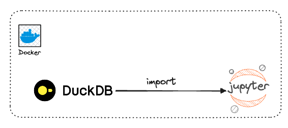
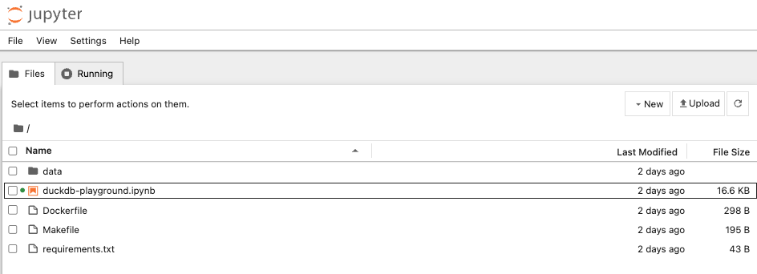
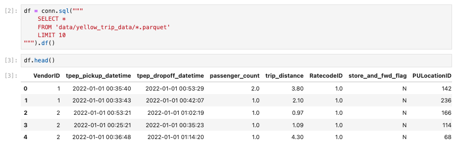
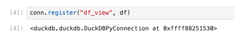
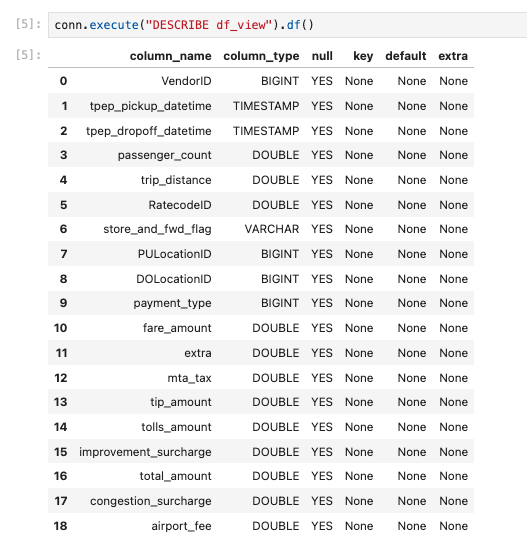

# DuckDB Quick Start using Jupyter Notebook



## What is DuckDB?

DuckDB is a fast in-memory process analytical database. In other words, DuckDB is the SQLite for analytics use cases.
It has no dependencies, is extremely easy to set up, and is optimized to perform queries on data.

### Use Cases

As a data analyst or a data scientiest, a typical workflow is to load data from CSV files or an S3 bucket, perform preprocessing steps, and run the analysis.
To achieve these things, we can pull up a Jupyter Notebook, import Numpy and Pandas, and then execute the queries.

Interestingly, if you look at your operations, you usually perform database operations such as joins, aggregates, filters, etc.
But, instead of using a relational database management system (RDBMS), you use Pandas and Numpy.

The question is, WHY?
Setting up a database and loading data in it can be a painful slow and frustrating experience. If it were easy, you would have everything to gain by using an RDBMS.

Say "**WELCOME**" to DuckDB! :wave:

!!! success

    DuckDB is the easiest and fastest way to analyze data with a DB.

### Why is using DuckDB?

Few benefits of using DuckDB:

#### Local

- DuckDB is an in-process single-file database with no external dependencies. What does that mean? Unlike Postgres, there is no client/server to set up or external dependencies to install.
- In addition, the data transfer to/from the client is slower than it should be, especially for local installations.
- On the other hand, DuckDB is embedded in the host application process and manages a database stored in a single file.
- There is no client/server, and it is straightforward to install.

#### Performances

- DuckDB is highly optimized for analytical query workloads (OLAP). Because it is columnar-oriented DB (along with other optimizations), complex-long-running queries to aggregate, join or read data become blazingly fast!
- It’s easy to claim that ~90% of big data workloads can be handled on a single machine without any setup or computation pains with DuckDB.

!!! warning

    That’s not the case with Pandas. Pandas cannot leverage CPU cores to parallelize computations, making them slow to complete. It operates entirely in memory leading to out-of-memory errors if the dataset is too big.

#### SQL

- Whether you like it or not, SQL is more alive than ever. DuckDB supports a fairly advanced SQL command set, such as window functions and aggregates.
- It provides transactional guarantees (ACID properties) and uses the Postgres API. Forget about the ugly and slow Panda’s manipulations.
- You can replace all of them with elegant SQL (it offers some additions on top of SQL to make it more friendly, as shown here).
- Finally, DuckDB has a Python Client and shines when mixed with Arrow and Parquet.
- DuckDB is an actively developed open-source, embeddable, in-process, and column-oriented SQL OLAP RDBMS.

!!! info

    Perfect for data practitioners who want to perform local analytical workloads easily and quickly.

### Limitations

- **DuckDB is designed to run on a single machine**

That means your data has to fit with that single machine; otherwise, it doesn’t work. In reality, you can use powerful computers that will be enough for 99% of your workload. That shouldn’t be an issue unless you process terabytes of data daily.

- **DuckDB is not a multi-tenant database**

Having different people with different teams, developing models, and sharing data on the database will be very challenging. However, when you integrate the DB with other tools such as Airflow, S3, Parquet, and dbt, you can get a robust data ecosystem with which teams can efficiently work.

- **DuckDB is not supposed a transactional database and should not be used that way**

## DuckDB using Jupyter

Time to play with DuckDB.

First, you need to clone the repo first.

```bash
git clone git@github.com:karlchris/duckdb-quickstart.git
```

### Quick Start Installation

- Add the `Dockerfile` to run everything inside Docker container.

```Dockerfile
FROM python:3.12-slim-bullseye

WORKDIR /app

COPY requirements.txt .
RUN pip install -r requirements.txt

COPY . .

EXPOSE 8888

# Run Jupyter Notebook when the container launches
CMD ["jupyter", "notebook", "--ip=0.0.0.0", "--port=8888", "--no-browser", "--allow-root", "--NotebookApp.token=''"]
```

- put relevant libraries in `requirements.txt`

```txt title="requirements.txt"
duckdb==1.0.0
pandas==2.2.2
jupyter==1.0.0
```

- run `make build` to build the docker image.

```bash
(base) ➜  duckdb-quickstart git:(main) make build
docker build -t duckdb-quickstart .
[+] Building 40.8s (11/11) FINISHED                                                                                                                                                                                                                                                                docker:desktop-linux
 => [internal] load build definition from Dockerfile                                                                                                                                                                                                                                                               0.0s
 => => transferring dockerfile: 337B                                                                                                                                                                                                                                                                               0.0s
 => [internal] load metadata for docker.io/library/python:3.12-slim-bullseye                                                                                                                                                                                                                                       3.6s
 => [auth] library/python:pull token for registry-1.docker.io                                                                                                                                                                                                                                                      0.0s
 => [internal] load .dockerignore                                                                                                                                                                                                                                                                                  0.0s
 => => transferring context: 2B                                                                                                                                                                                                                                                                                    0.0s
 => [1/5] FROM docker.io/library/python:3.12-slim-bullseye@sha256:7e9400f6d73dcb6fd4ea9a2f6e5334da18631f8facb007711648d924a38cfdc6                                                                                                                                                                                 3.2s
 => => resolve docker.io/library/python:3.12-slim-bullseye@sha256:7e9400f6d73dcb6fd4ea9a2f6e5334da18631f8facb007711648d924a38cfdc6                                                                                                                                                                                 0.0s
 => => sha256:7e9400f6d73dcb6fd4ea9a2f6e5334da18631f8facb007711648d924a38cfdc6 9.12kB / 9.12kB                                                                                                                                                                                                                     0.0s
 => => sha256:a3db278a8d77cbdf5e65489c7088997af2402fa9fdc1ac964a48a4d9d11b81d2 1.95kB / 1.95kB                                                                                                                                                                                                                     0.0s
 => => sha256:4324ba87c71ab1bae726e1b4cf41a7431890b13de8649090720eb61faf9f4a5e 6.69kB / 6.69kB                                                                                                                                                                                                                     0.0s
 => => sha256:d13ad33c16eef01d20d5563bfb2ec4f25c0d12699b40cdab418e47b88d2f02e2 30.07MB / 30.07MB                                                                                                                                                                                                                   1.9s
 => => sha256:2197229b63cd075b53e5db849039a3900a119a8b056fbc92b7c606dbf3ecc530 1.06MB / 1.06MB                                                                                                                                                                                                                     1.6s
 => => sha256:95308c8804cad9fdf83d34811f850e032b4b36b2df9b53869b4f5a864e2219ab 11.29MB / 11.29MB                                                                                                                                                                                                                   2.5s
 => => sha256:90092edca53bb728d1d06f3d69125fc61fc5ea000d537a582a50391757705a45 232B / 232B                                                                                                                                                                                                                         2.0s
 => => extracting sha256:d13ad33c16eef01d20d5563bfb2ec4f25c0d12699b40cdab418e47b88d2f02e2                                                                                                                                                                                                                          0.8s
 => => sha256:5c5dbeaf51892c2b8c912e91ffe69046e3181b752e395fc638288a034c58e579 2.87MB / 2.87MB                                                                                                                                                                                                                     2.7s
 => => extracting sha256:2197229b63cd075b53e5db849039a3900a119a8b056fbc92b7c606dbf3ecc530                                                                                                                                                                                                                          0.0s
 => => extracting sha256:95308c8804cad9fdf83d34811f850e032b4b36b2df9b53869b4f5a864e2219ab                                                                                                                                                                                                                          0.2s
 => => extracting sha256:90092edca53bb728d1d06f3d69125fc61fc5ea000d537a582a50391757705a45                                                                                                                                                                                                                          0.0s
 => => extracting sha256:5c5dbeaf51892c2b8c912e91ffe69046e3181b752e395fc638288a034c58e579                                                                                                                                                                                                                          0.1s
 => [internal] load build context                                                                                                                                                                                                                                                                                  0.9s
 => => transferring context: 278.21MB                                                                                                                                                                                                                                                                              0.9s
 => [2/5] WORKDIR /app                                                                                                                                                                                                                                                                                             0.2s
 => [3/5] COPY requirements.txt .                                                                                                                                                                                                                                                                                  0.0s
 => [4/5] RUN pip install -r requirements.txt                                                                                                                                                                                                                                                                     32.6s
 => [5/5] COPY . .                                                                                                                                                                                                                                                                                                 0.2s 
 => exporting to image                                                                                                                                                                                                                                                                                             1.0s 
 => => exporting layers                                                                                                                                                                                                                                                                                            1.0s 
 => => writing image sha256:9ca3eaade8602a5b5e100894d9d2b7bb2a641b1b280e9bdb0c861573148ab58d                                                                                                                                                                                                                       0.0s 
 => => naming to docker.io/library/duckdb-quickstart                                                                                                                                                                                                                                                               0.0s 
                                                                                                                                                                                                                                                                                                                        
View build details: docker-desktop://dashboard/build/desktop-linux/desktop-linux/mg3pyrw20olihy8xvkg7f2kz6

What's next:
    View a summary of image vulnerabilities and recommendations → docker scout quickview
```

- run `make run` to start container.

```bash
(base) ➜  duckdb-quickstart git:(main) make run  
docker run --rm -d -p 8888:8888 --name duckdb-quickstart -v /Users/karlchristian/repos/duckdb-quickstart:/app duckdb-quickstart
17abb0eb31ce83dffffcf279ec5431fc377169e426dd17a1a12fc735fd9ed985
```

!!! danger

    Please, run `make stop` once you finish with this project.

### Create DuckDB Connection

- open `http://localhost:8888/tree?` as the Jupyter Notebook UI.



- open `duckdb-playground.ipynb` to run the main code.

```python
import duckdb


conn = duckdb.connect()
```

### Query Data With DuckDB and Python

```python
df = conn.sql("""
    SELECT *
    FROM 'data/yellow_trip_data/*.parquet'
    LIMIT 10
""").df()

df.head()
```

Output:


Being able to query data is good, but retrieving data from a query is even better!
DuckDB provides multiple methods that you can use to efficiently retrieve data, such as:

- `fetchnumpy()` fetches the data as a dictionary of Numpy arrays.
- `df()` brings the data as a Pandas Dataframe.
- `arrow()` fetches the data as an Arrow table.
- `pl()` pulls the data as a Polars Dataframe.

!!! warning

    Ultimately, choosing the best method that suits your needs is up to you.
    As a best practice, don't use `fetch_one` or `fetch_all` as they create a Python object for every value returned by your query.

    If you have a lot of data, you can have a memory error or poor performance.

### Create a Table from DataFrame

- you need to register the dataframe as a virtual table so you can query the data using the usual SQL features.

```bash
conn.register("df_view", df)
print(conn.execute("DESCRIBE df_view").df())
```

Output:


- execute `DESCRIBE` to check table information, including its table schema.

```bash
conn.execute("DESCRIBE df_view").df()
```

Output:


## Conclusion

DuckDB saves you time by being easy to use and efficient at querying any data. 
Instead of going through a classic RDBMS to load and query your data, simply use DuckDB. 

!!! danger

    Remember that for most of your use cases, you may not need a massive setup with 100 CPUs and 100Gb of memory.

## References

- [DuckDB Official Documentation](https://duckdb.org/why_duckdb)
- [DuckDB: Getting started for Begineers](https://marclamberti.com/blog/duckdb-getting-started-for-beginners/)
