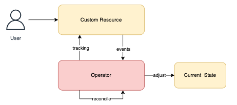
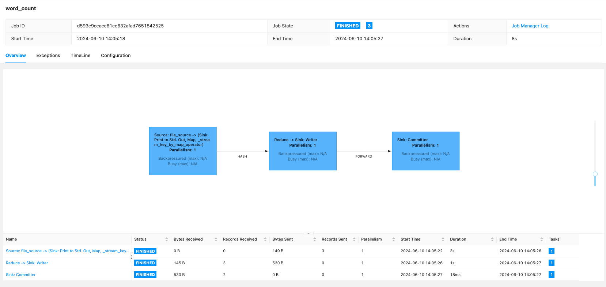
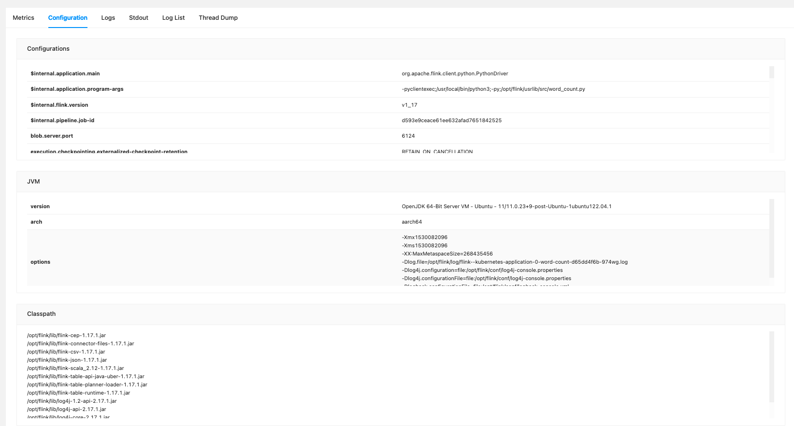

# Running Apache Flink on Kubernetes

## Apache Flink


Flink is a distributed system and requires effective allocation and management of compute resources in order to execute streaming applications.

It integrates with all common cluster resource managers such as Hadoop YARN and Kubernetes, but can also be set up to run as a standalone cluster or even as a library.

The Flink runtime consists of 2 types of processes:

### Client

The client is not part of the runtime and program execution, but is used to prepare and send a dataflow to the JobManager.

After that, client can disconnect (detached mode), or stay connected to receive progress reports (attached mode).

The client runs either as part of the Java/Scala program that triggers the execution, or in the command line process `./bin/flink run`

### JobManager

The `JobManager` has a number of responsibilities related to coordinating the distributed execution of Flink Applications:

- it decides when to schedule the next task (or set of tasks)
- reacts to finished tasks or execution failures
- coordinates checkpoints
- coordinates recovery on failures

this process consists of 3 components:

- **ResourceManager**: responsible for resource de-/allocation and provisioning in a Flink cluster -- it manages **task slots**, which are the unit of the resource scheduling in a Flink cluster.
- **Dispatcher**: REST interface to submit Flink applications for executions and starts a new JobMaster for each submitted job.
- **JobMaster**: responsible for managing the execution of a single **JobGraph**. Multiple jobs can run simultaneously in a Flink cluster, each having its own JobMaster.

There is always at least one JobManager. A high-availability setup might have multiple JobManagers, one of which is always the *leader*, and the others are *standby*.

### TaskManagers

The `TaskManagers` (also called workers) execute the tasks of a dataflow, and buffer and exchange the data streams.

There must always be at least one TaskManager. The smallest unit of resource scheduling in a TaskManager is a task `slot`. The number of task slots in a TaskManager indicates the number of concurrent processing tasks.

!!! note

    multiple operators may execute in a task slot

## Flink Application Execution

A *Flink Application* is any user program that spawns one or multiple Flink jobs from its `main()` method.
The execution of these jobs can happen in a local JVM (`LocalEnvironment`) or on a remote setup of clusters with multiple machines (`RemoteEnvironment`).

For each program, the `ExecutionEnvironment` provide methods to control the job execution.

The jobs of a Flink Application can either be submitted to a long-running **Flink Session CLuster** or a **Flink Application Cluster**.

!!! info

    the difference between those options is mainly related to the cluster's lifecycle and to resource isolation guarantees.

## Flink Kubernetes Operator


Flink Kubernetes Operator acts as a control plane to manage the complete deployment lifecycle of Apache Flink applications.

Although Flink’s native Kubernetes integration already allows you to directly deploy Flink applications on a running Kubernetes(k8s) cluster, custom resources and the operator pattern have also become central to a Kubernetes native deployment experience.

Flink Kubernetes Operator aims to capture the responsibilities of a human operator who is managing Flink deployments.

Human operators have deep knowledge of how Flink deployments ought to behave, how to start clusters, how to deploy jobs, how to upgrade them and how to react if there are problems.

The main goal of the operator is the automation of these activities, which cannot be achieved through the Flink native integration alone.

### Control Loop



Users can interact with the operator using the Kubernetes command-line tool, `kubectl`.
The operator continuously tracks cluster events relating to the `FlinkDeployment` custom resources.
When the operator receives a new resource update, it will take action to adjust the Kubernetes cluster to the desired state as part of its reconciliation loop.

The steps are:

- User submits a `FlinkDeployment` custom resource using `kubectl`
- Operator observes the current status of the Flink resource (if previously deployed)
- Operator validates the submitted resource change
- Operator reconciles any required changes and executes upgrades

The CR can be (re)applied on the cluster any time. The Operator makes continuous adjustments to imitate the desired state until the current state becomes the desired state.
All lifecycle management operations are realized using this very simple principle in the Operator.

!!! info

    The Operator is built with the Java Operator SDK and uses the Native Kubernetes Integration for launching Flink deployments and submitting jobs under the hood.

## Steps to deploy Flink Kubernetes Operator

First, clone this repo [Flink on K8s](https://github.com/karlchris/flink-k8s), by running this command

```bash
git clone git@github.com:karlchris/flink-k8s.git
```

### 1. Create Flink Kubernetes Cluster

run below command to create Kubernetes cluster

```bash
kind create cluster --name flink --config kind-cluster.yaml
kubectl cluster-info
kubectl get nodes -o wide
```

or just run

```bash
make cluster
```

Output

```bash
➜  flink-k8s make cluster
Creating kubernetes cluster and check it ...
Creating cluster "flink" ...
 ✓ Ensuring node image (kindest/node:v1.30.0) 🖼 
 ✓ Preparing nodes 📦 📦  
 ✓ Writing configuration 📜 
 ✓ Starting control-plane 🕹️ 
 ✓ Installing CNI 🔌 
 ✓ Installing StorageClass 💾 
 ✓ Joining worker nodes 🚜 
Set kubectl context to "kind-flink"
You can now use your cluster with:

kubectl cluster-info --context kind-flink

Have a nice day! 👋
Kubernetes control plane is running at https://127.0.0.1:58557
CoreDNS is running at https://127.0.0.1:58557/api/v1/namespaces/kube-system/services/kube-dns:dns/proxy

To further debug and diagnose cluster problems, use 'kubectl cluster-info dump'.
NAME                  STATUS     ROLES           AGE   VERSION   INTERNAL-IP   EXTERNAL-IP   OS-IMAGE                         KERNEL-VERSION    CONTAINER-RUNTIME
flink-control-plane   Ready      control-plane   21s   v1.30.0   172.24.0.3    <none>        Debian GNU/Linux 12 (bookworm)   6.6.26-linuxkit   containerd://1.7.15
flink-worker          NotReady   <none>          1s    v1.30.0   172.24.0.2    <none>        Debian GNU/Linux 12 (bookworm)   6.6.26-linuxkit   containerd://1.7.15
```

### 2. Deploy Kubernetes namespace

run this command to create and deploy kubernetes namespace `flink`

```bash
kubectl create namespace flink
kubectl get namespaces
kubectl config set-context --current --namespace=flink
```

or just run

```bash
make ns
```

Output

```bash
➜  flink-k8s make ns     
namespace/flink created
NAME                 STATUS   AGE
default              Active   84s
flink                Active   0s
kube-node-lease      Active   84s
kube-public          Active   84s
kube-system          Active   84s
local-path-storage   Active   81s
Context "kind-flink" modified.
```

### 3. Install Helm chart for Flink and Prometheus

run below command to fetch and install helm charts

```bash
echo "Fetching flink from Helm chart"
helm repo add flink-operator-repo https://downloads.apache.org/flink/flink-kubernetes-operator-1.7.0/
helm repo update
helm search repo flink
helm repo add prometheus-community https://prometheus-community.github.io/helm-charts
helm install prometheus prometheus-community/kube-prometheus-stack

echo "Installing certs ..."
kubectl create -f https://github.com/jetstack/cert-manager/releases/download/v1.8.2/cert-manager.yaml

echo "Waiting for 1 min ..."
sleep 60

echo "Installing flink ..."
helm install flink flink-operator-repo/flink-kubernetes-operator --namespace flink --debug
```

or run

```bash
make install
```

Output

```bash
➜  flink-k8s make install
Fetching flink from Helm chart
"flink-operator-repo" already exists with the same configuration, skipping
Hang tight while we grab the latest from your chart repositories...
...Successfully got an update from the "apache-airflow" chart repository
...Successfully got an update from the "flink-operator-repo" chart repository
...Successfully got an update from the "prometheus-community" chart repository
Update Complete. ⎈Happy Helming!⎈
NAME                                            CHART VERSION   APP VERSION     DESCRIPTION                                       
flink-operator-repo/flink-kubernetes-operator   1.7.0           1.7.0           A Helm chart for the Apache Flink Kubernetes Op...
"prometheus-community" already exists with the same configuration, skipping
NAME: prometheus
LAST DEPLOYED: Mon Jun 10 13:52:21 2024
NAMESPACE: flink
STATUS: deployed
REVISION: 1
NOTES:
kube-prometheus-stack has been installed. Check its status by running:
  kubectl --namespace flink get pods -l "release=prometheus"

Visit https://github.com/prometheus-operator/kube-prometheus for instructions on how to create & configure Alertmanager and Prometheus instances using the Operator.
Installing certs ...
namespace/cert-manager created
customresourcedefinition.apiextensions.k8s.io/certificaterequests.cert-manager.io created
customresourcedefinition.apiextensions.k8s.io/certificates.cert-manager.io created
customresourcedefinition.apiextensions.k8s.io/challenges.acme.cert-manager.io created
customresourcedefinition.apiextensions.k8s.io/clusterissuers.cert-manager.io created
customresourcedefinition.apiextensions.k8s.io/issuers.cert-manager.io created
customresourcedefinition.apiextensions.k8s.io/orders.acme.cert-manager.io created
serviceaccount/cert-manager-cainjector created
serviceaccount/cert-manager created
serviceaccount/cert-manager-webhook created
configmap/cert-manager-webhook created
clusterrole.rbac.authorization.k8s.io/cert-manager-cainjector created
clusterrole.rbac.authorization.k8s.io/cert-manager-controller-issuers created
clusterrole.rbac.authorization.k8s.io/cert-manager-controller-clusterissuers created
clusterrole.rbac.authorization.k8s.io/cert-manager-controller-certificates created
clusterrole.rbac.authorization.k8s.io/cert-manager-controller-orders created
clusterrole.rbac.authorization.k8s.io/cert-manager-controller-challenges created
clusterrole.rbac.authorization.k8s.io/cert-manager-controller-ingress-shim created
clusterrole.rbac.authorization.k8s.io/cert-manager-view created
clusterrole.rbac.authorization.k8s.io/cert-manager-edit created
clusterrole.rbac.authorization.k8s.io/cert-manager-controller-approve:cert-manager-io created
clusterrole.rbac.authorization.k8s.io/cert-manager-controller-certificatesigningrequests created
clusterrole.rbac.authorization.k8s.io/cert-manager-webhook:subjectaccessreviews created
clusterrolebinding.rbac.authorization.k8s.io/cert-manager-cainjector created
clusterrolebinding.rbac.authorization.k8s.io/cert-manager-controller-issuers created
clusterrolebinding.rbac.authorization.k8s.io/cert-manager-controller-clusterissuers created
clusterrolebinding.rbac.authorization.k8s.io/cert-manager-controller-certificates created
clusterrolebinding.rbac.authorization.k8s.io/cert-manager-controller-orders created
clusterrolebinding.rbac.authorization.k8s.io/cert-manager-controller-challenges created
clusterrolebinding.rbac.authorization.k8s.io/cert-manager-controller-ingress-shim created
clusterrolebinding.rbac.authorization.k8s.io/cert-manager-controller-approve:cert-manager-io created
clusterrolebinding.rbac.authorization.k8s.io/cert-manager-controller-certificatesigningrequests created
clusterrolebinding.rbac.authorization.k8s.io/cert-manager-webhook:subjectaccessreviews created
role.rbac.authorization.k8s.io/cert-manager-cainjector:leaderelection created
role.rbac.authorization.k8s.io/cert-manager:leaderelection created
role.rbac.authorization.k8s.io/cert-manager-webhook:dynamic-serving created
rolebinding.rbac.authorization.k8s.io/cert-manager-cainjector:leaderelection created
rolebinding.rbac.authorization.k8s.io/cert-manager:leaderelection created
rolebinding.rbac.authorization.k8s.io/cert-manager-webhook:dynamic-serving created
service/cert-manager created
service/cert-manager-webhook created
deployment.apps/cert-manager-cainjector created
deployment.apps/cert-manager created
deployment.apps/cert-manager-webhook created
mutatingwebhookconfiguration.admissionregistration.k8s.io/cert-manager-webhook created
validatingwebhookconfiguration.admissionregistration.k8s.io/cert-manager-webhook created
Waiting for 1 min ...
Installing flink ...
install.go:222: [debug] Original chart version: ""
install.go:239: [debug] CHART PATH: /Users/karlchristian/Library/Caches/helm/repository/flink-kubernetes-operator-1.7.0-helm.tgz
```

### 4. Build docker image and load it into Flink Cluster

run below commands to build the docker image and load it to Kubernetes cluster

```bash
DOCKER_BUILDKIT=1 docker build -t pyflink:dev .
kind load docker-image pyflink:dev --name flink
```

or just run

```bash
make build
```

Output

```bash
➜  flink-k8s make build  
[+] Building 309.5s (13/13) FINISHED                                                                                                                                                                                                     docker:desktop-linux
 => [internal] load build definition from Dockerfile                                                                                                                                                                                                     0.0s
 => => transferring dockerfile: 1.45kB                                                                                                                                                                                                                   0.0s
 => [internal] load metadata for docker.io/library/flink:1.17.1                                                                                                                                                                                          3.5s
 => [auth] library/flink:pull token for registry-1.docker.io                                                                                                                                                                                             0.0s
 => [internal] load .dockerignore                                                                                                                                                                                                                        0.0s
 => => transferring context: 2B                                                                                                                                                                                                                          0.0s
 => [1/7] FROM docker.io/library/flink:1.17.1@sha256:2d2733e37ead5b1df1a81110db653382ba7906fb3ba4e998e0f325d8c752cd7b                                                                                                                                   56.2s
 => => resolve docker.io/library/flink:1.17.1@sha256:2d2733e37ead5b1df1a81110db653382ba7906fb3ba4e998e0f325d8c752cd7b                                                                                                                                    0.0s
 => => sha256:895d322e8e5957c04af3ab7b3431f2a562182d34167c6e159e02044150a66967 28.39MB / 28.39MB                                                                                                                                                         4.7s
 => => sha256:4035bfa3ea28e4a939fa769d2862227b94b4b5b961f65ac5df2ea3df7a0c51e4 12.84MB / 12.84MB                                                                                                                                                         8.0s
 => => sha256:44426d62154b920edc46b4f9c3d95ead5cff773239ebb0640ed78a3eabd75d3d 45.40MB / 45.40MB                                                                                                                                                        10.1s
 => => sha256:2d2733e37ead5b1df1a81110db653382ba7906fb3ba4e998e0f325d8c752cd7b 549B / 549B                                                                                                                                                               0.0s
 => => sha256:ccd51a0f3b8f4c019155583df273c6562bfaac9abe52704a48e67d967f8e5388 2.62kB / 2.62kB                                                                                                                                                           0.0s
 => => sha256:1501184341512f2c553a429222fed9ffdf62b1e815356676ed2767b8033358bf 11.93kB / 11.93kB                                                                                                                                                         0.0s
 => => sha256:a5b0a8b8196635efd1dce5dd763022df6a147662cd3aa1dcff312442551fce3d 159B / 159B                                                                                                                                                               5.0s
 => => extracting sha256:895d322e8e5957c04af3ab7b3431f2a562182d34167c6e159e02044150a66967                                                                                                                                                                0.5s
 => => sha256:deeea1065ab43308ab77465a15be2c3e434488174fb1da412ee0e1f868c0ea93 732B / 732B                                                                                                                                                               5.4s
 => => sha256:6f996a6320ba196b53221fe2bc2ce7ce09f922cbc421e0123815593ac38c025e 4.51MB / 4.51MB                                                                                                                                                           6.8s
 => => sha256:8e2a6e0a48e478e486e6c060d2b736fb3687a0bab95bb276acceff8e9f218734 835.39kB / 835.39kB                                                                                                                                                       7.4s
 => => sha256:9d20355c28ef09a7afe8ebd2a08cadaae9ffc2d8d9039d7e7a52edbbebc07575 4.64kB / 4.64kB                                                                                                                                                           8.0s
 => => extracting sha256:4035bfa3ea28e4a939fa769d2862227b94b4b5b961f65ac5df2ea3df7a0c51e4                                                                                                                                                                0.5s
 => => sha256:00a06505ac4a71a0a3a3fa5d6b4c8a61621c35508a0bfdce82d878dcfd1d9c19 148B / 148B                                                                                                                                                               8.4s
 => => sha256:a8077a97f1384ae731c36f4f260e8acd9f7f50521b9ccacec61a903165fa5a6a 469.60MB / 469.60MB                                                                                                                                                      53.4s
 => => sha256:33336083219c139aedbf20429bd9b3f24b495ee36f145b0e8d253f675ea27a7c 2.11kB / 2.11kB                                                                                                                                                           8.9s
 => => extracting sha256:44426d62154b920edc46b4f9c3d95ead5cff773239ebb0640ed78a3eabd75d3d                                                                                                                                                                0.9s
 => => extracting sha256:a5b0a8b8196635efd1dce5dd763022df6a147662cd3aa1dcff312442551fce3d                                                                                                                                                                0.0s
 => => extracting sha256:deeea1065ab43308ab77465a15be2c3e434488174fb1da412ee0e1f868c0ea93                                                                                                                                                                0.0s
 => => extracting sha256:6f996a6320ba196b53221fe2bc2ce7ce09f922cbc421e0123815593ac38c025e                                                                                                                                                                0.1s
 => => extracting sha256:8e2a6e0a48e478e486e6c060d2b736fb3687a0bab95bb276acceff8e9f218734                                                                                                                                                                0.0s
 => => extracting sha256:9d20355c28ef09a7afe8ebd2a08cadaae9ffc2d8d9039d7e7a52edbbebc07575                                                                                                                                                                0.0s
 => => extracting sha256:00a06505ac4a71a0a3a3fa5d6b4c8a61621c35508a0bfdce82d878dcfd1d9c19                                                                                                                                                                0.0s
 => => extracting sha256:a8077a97f1384ae731c36f4f260e8acd9f7f50521b9ccacec61a903165fa5a6a                                                                                                                                                                2.7s
 => => extracting sha256:33336083219c139aedbf20429bd9b3f24b495ee36f145b0e8d253f675ea27a7c                                                                                                                                                                0.0s
 => [internal] load build context                                                                                                                                                                                                                        0.0s
 => => transferring context: 1.82kB                                                                                                                                                                                                                      0.0s
 => [2/7] RUN apt-get update -y &&   apt-get install -y --no-install-recommends     build-essential=12.9ubuntu3     openjdk-11-jdk-headless     libbz2-dev     libffi-dev     libssl-dev     zlib1g-dev     lzma     liblzma-dev   &&   wget -q "http  147.2s
 => [3/7] RUN pip3 install --no-cache-dir apache-flink==1.17.1 &&   pip3 cache purge                                                                                                                                                                   100.9s 
 => [4/7] WORKDIR /opt/flink                                                                                                                                                                                                                             0.0s 
 => [5/7] RUN mkdir /opt/flink/usrlib &&     mkdir /opt/flink/usrlib/output                                                                                                                                                                              0.1s 
 => [6/7] COPY src /opt/flink/usrlib/src/                                                                                                                                                                                                                0.0s 
 => [7/7] COPY input /opt/flink/usrlib/input/                                                                                                                                                                                                            0.0s 
 => exporting to image                                                                                                                                                                                                                                   1.5s 
 => => exporting layers                                                                                                                                                                                                                                  1.5s 
 => => writing image sha256:75a2e6a108d935d8c707c9dbd358d9483995c5308a1f0f371901f1a7640ac36c                                                                                                                                                             0.0s
 => => naming to docker.io/library/pyflink:dev                                                                                                                                                                                                           0.0s

View build details: docker-desktop://dashboard/build/desktop-linux/desktop-linux/mp9pld6uzxlzlvohlenyzcp31
Image: "pyflink:dev" with ID "sha256:75a2e6a108d935d8c707c9dbd358d9483995c5308a1f0f371901f1a7640ac36c" not yet present on node "flink-control-plane", loading...
Image: "pyflink:dev" with ID "sha256:75a2e6a108d935d8c707c9dbd358d9483995c5308a1f0f371901f1a7640ac36c" not yet present on node "flink-worker", loading...
```

### 5. Execute the Job

There's 1 simple job to show word count based on the `FileSource`, it's located in `src/word_count.py`

There's related YAML file for this job

```yaml title="jobs/word_count.yaml"
apiVersion: flink.apache.org/v1beta1
kind: FlinkDeployment
metadata:
  name: word-count
spec:
  image: pyflink:dev
  imagePullPolicy: Never
  flinkVersion: v1_17
  flinkConfiguration:
    taskmanager.numberOfTaskSlots: "2"
  serviceAccount: flink
  jobManager:
    resource:
      memory: "2048m"
      cpu: 1
  taskManager:
    resource:
      memory: "2048m"
      cpu: 1
  job:
    entryClass: "org.apache.flink.client.python.PythonDriver"
    args: ["-pyclientexec", "/usr/local/bin/python3", "-py", "/opt/flink/usrlib/src/word_count.py"]
    parallelism: 1
    upgradeMode: stateless
```

run with this command

```bash
kubectl apply -f jobs/word_count.yaml -n flink
```

It will create `Pods` and `Service` related to the submitted jobs.
Once you apply some new jobs, it will create new pods with resources.

You can check the existing pods by running

```bash
kubectl get pods
```

to check the running job on Flink UI, you can run this command

```bash
kubectl port-forward svc/word-count-rest 8081
```

you can access the UI on `http://localhost:8081`


You can also check the Word Count DAG and process details on UI



You can also go to `Job Manager Log` to see the full logs


There's `Metrics` related to this job


and its `Configuration`



## Monitoring

You can use `Prometheus` to view infrastructure loads in the dashboard.

The Prometheus Operator among other options provides an elegant, declarative way to specify how group of pods should be monitored using custom resources.

To install the Prometheus operator via Helm run:

```bash
helm repo add prometheus-community https://prometheus-community.github.io/helm-charts
helm install prometheus prometheus-community/kube-prometheus-stack
```

you can run below commands to create prometheus pods and forward it to localhost port

```yaml title="pod-monitor.yaml"
apiVersion: monitoring.coreos.com/v1
kind: PodMonitor
metadata:
  name: flink-kubernetes-operator
  labels:
    release: prometheus
spec:
  selector:
    matchLabels:
      app.kubernetes.io/name: flink-kubernetes-operator
  podMetricsEndpoints:
      - port: metrics
```

```bash
kubectl apply -f pod-monitor.yaml -n flink
kubectl port-forward deployment/prometheus-grafana 3000
```

you can view it through `http://localhost:3000/explore`

you can do all the above commands or just simply run below

```bash
make monitor
```

the credentials for the dashboard can be retrieved by:

```bash
kubectl get secret prometheus-grafana -o jsonpath="{.data.admin-user}" | base64 --decode ; echo
kubectl get secret prometheus-grafana -o jsonpath="{.data.admin-password}" | base64 --decode ; echo
```

or just simply run

```bash
make grafana-creds
```


By dashboard above, you can see the CPU utilization for this Kubernetes cluster and jobs. This is a great view to be able to optimize the infrastructure better.

## References

- [Flink Kubernetes Operator](https://nightlies.apache.org/flink/flink-kubernetes-operator-docs-main/docs/concepts/architecture/)
- [Apache Flink](https://nightlies.apache.org/flink/flink-docs-release-1.19/docs/concepts/flink-architecture/)
