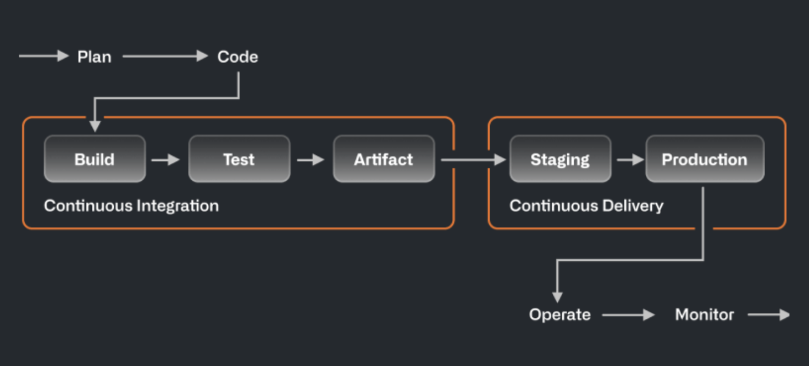
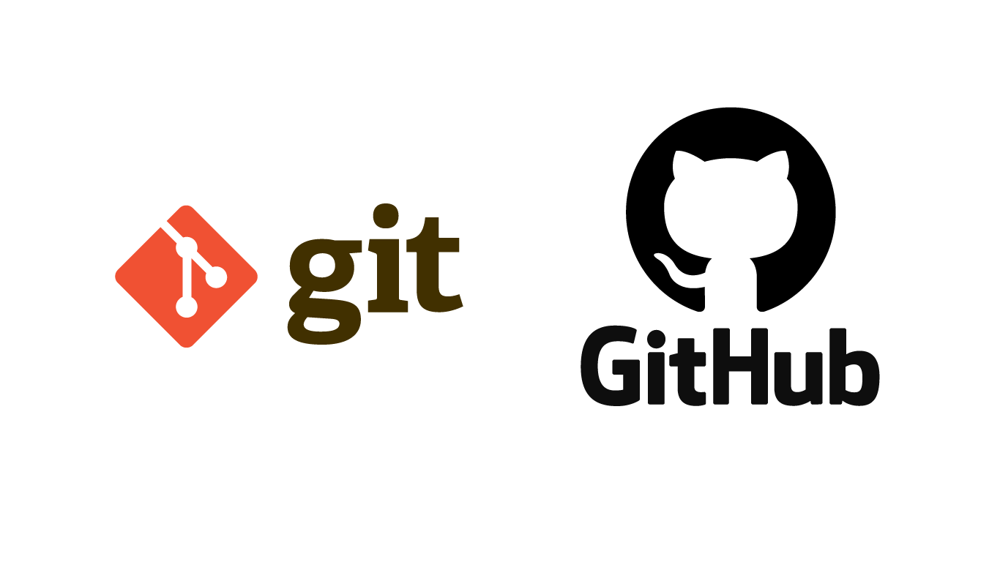
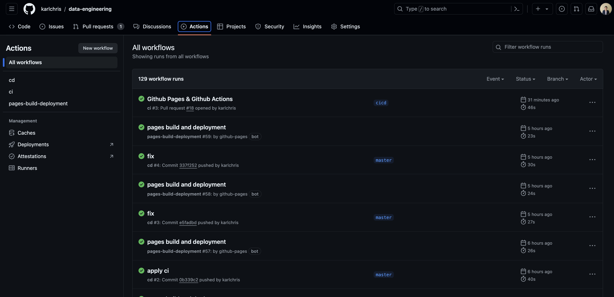
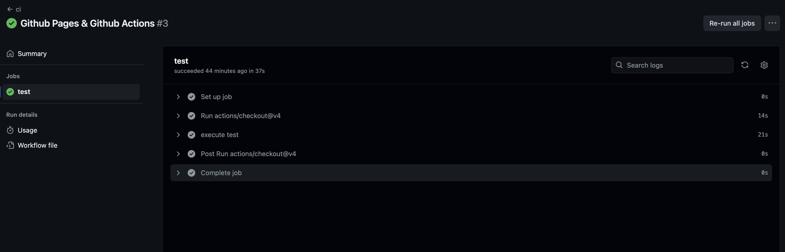
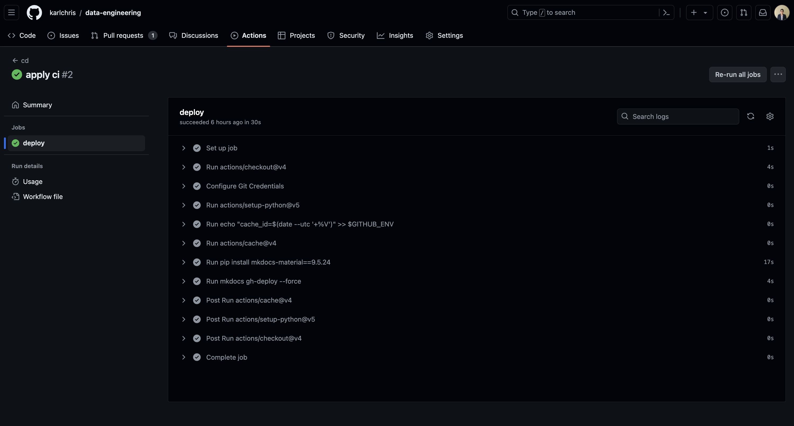
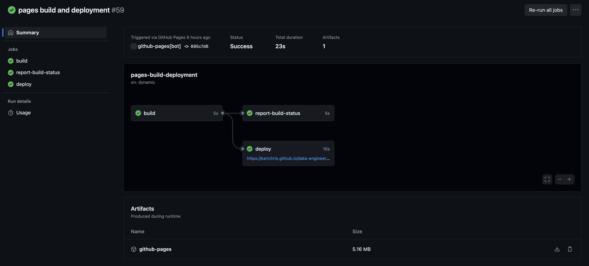

# Building Github Pages using Github Actions


## What is CI/CD?

Automation is a core principle for achieving DevOps success and CI/CD is a critical component.
CI/CD comprises of continuous integration and continuous delivery or continuous deployment. Put together, they form a “CI/CD pipeline”—a series of automated workflows that help DevOps teams cut down on manual tasks:

- **Continuous Integration (CI)**: Automatically builds, tests, and integrates code changes within a shared repository
- **Continuous Delivery (CD)**: automatically delivers code changes to production-ready environments for approval
- **Continuous Deployment (CD)**: automatically deploys code changes to customers directly



Continuous deployment is the ultimate example of DevOps automation. That doesn’t mean it’s the only way to do CI/CD, or the “right” way.
Since continuous deployment relies on rigorous testing tools and a mature testing culture, most software teams start with continuous delivery and integrate more automated testing over time.

## Why CI/CD?

- **Deployment velocity**: Ongoing feedback allows developers to commit smaller changes more often, versus waiting for one release.
- **Stability and reliability**: Automated, continuous testing ensures that codebases remain stable and release-ready at any time.
- **Business growth**: Freed up from manual tasks, organizations can focus resources on innovation, customer satisfaction, and paying down technical debt.

## Github world

This is everything you must know quickly about Github, Github Actions & Github Pages.

**GitHub** is a developer platform that allows developers to create, store, manage and share their code.



### Github Actions

Using **GitHub Actions**, it’s easier than ever to bring CI/CD directly into your workflow right from your repository.



Benefits of using Github Actions as CI/CD automation:

- CI/CD pipeline setup is relatively simple

GitHub Actions is made by and for developers, so you don’t need dedicated resources to set up and maintain your pipeline.
There’s no need to manually configure and set up CI/CD.

- Respond to any webhook on GitHub

Since GitHub Actions is fully integrated with GitHub, you can set any webhook as an event trigger for an automation or CI/CD pipeline.
This includes things like pull requests, issues, and comments, but it also includes webhooks from any app you have integrated into your GitHub repository.

- Community-powered, reusable workflows

You can share your workflows publicly with the wider GitHub community or access pre-built CI/CD workflows in the GitHub Marketplace (there are more than 11,000 available actions!).

- Support for any platform, any language, and any cloud

GitHub Actions is platform agnostic, language agnostic, and cloud agnostic.

### Github Pages

**GitHub Pages** are public webpages hosted and published through GitHub.
You can use GitHub Pages to showcase some open source projects, host a blog or share any portfolio.

!!! note

    Usually, github pages will be published in `<your github handle>.github.io` domain, unless you provide custom domain.

## CI Test

CI is used to to test the code changes, it will lint, check and validate whatever we put as the test checks and ensure if this code changes is deployed, it will be really safe.

!!! example

    In this project, the website will only contains markdown files, then the test check will lint all the markdown and ensure nothing is violating the rules.

    the used library here is [markdownlint](https://github.com/DavidAnson/markdownlint)

- First, we need to wrap the test execution inside Docker, so the idea is everytime it attempts to test, it will build the image, run the container and perform testing.

```Dockerfile title="Dockerfile-test"
FROM markdownlint/markdownlint:0.13.0

WORKDIR /docs
COPY docs .
COPY .mdlrc .

ENTRYPOINT ["mdl", "/docs"]
```

- You will aware about `.mdlrc` file, it's config file specific to markdownlint, you can put all the rules, ignore rules, etc in that config file.

```text title=".mdlrc"
rules "~MD013", "~MD046", "~MD036", "~MD026", "~MD009", "~MD024", "~MD022", "~MD033", "~MD012", "~MD023", "~MD025", "~MD034"
```

- build `ci.yaml` github actions workflow file

```yaml title=".github/workflows/ci.yaml"
name: ci
on:
  pull_request:
    types: [opened, reopened]
jobs:
  test:
    runs-on: ubuntu-latest
    steps:
      - uses: actions/checkout@v4
      - name: execute test
        run: make test
```

CI will be triggered every time GH Pull Request is opened or reopened and perform the testings.



- you can also try to perform the testing in local first, before proceeding to perform CI on github, just run this command.

```bash
make test
```

```bash
test:
	@docker build . -f Dockerfile-test \
		-t ${IMG}:test
	@docker run ${IMG}:test
```

Output

```bash
➜  data-engineering git:(cicd) make test
[+] Building 2.9s (10/10) FINISHED                                                                                                                                   docker:desktop-linux
 => [internal] load build definition from Dockerfile-test                                                                                                                            0.0s
 => => transferring dockerfile: 150B                                                                                                                                                 0.0s
 => [internal] load metadata for docker.io/markdownlint/markdownlint:0.13.0                                                                                                          2.8s
 => [auth] markdownlint/markdownlint:pull token for registry-1.docker.io                                                                                                             0.0s
 => [internal] load .dockerignore                                                                                                                                                    0.0s
 => => transferring context: 2B                                                                                                                                                      0.0s
 => [1/4] FROM docker.io/markdownlint/markdownlint:0.13.0@sha256:25c930bb03b1ea50a2e6e377e4ab6f1fe89a760f85e56d189cc007caa4301b0b                                                    0.0s
 => [internal] load build context                                                                                                                                                    0.0s
 => => transferring context: 26.95kB                                                                                                                                                 0.0s
 => CACHED [2/4] WORKDIR /docs                                                                                                                                                       0.0s
 => [3/4] COPY docs .                                                                                                                                                                0.0s
 => [4/4] COPY .mdlrc .                                                                                                                                                              0.0s
 => exporting to image                                                                                                                                                               0.0s
 => => exporting layers                                                                                                                                                              0.0s
 => => writing image sha256:4d7129163c4685f05e0c55eb21fc2c628ab08379a9de905393050f7d7698ae6a                                                                                         0.0s
 => => naming to docker.io/library/de-kchrs:test                                                                                                                                     0.0s

View build details: docker-desktop://dashboard/build/desktop-linux/desktop-linux/4nvr40dc58fstxv72l1mtsse6
```

!!! tip

    CI should run really fast and keep it light, under 10s or maximum couple of minutes.
    
    Why? Just imagine if you will have a lot of PRs in your repo, they will run CI at the same time or almost same time. 
    If 1 CI on 1 PR will run around 30 minutes or 1 hour, you will know how long it will take to perform testing on multiple PRs.
    
    Also, it will take a lot of resources to run heavy testing, if the production code interact with REST API with considerate I/O, we need to eliminate this blockers in CI by mocking it.

## Development in local

You can try/test to build the code and host it to your localhost.

- First, you will need a `Dockerfile`

```Dockerfile title="Dockerfile"
ARG MKDM_VERSION=latest

FROM squidfunk/mkdocs-material:${MKDM_VERSION}

COPY . .

# Start development server by default
ENTRYPOINT ["mkdocs"]
CMD ["serve", "--dev-addr=0.0.0.0:8000"]
```

- run below command to build the image

```bash
make build-page
```

```bash
# Build docker image for local development
build-page:
	@echo "Building page image"
	@docker build . -f Dockerfile \
		-t ${IMG}:dev \
		--build-arg MKDM_VERSION=${MKDM_VERSION}
```

Output

```bash
➜  data-engineering git:(cicd) ✗ make build-page
Building page image
[+] Building 3.1s (8/8) FINISHED                                                                                                                                     docker:desktop-linux
 => [internal] load build definition from Dockerfile                                                                                                                                 0.0s
 => => transferring dockerfile: 260B                                                                                                                                                 0.0s
 => [internal] load metadata for docker.io/squidfunk/mkdocs-material:9.5.24                                                                                                          2.9s
 => [auth] squidfunk/mkdocs-material:pull token for registry-1.docker.io                                                                                                             0.0s
 => [internal] load .dockerignore                                                                                                                                                    0.0s
 => => transferring context: 2B                                                                                                                                                      0.0s
 => [internal] load build context                                                                                                                                                    0.1s
 => => transferring context: 12.87MB                                                                                                                                                 0.1s
 => CACHED [1/2] FROM docker.io/squidfunk/mkdocs-material:9.5.24@sha256:5358893a04dc6ed0e267ef1c0c06abc5d6b00d13dd0fee703c978ef98d56fd53                                             0.0s
 => [2/2] COPY . .                                                                                                                                                                   0.1s
 => exporting to image                                                                                                                                                               0.0s
 => => exporting layers                                                                                                                                                              0.0s
 => => writing image sha256:88fcc7e84428e26425f1c373f98cdfe37b6cc39a85768b47dad3536e86179aa1                                                                                         0.0s
 => => naming to docker.io/library/de-kchrs:dev                                                                                                                                      0.0s

View build details: docker-desktop://dashboard/build/desktop-linux/desktop-linux/viwdpwiy4tlj9xrlmygm0lgrp
```

- run command to run the image inside container and host it to `localhost`

```bash
make dev
```

```bash
# Run dev server in docker
dev:
	@echo "Starting dev server in a docker container"
	@docker run \
		--rm -d \
		--name ${IMG} \
		-p 127.0.0.1:${PORT}:8000 \
		-v ${PWD}:/docs \
		${IMG}:dev
```

- you can preview the pages in `localhost:8000`

## Deployment

CD is triggered when CI is success, then it will proceed to deployment, push to production.

In this project, there will be 2 steps in deployment.

1. It will ships all the code and push to branch `gh-pages`.
2. It will handle for the page deployment and publish it to domain `karlchris.github.io/data-engineering`

### 1. Push to `gh-pages`

- create `cd.yaml`

```yaml title=".github/workflows/cd.yaml"
name: cd
on:
  push:
    branches:
      - master
permissions:
  contents: write
jobs:
  deploy:
    runs-on: ubuntu-latest
    steps:
      - uses: actions/checkout@v4
      - name: Configure Git Credentials
        run: |
          git config user.name github-actions[bot]
          git config user.email 41898282+github-actions[bot]@users.noreply.github.com
      - uses: actions/setup-python@v5
        with:
          python-version: 3.x
      - run: echo "cache_id=$(date --utc '+%V')" >> $GITHUB_ENV 
      - uses: actions/cache@v4
        with:
          key: mkdocs-material-${{ env.cache_id }}
          path: .cache
          restore-keys: |
            mkdocs-material-
      - run: pip install mkdocs-material==9.5.24
      - run: mkdocs gh-deploy --force
```

- push this file to `master` branch.
- once it's pushed, you can view the execution as follow



### 2. Publish to domain

Basically, you don't need to configure yaml or code for this.
Github Actions bot will handle it for you.



## References

- [CI/CD Explained](https://resources.github.com/devops/ci-cd/)
- [Build CI/CD Pipeline with Github Actions](https://github.blog/2022-02-02-build-ci-cd-pipeline-github-actions-four-steps/)
- [Quickstart for Github Pages](https://docs.github.com/en/pages/quickstart)
