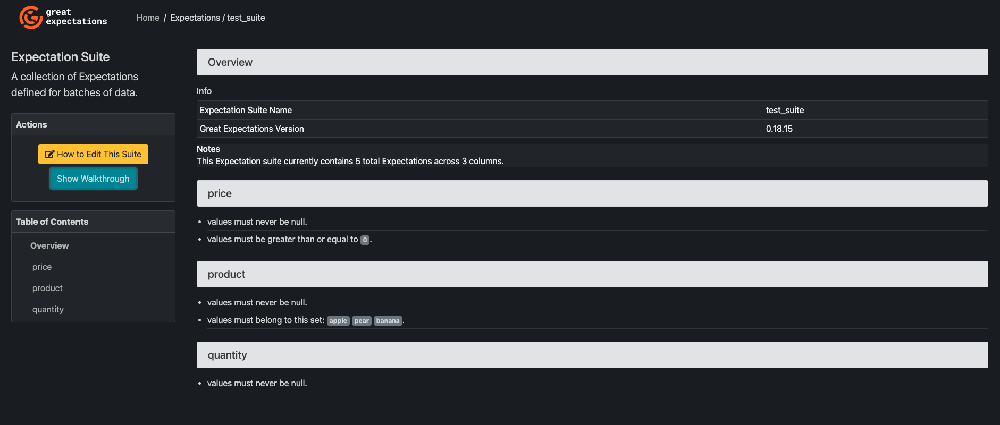
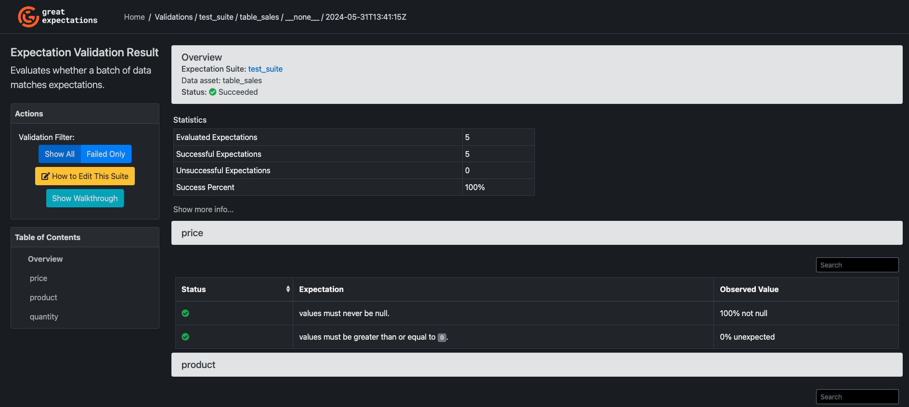

# Automated Data Quality with Great Expectations and BigQuery

!!! warning "must have"

    Before starting this project, you need to install some prerequisites in your laptop:

    - [Docker](https://docs.docker.com/engine/install/)
    - [gcloud CLI](https://cloud.google.com/sdk/docs/install)
    - [GCP console](https://console.cloud.google.com/)

    If you haven't create any project in Google Cloud Platform, please follow [this](dbt.md#interact-with-google-cloud-platform)

## Great Expectations


[Great Expectations](https://greatexpectations.io/)(GX) is a open source tool to have automated data quality testing, it can integrate with a lot of other tools/platforms.

### Advantages

- **Get started quickly**

  use GX OSS with tools you're familiar such as Python and Jupyter notebook

- **Create a shared point of view**

  using GX OSS gives everyone a shared toolset and starting point while still allowing each team their own flexibility and independence.

- **Communicate better**

  Data Docs make it easy to work with stakeholders by automatically rendering business-ready visualizations and test results expressed in plain language.

- **Take action**

  Your data systems never sleep, so your data quality processes can’t either. Take proactive action 24/7 with GX OSS: it integrates with your orchestrator to enable automation that ensures your data never goes unchecked.

- **It works with the tools we know and love**

  Apache Airflow, Amazon S3, databricks, Google Cloud Platform, Jupyter Notebook, PostgreSQL, many more.

## The power of `Expectations`

It's using `Expectation` as how they are calling their test cases.

- **An Expectation is a verifiable assertion about your data.**

Creating an Expectation offers you unparalleled flexibility and control compared with other ways of defining data quality tests.

- **This intuitive approach is accessible to technical and nontechnical teams.**

Expectations automatically generate updated documentation on top of individual validation results, making sure everyone has visibility into your test suites and validation results.

- **Expectations offer deeper insights than schema-focused validation**

more resilient to changing business and technical requirements than low-configuration options like anomaly detection.

- **Expectations are reusable and can be auto-generated**

making it easy to deploy them across large amounts of data

## Build Great Expectations docker image

- clone the repo

```bash
git clone git@github.com:karlchris/great-expectations-bq.git
```

- make sure you are in `data-engineering dir`, then run this command

```bash
make build-gx
```

Output:

```bash
➜  data-engineering git:(great-expectations) make build-gx
Building great expectations image
[+] Building 2.1s (10/10) FINISHED                               docker:desktop-linux
 => [internal] load build definition from Dockerfile                             0.0s
 => => transferring dockerfile: 315B                                             0.0s
 => [internal] load metadata for docker.io/library/python:3.9                    1.9s
 => [auth] library/python:pull token for registry-1.docker.io                    0.0s
 => [internal] load .dockerignore                                                0.0s
 => => transferring context: 2B                                                  0.0s
 => [1/4] FROM docker.io/library/python:3.9@sha256:1446afd121c574b13077f4137443  0.0s
 => [internal] load build context                                                0.0s
 => => transferring context: 4.19MB                                              0.0s
 => CACHED [2/4] WORKDIR /app                                                    0.0s
 => CACHED [3/4] RUN pip install great-expectations==0.18.15 &&     pip install  0.0s
 => [4/4] COPY . /app                                                            0.1s
 => exporting to image                                                           0.0s
 => => exporting layers                                                          0.0s
 => => writing image sha256:03928fb4d00f8d5a26079b81d01e4df586e116ee1e3f05fda18  0.0s
 => => naming to docker.io/library/gx                                            0.0s
```

- If you see above output, then your great expectations image is alrady built.

## Run Great Expectations container interactively

- run this command

```bash
make run-gx
```

Output:

```bash
➜  data-engineering git:(great-expectations) ✗ make run-gx
Running great expectations in container
root@c6ee28c3a1f6:/app#
```

- run this command to initiate the `DataContext`, connecting to `Datasource` and running some tests (tests are called as `Expectations`)

```python
from ruamel import yaml

import great_expectations as ge
from great_expectations.core.batch import RuntimeBatchRequest

GCP_PROJECT_NAME = "data-engineering-424915"
BIGQUERY_DATASET = "data_eng"


# Instantiate project DataContext
context = ge.get_context()

# Configure Datasource
datasource_config = {
    "name": "my_bigquery_datasource",
    "class_name": "Datasource",
    "execution_engine": {
        "class_name": "SqlAlchemyExecutionEngine",
        "connection_string": f"bigquery://{GCP_PROJECT_NAME}/{BIGQUERY_DATASET}",
    },
    "data_connectors": {
        "default_runtime_data_connector_name": {
            "class_name": "RuntimeDataConnector",
            "batch_identifiers": ["default_identifier_name"],
        },
        "default_inferred_data_connector_name": {
            "class_name": "InferredAssetSqlDataConnector",
            "include_schema_name": True,
        },
    },
}
context.test_yaml_config(yaml.dump(datasource_config))

# Save Datasource configuration to DataContext
context.add_datasource(**datasource_config)

# Test new Datasource
batch_request = RuntimeBatchRequest(
    datasource_name="my_bigquery_datasource",
    data_connector_name="default_runtime_data_connector_name",
    data_asset_name="table_sales",  # this can be anything that identifies this data
    runtime_parameters={"query": "SELECT * from data_eng.table_sales LIMIT 10"},
    batch_identifiers={"default_identifier_name": "default_identifier"},
)

context.add_or_update_expectation_suite(
    expectation_suite_name="test_suite"
)
validator = context.get_validator(
    batch_request=batch_request, expectation_suite_name="test_suite"
)
print(validator.head())

# Data Quality checks
validator.expect_column_values_to_not_be_null("quantity")

validator.expect_column_values_to_not_be_null("product")
validator.expect_column_values_to_be_in_set(
    "product",
    ["apple", "pear", "banana",],
)

validator.expect_column_values_to_not_be_null("price")
validator.expect_column_values_to_be_between(
    "price", min_value=0, max_value=None,
)
validator.save_expectation_suite(discard_failed_expectations=False)

# Run checkpoint
checkpoint = context.add_or_update_checkpoint(
    name="my_quickstart_checkpoint",
    validator=validator,
)
checkpoint_result = checkpoint.run()
context.view_validation_result(checkpoint_result)
```

you need to run python script above using

```bash
python run.py
```

Output:

```bash
root@9e909c33e977:/app# python run.py
Attempting to instantiate class from config...
        Instantiating as a Datasource, since class_name is Datasource
        Successfully instantiated Datasource


ExecutionEngine class name: SqlAlchemyExecutionEngine
Data Connectors:
        default_inferred_data_connector_name : InferredAssetSqlDataConnector

        Available data_asset_names (3 of 10):
                data_eng.gx_temp_29379392 (1 of 1): [{}]
                data_eng.gx_temp_31f38543 (1 of 1): [{}]
                data_eng.gx_temp_78a977d7 (1 of 1): [{}]

        Unmatched data_references (0 of 0):[]

        default_runtime_data_connector_name:RuntimeDataConnector

        Available data_asset_names (0 of 0):
                Note : RuntimeDataConnector will not have data_asset_names until they are passed in through RuntimeBatchRequest

        Unmatched data_references (0 of 0): []

Calculating Metrics: 100%|██████████████████████████████| 1/1 [00:00<00:00,  1.61it/s]
  product  quantity  price                      date
0   apple        10    1.0 2023-01-01 00:00:00+00:00
1  banana         7    3.0 2023-01-01 00:00:00+00:00
2    pear         5    2.0 2023-01-01 00:00:00+00:00
Calculating Metrics: 100%|██████████████████████████████| 8/8 [00:02<00:00,  3.30it/s]
Calculating Metrics: 100%|██████████████████████████████| 8/8 [00:02<00:00,  2.69it/s]
Calculating Metrics: 100%|████████████████████████████| 11/11 [00:03<00:00,  3.63it/s]
Calculating Metrics: 100%|██████████████████████████████| 8/8 [00:02<00:00,  2.80it/s]
Calculating Metrics: 100%|████████████████████████████| 11/11 [00:02<00:00,  4.63it/s]
Calculating Metrics: 100%|████████████████████████████| 34/34 [00:05<00:00,  6.17it/s]
```

- all the `Expectations` have been built and tested, the result will be stored in `gx` dir.

## Data docs in UI

- run this command

```bash
great_expectations docs build
```

Output:

```bash
root@12a2f87f7cb7:/app# great_expectations docs build

The following Data Docs sites will be built:

 - local_site: file:///app/gx/uncommitted/data_docs/local_site/index.html

Would you like to proceed? [Y/n]: Y

Building Data Docs...

Done building Data Docs
```

- the UI will be saved as HTML file in your local path `file:///app/gx/uncommitted/data_docs/local_site/index.html`

List of expectations suite



Test results



- Done, you have wrapped data quality testing using Great Expectations to run within Docker.

!!! tip

    Next step, you can schedule this to run in any server or cloud providers.

    Since it's already in Docker, it's easier to ship it in anywhere.

Reference: [Great Expectations: Connecting to BigQuery](https://legacy.016.docs.greatexpectations.io/docs/0.14.13/guides/connecting_to_your_data/database/bigquery/)
