# Querying Streaming Data in Kafka using ksql

Let's discuss about how data streaming ingestion looks like and how we can query those data using ksql.

## What is Kafka

Apache Kafka is an **open-source**, **distributed**, **event streaming** platform capable of handling large volumes of **real-time** data. You use Kafka to build real-time streaming applications.

### Kafka Components

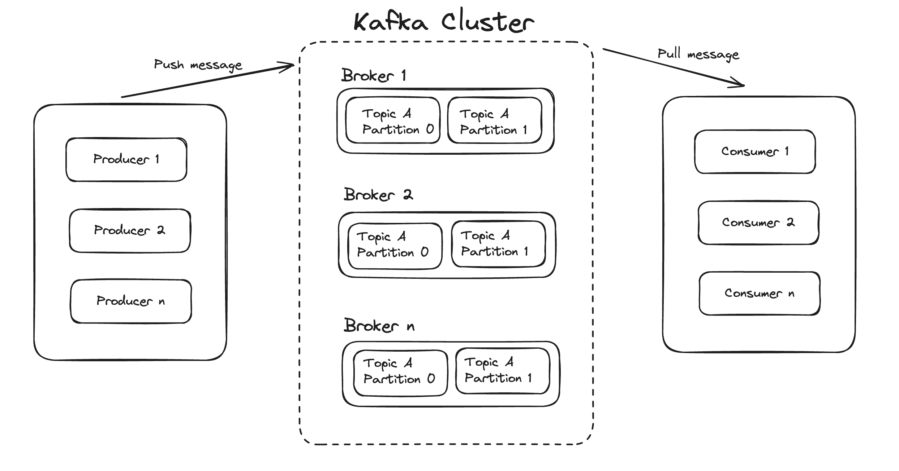

- **Kafka Cluster**

A Kafka cluster is a system that comprises of different brokers, topics, and their respective partitions. Data is written to the topic within the cluster and read by the cluster itself.

- **Producers**

A producer sends or writes data/messages to the topic within the cluster. In order to store a huge amount of data, different producers within an application send data to the Kafka cluster.

- **Consumers**

A consumer is the one that reads or consumes messages from the Kafka cluster. There can be several consumers consuming different types of data form the cluster. The beauty of Kafka is that each consumer knows from where it needs to consume the data.

- **Brokers**

A Kafka server is known as a broker. A broker is a bridge between producers and consumers. If a producer wishes to write data to the cluster, it is sent to the Kafka server. All brokers lie within a Kafka cluster itself. Also, there can be multiple brokers.

- **Topics**

It is a common name or a heading given to represent a similar type of data. In Apache Kafka, there can be multiple topics in a cluster. Each topic specifies different types of messages.

- **Partitions**
  
The data or message is divided into small subparts, known as partitions. Each partition carries data within it having an offset value.

### The Capabilities

- At the core of Kafka is the **Kafka broker**. A broker stores data in a durable way from clients in one or more topics that can be consumed by one or more clients. Kafka also provides several command-line tools that enable you to start and stop Kafka, create topics and more.
- Kafka provides security features such as **data encryption** between producers and consumers and brokers using SSL / TLS.
- Support of the following **Java APIs**

    - The **Producer API** that enables an application to send messages to Kafka.
    - The **Consumer API** that enables an application to subscribe to one or more topics and process the stream of records produced to them.
    - **Kafka Connect**, a component that you can use to stream data between Kafka and other data systems in a scalable and reliable way. It makes it simple to configure connectors to move data into and out of Kafka.
    - The **Streams API** that enables applications to act as a stream processor, consuming an input stream from one or more topics and producing an output stream to one or more output topics, effectively transforming the input streams to output streams.
    - The **Admin API** that provides the capability to create, inspect, delete, and manage topics, brokers, ACLs, and other Kafka objects.

### Challenges

- Must have high-throughput to support high volume event streams such as real-time log aggregation.
- Requires the ability to gracefully deal with large data backlogs in order to support periodic data loads from offline systems.
- Must handle low-latency delivery for more traditional messaging use-cases.

!!! info

    The goal for Kafka is to support partitioned, distributed, real-time processing feeds to create new, derived feeds.
    This motivated Kafka’s partitioning and consumer model.

    Finally in cases where the stream is fed into other data systems for serving, it was important that the system would guarantee **fault-tolerance** in case of machine failures.

### Confluent and Kafka

**Confluent** is a commercial, global corporation that specializes in providing businesses with real-time access to data.
Confluent was founded by the creators of Kafka, and its product line includes proprietary products based on open-source Kafka.

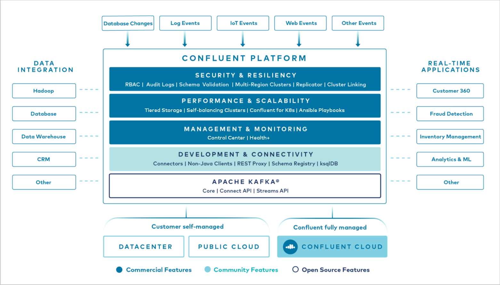

At the core of Confluent Platform is Kafka, the most popular open source distributed streaming platform. Kafka enables you to:

- **Publish** and **subscribe** to streams of records
- **Store** streams of records in a fault tolerant way
- **Process** streams of records

Each Confluent Platform release includes the latest release of Kafka and additional tools and services that make it easier to build and manage an event streaming platform.
Confluent Platform provides community and commercially licensed features such as Schema Registry, Cluster Linking, a REST Proxy, 100+ pre-built Kafka connectors, and ksqlDB.

### Use Cases

Consider an application that uses Kafka topics as a backend to store and retrieve posts, likes, and comments from a popular social media site. The application incorporates producers and consumers that subscribe to those Kafka topics.

- When a user of the application publishes a post, likes something, or comments, the Kafka producer code in the application sends that data to the associated topic.
- When the user navigates to a particular page in the application, a Kafka consumer reads from the associated backend topic and the application renders data on the user’s device.

## Kafka Streams


Kafka Streams is a client library for building applications and microservices, where the input and output data are stored in an Apache Kafka® cluster.
It combines the simplicity of writing and deploying standard Java and Scala applications on the client side with the benefits of Kafka’s server-side cluster technology.

## ksqlDB for Querying

ksqlDB is the streaming SQL engine for Kafka that you can use to perform stream processing tasks using SQL statements.


Some of its features:

- Create real-time value by processing data in motion rather than data at rest.
- Simplify your stream processing architecture.
- Start building real-time applications with simple SQL syntax, as below example.

```sql
CREATE TABLE activePromotions AS
    SELECT rideId,
            qualityPromotion(distanceToDst) AS promotion
    FROM locations
    GROUP BY rideId
    EMIT CHANGES
```

## Quick Start

Use this quick start to get up and running locally with Confluent Platform and its main components using Docker containers.

In this quick start, you will create Apache Kafka topics, use Kafka Connect to generate mock data to those topics, and create ksqlDB streaming queries on those topics.
You then go to Confluent Control Center to monitor and analyze the event streaming queries.
When you finish, you’ll have a real-time app that consumes and processes data streams by using familiar SQL statements.

!!! warning "must have"

    Before starting this project, you need to install some prerequisites in your laptop:

    - [Docker](https://docs.docker.com/engine/install/)

First, you need to clone the repo.

```bash
git clone git@github.com:karlchris/kafka-docker.git
```

then, run below command to initialize the apps and its resources.

```bash
make up
```

This will launch several containers.

```bash
(base) ➜  kafka-docker git:(main) dpsa
CONTAINER ID   IMAGE                                             COMMAND                  CREATED             STATUS             PORTS                                            NAMES
cb4f8fb1d3c5   confluentinc/ksqldb-examples:7.6.1                "bash /root/datagen_…"   About an hour ago   Up About an hour                                                    ksql-datagen
c132b535cfed   confluentinc/cp-ksqldb-cli:7.6.1                  "/bin/sh"                About an hour ago   Up About an hour                                                    ksqldb-cli
515344724de1   confluentinc/cp-enterprise-control-center:7.6.1   "/etc/confluent/dock…"   About an hour ago   Up About an hour   0.0.0.0:9021->9021/tcp                           control-center
1f3a2ce862b1   confluentinc/cp-ksqldb-server:7.6.1               "/etc/confluent/dock…"   About an hour ago   Up About an hour   0.0.0.0:8088->8088/tcp                           ksqldb-server
d0d7b2abe0e4   cnfldemos/cp-server-connect-datagen:0.6.4-7.6.0   "/etc/confluent/dock…"   About an hour ago   Up About an hour   0.0.0.0:8083->8083/tcp, 9092/tcp                 connect
915a1c8552e3   confluentinc/cp-kafka-rest:7.6.1                  "/etc/confluent/dock…"   About an hour ago   Up About an hour   0.0.0.0:8082->8082/tcp                           rest-proxy
8df2fc0e9c7a   confluentinc/cp-schema-registry:7.6.1             "/etc/confluent/dock…"   About an hour ago   Up About an hour   0.0.0.0:8081->8081/tcp                           schema-registry
640b67c01686   provectuslabs/kafka-ui:latest                     "/bin/sh -c 'java --…"   About an hour ago   Up About an hour   0.0.0.0:8080->8080/tcp                           kafka-ui
bee8cb1574bc   confluentinc/cp-kafka:7.6.1                       "/etc/confluent/dock…"   About an hour ago   Up About an hour   0.0.0.0:9092->9092/tcp, 0.0.0.0:9101->9101/tcp   broker
```

### 1. Create Kafka Topics

- Open `http://localhost:9021`
- Click **controlcenter.cluster**

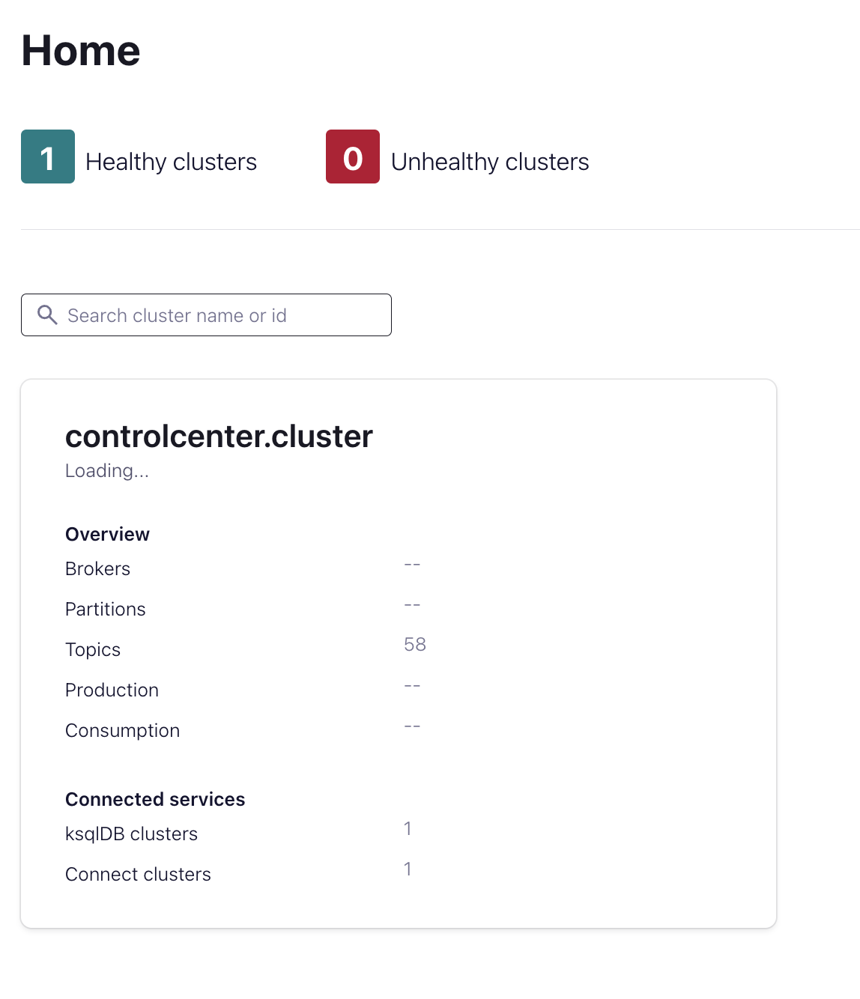

Cluster overview


- In navigation menu, click **Topics**. Then, Create topic `pageviews` and `users`, rest click **Create with defaults**

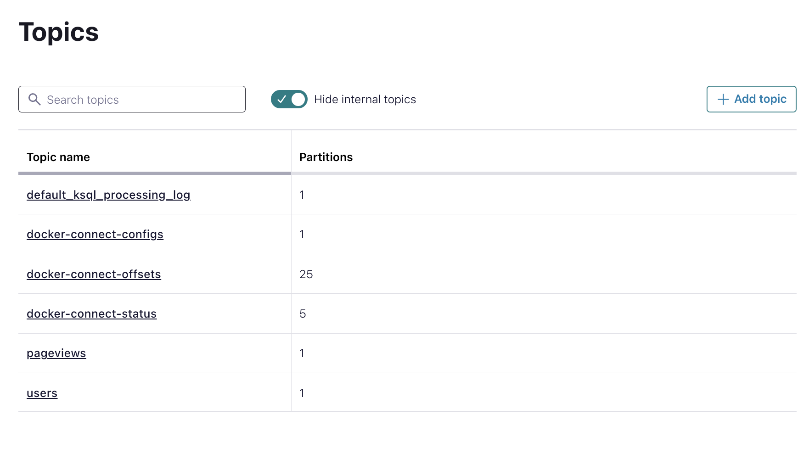

### 2. Generate Mock Data

- In navigation menu click **Connect**.
- Click `connect-default` cluster in the **Connect cluster** list.
- Click **Add connector**.
- Select `DatagenConnector` tile.
- In the **Name** field, enter `datagen-pageviews` as the name of connector.
- Enter the following configuration values in the following sections:

**Common** section:

`Key converter class`: `org.apache.kafka.connect.storage.StringConverter`

**General** section:

`kafka.topic`: Choose `pageviews` from the dropdown menu
`max.interval`: `100`
`quickstart`: `pageviews`

- Click **Next** to review the configurations, then click **Launch**.

```json title="datagen-pageviews"
{
  "name": "datagen-pageviews",
  "config": {
    "name": "datagen-pageviews",
    "connector.class": "io.confluent.kafka.connect.datagen.DatagenConnector",
    "key.converter": "org.apache.kafka.connect.storage.StringConverter",
    "kafka.topic": "pageviews",
    "max.interval": "100",
    "quickstart": "pageviews"
  }
}
```

- Repeat above steps to create `datagen-users` for users mock data with below configurations.

```json title="datagen-users"
{
  "name": "datagen-users",
  "config": {
    "name": "datagen-users",
    "connector.class": "io.confluent.kafka.connect.datagen.DatagenConnector",
    "key.converter": "org.apache.kafka.connect.storage.StringConverter",
    "kafka.topic": "users",
    "max.interval": "1000",
    "quickstart": "users"
  }
}
```

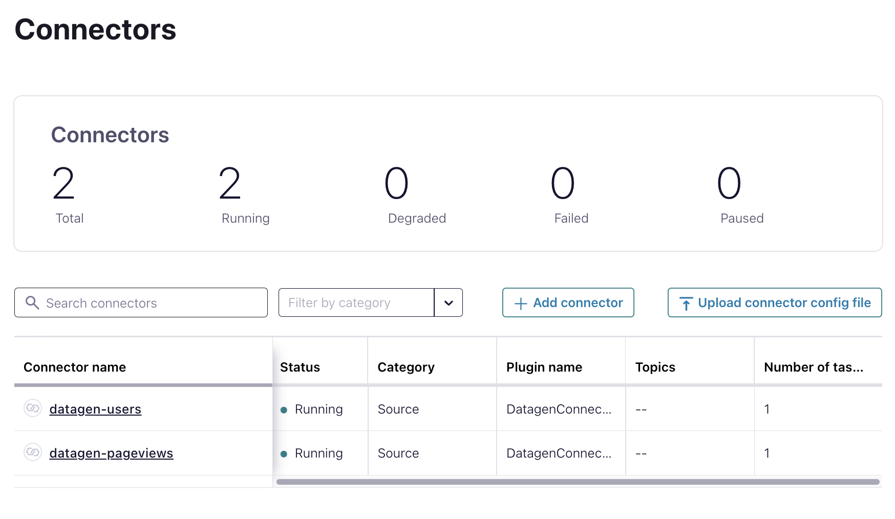

### 3. Create a Stream and Table using SQL statements

!!! note

    A **stream** is a an immutable, append-only collection that represents a series of historical facts, or events.

    A **table** is a mutable collection that models change over time. It uses row keys to display the most recent data for each key.

- In the navigation menu, click **ksqlDB**.
- Click `ksqldb1` cluster to open **ksqldb1** page.
- Run this SQL statements

```sql title="create_pageviews_stream.sql"
CREATE STREAM pageviews_stream
  WITH (KAFKA_TOPIC='pageviews', VALUE_FORMAT='AVRO');
```

Output

```json
{
  "@type": "currentStatus",
  "statementText": "CREATE STREAM PAGEVIEWS_STREAM (VIEWTIME BIGINT, USERID STRING, PAGEID STRING) WITH (CLEANUP_POLICY='delete', KAFKA_TOPIC='pageviews', KEY_FORMAT='KAFKA', VALUE_FORMAT='AVRO');",
  "commandId": "stream/`PAGEVIEWS_STREAM`/create",
  "commandStatus": {
    "status": "SUCCESS",
    "message": "Stream created",
    "queryId": null
  },
  "commandSequenceNumber": 2,
  "warnings": [

  ]
}
```

```sql title="view_pageviews_stream.sql"
SELECT * FROM pageviews_stream EMIT CHANGES;
```

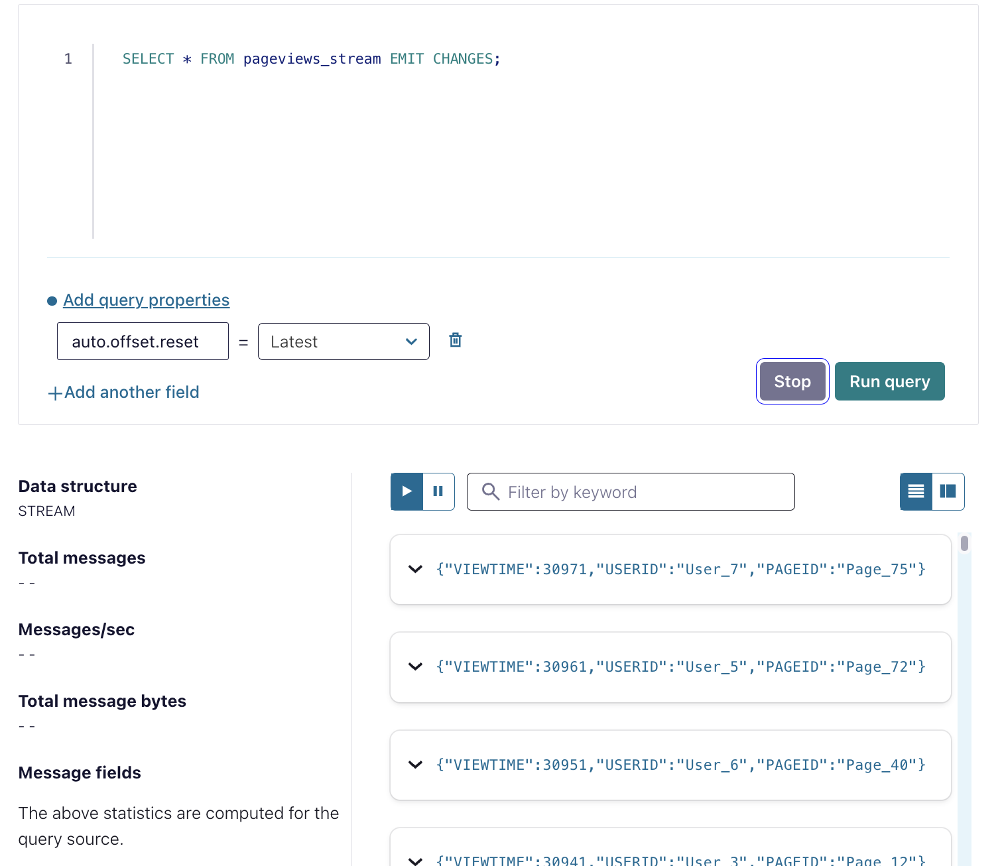

- you can click **Stop** to end the SELECT query.

!!! tip

    Stopping the SELECT query doesn't stop data movement through the stream.

```sql title="create_users_table.sql"
CREATE TABLE users_table (id VARCHAR PRIMARY KEY)
  WITH (KAFKA_TOPIC='users', VALUE_FORMAT='AVRO');
```

Output

```json
{
  "@type": "currentStatus",
  "statementText": "CREATE TABLE USERS_TABLE (ID STRING PRIMARY KEY, REGISTERTIME BIGINT, USERID STRING, REGIONID STRING, GENDER STRING) WITH (CLEANUP_POLICY='compact', KAFKA_TOPIC='users', KEY_FORMAT='KAFKA', VALUE_FORMAT='AVRO');",
  "commandId": "table/`USERS_TABLE`/create",
  "commandStatus": {
    "status": "SUCCESS",
    "message": "Table created",
    "queryId": null
  },
  "commandSequenceNumber": 4,
  "warnings": [

  ]
}
```

!!! warning

    A table requires you to specify a PRIMARY KEY when you register it.

#### Inspect the schemas of your stream and table

- Click **Streams** to see the currently registered streams. In the list, click **PAGEVIEWS_STREAM** to see details.

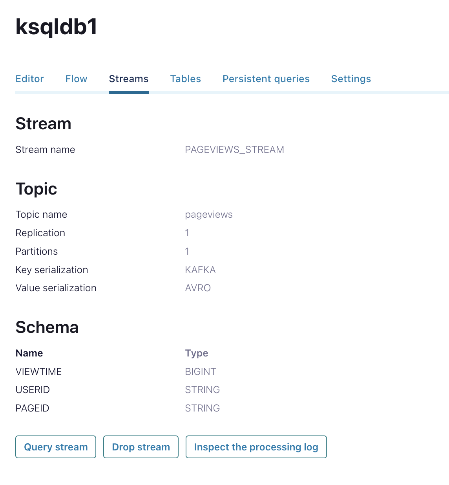

- Click **Tables** to see the currently registered tables. In the list, click **USERS_TABLE** to see details.

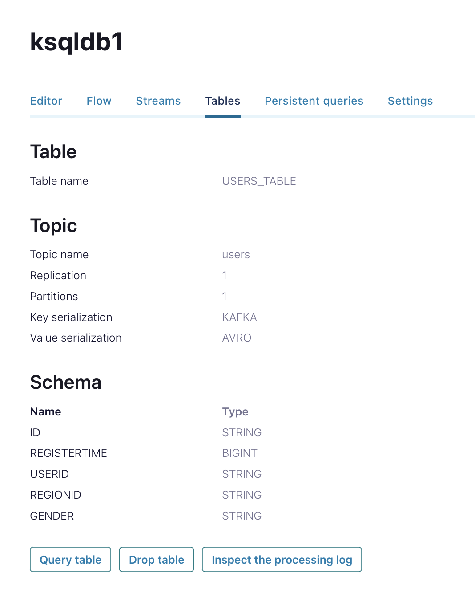

#### Create queries to process data

Different kinds of queries:

- **Transient query**

a non-persistent, client-side query that you terminate manually or with a LIMIT clause. A transient query doesn’t create a new topic.

- **Persistent query**

a server-side query that outputs a new stream or table that’s backed by a new topic. It runs until you issue the `TERMINATE` statement.

- **Push query**

A query that produces results continuously to a subscription. The syntax for a push query uses the `EMIT CHANGES` keyword. Push queries can be transient or persistent.

- **Pull query**

A query that gets a result as of “now”, like a query against a traditional relational database. A pull query runs once and returns the current state of a table. Pull queries are always transient.

##### Query for pageviews

Run this query to view the pageID.

```sql title="query-pageviews.sql"
SELECT pageid FROM pageviews_stream EMIT CHANGES LIMIT 3;
```

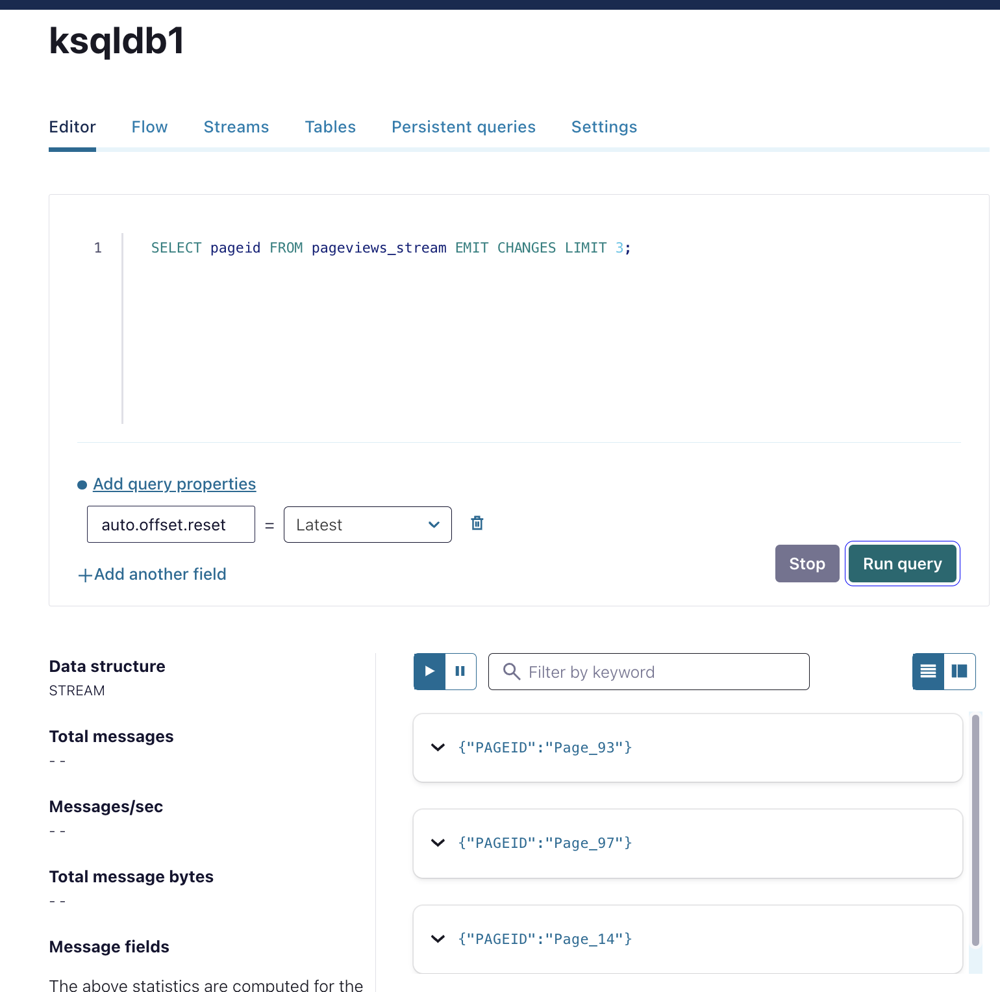

##### Joining data from Stream and Table

This join enriches pageview data with information about the user who viewed the page. The joined rows are written to a new sink topic, which has the same name as the new stream, by default.

!!! tip

    You can specify the name of the sink topic by using the `KAFKA_TOPIC` keyword in a `WITH` clause.

Run below query to create the joined stream.

```sql
CREATE STREAM user_pageviews
  AS SELECT users_table.id AS userid, pageid, regionid, gender
    FROM pageviews_stream
    LEFT JOIN users_table ON pageviews_stream.userid = users_table.id
EMIT CHANGES;
```

Output

```json
{
  "@type": "currentStatus",
  "statementText": "CREATE STREAM USER_PAGEVIEWS WITH (CLEANUP_POLICY='delete', KAFKA_TOPIC='USER_PAGEVIEWS', PARTITIONS=1, REPLICAS=1, RETENTION_MS=604800000) AS SELECT\n  USERS_TABLE.ID USERID,\n  PAGEVIEWS_STREAM.PAGEID PAGEID,\n  USERS_TABLE.REGIONID REGIONID,\n  USERS_TABLE.GENDER GENDER\nFROM PAGEVIEWS_STREAM PAGEVIEWS_STREAM\nLEFT OUTER JOIN USERS_TABLE USERS_TABLE ON ((PAGEVIEWS_STREAM.USERID = USERS_TABLE.ID))\nEMIT CHANGES;",
  "commandId": "stream/`USER_PAGEVIEWS`/create",
  "commandStatus": {
    "status": "SUCCESS",
    "message": "Created query with ID CSAS_USER_PAGEVIEWS_5",
    "queryId": "CSAS_USER_PAGEVIEWS_5"
  },
  "commandSequenceNumber": 6,
  "warnings": [

  ]
}
```

!!! note

    The query uses the `EMIT CHANGES` syntax, which indicates that this is a push query.

    A push query enables you to query a stream or table with a subscription to the results. It continues until you stop it.

Click **Stop** to end the transient push query.

##### Filter a stream

You will create a stream, named `pageviews_region_like_89`, which is made of `user_pageviews` rows that have a `regionid` value that ends with `8` or `9`.

```sql
CREATE STREAM pageviews_region_like_89
  WITH (KAFKA_TOPIC='pageviews_filtered_r8_r9', VALUE_FORMAT='AVRO')
    AS SELECT * FROM user_pageviews
    WHERE regionid LIKE '%_8' OR regionid LIKE '%_9'
EMIT CHANGES;
```

Output

```json
{
  "@type": "currentStatus",
  "statementText": "CREATE STREAM PAGEVIEWS_REGION_LIKE_89 WITH (CLEANUP_POLICY='delete', KAFKA_TOPIC='pageviews_filtered_r8_r9', PARTITIONS=1, REPLICAS=1, RETENTION_MS=604800000, VALUE_FORMAT='AVRO') AS SELECT *\nFROM USER_PAGEVIEWS USER_PAGEVIEWS\nWHERE ((USER_PAGEVIEWS.REGIONID LIKE '%_8') OR (USER_PAGEVIEWS.REGIONID LIKE '%_9'))\nEMIT CHANGES;",
  "commandId": "stream/`PAGEVIEWS_REGION_LIKE_89`/create",
  "commandStatus": {
    "status": "SUCCESS",
    "message": "Created query with ID CSAS_PAGEVIEWS_REGION_LIKE_89_7",
    "queryId": "CSAS_PAGEVIEWS_REGION_LIKE_89_7"
  },
  "commandSequenceNumber": 8,
  "warnings": [

  ]
}
```

to view the data, run below query

```sql
SELECT * FROM pageviews_region_like_89 EMIT CHANGES;
```

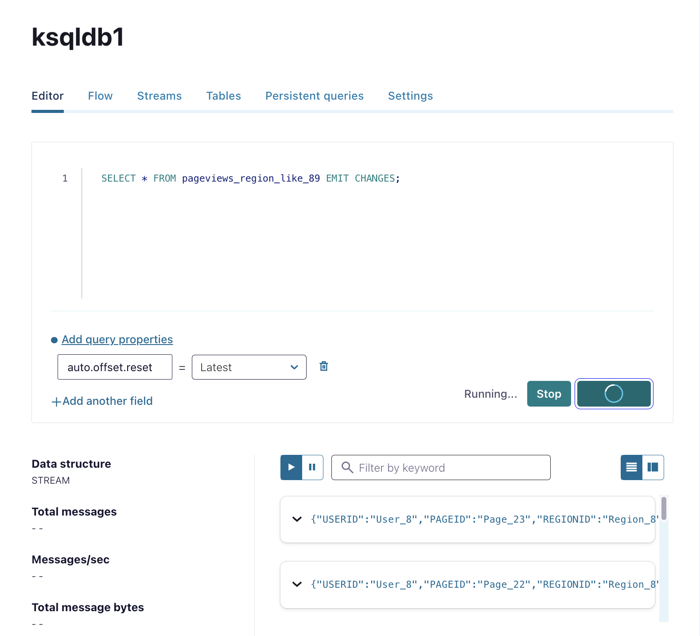

##### Create a windowed view

You will create a table named `pageviews_per_region_89` that counts the number of pageviews from regions `8` and `9` in a tumbling window with a SIZE of 30 seconds.

!!! info

    A tumbling window is a hopping window whose window size is equal to its advance interval.
    Since tumbling windows never overlap, a data record will belong to one and only one window.

    Reference: [Windowing tumbling](https://docs.confluent.io/platform/7.6/streams/developer-guide/dsl-api.html#windowing-tumbling)

```sql
CREATE TABLE pageviews_per_region_89 WITH (KEY_FORMAT='JSON')
  AS SELECT userid, gender, regionid, COUNT(*) AS numviews
    FROM pageviews_region_like_89
    WINDOW TUMBLING (SIZE 30 SECOND)
    GROUP BY gender, regionid, userid
    HAVING COUNT(*) > 1
EMIT CHANGES;
```

Output

```json
{
  "@type": "currentStatus",
  "statementText": "CREATE TABLE PAGEVIEWS_PER_REGION_89 WITH (CLEANUP_POLICY='compact,delete', KAFKA_TOPIC='PAGEVIEWS_PER_REGION_89', KEY_FORMAT='JSON', PARTITIONS=1, REPLICAS=1, RETENTION_MS=604800000) AS SELECT\n  PAGEVIEWS_REGION_LIKE_89.USERID USERID,\n  PAGEVIEWS_REGION_LIKE_89.GENDER GENDER,\n  PAGEVIEWS_REGION_LIKE_89.REGIONID REGIONID,\n  COUNT(*) NUMVIEWS\nFROM PAGEVIEWS_REGION_LIKE_89 PAGEVIEWS_REGION_LIKE_89\nWINDOW TUMBLING ( SIZE 30 SECONDS ) \nGROUP BY PAGEVIEWS_REGION_LIKE_89.GENDER, PAGEVIEWS_REGION_LIKE_89.REGIONID, PAGEVIEWS_REGION_LIKE_89.USERID\nHAVING (COUNT(*) > 1)\nEMIT CHANGES;",
  "commandId": "table/`PAGEVIEWS_PER_REGION_89`/create",
  "commandStatus": {
    "status": "SUCCESS",
    "message": "Created query with ID CTAS_PAGEVIEWS_PER_REGION_89_9",
    "queryId": "CTAS_PAGEVIEWS_PER_REGION_89_9"
  },
  "commandSequenceNumber": 10,
  "warnings": [

  ]
}
```

to view the data, run below query

```sql
SELECT * FROM pageviews_per_region_89 EMIT CHANGES;
```

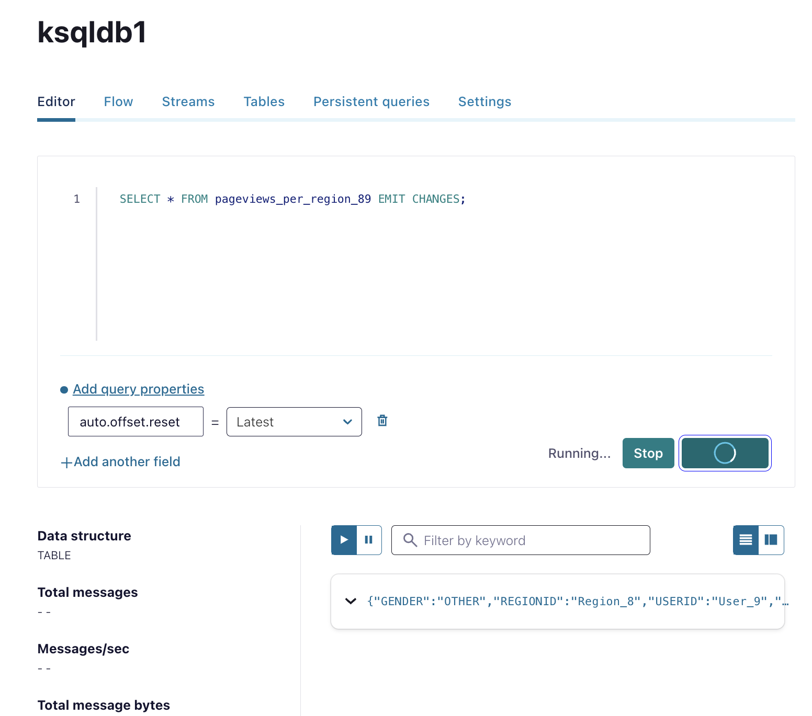

!!! tip

    the **NUMVIEWS** column shows the count of views in a 30-second window.

##### Snapshot a table by using a pull query

You can get the current state of a table by using a pull query, which returns rows for a specific key at the time you issue the query.
A pull query runs once and terminates.

In this step, you query the `pageviews_per_region_89` table for all rows that have `User_1` in `Region_9`.

```sql
SELECT * FROM pageviews_per_region_89
  WHERE userid = 'User_1' AND gender='FEMALE' AND regionid='Region_9';
```

##### Inspect your streams and tables

- In the upper-right corner of the editor, the **All available streams and tables** panes shows all of the streams and tables that you can access.


- Click **Persistent queries** to inspect the streams and tables that you've created.

!!! tip

    this page to check whether your queries are running, to explain a query, and to terminate running queries.


### 4. Visualize stream topology

In the streaming application you’ve built, events flow from the Datagen connectors into the `pageviews` and `users` topics.

Rows are processed with a join and filtered, and in the final step, rows are aggregated in a table view of the streaming data.

- Click **Flow** to open Flow view.


### 5. Clean up

Run below command

```bash
make down
```

Output

```bash
(base) ➜  kafka-docker git:(main) make down 
docker compose down --rmi all
[+] Running 19/19
 ✔ Container ksql-datagen                                 Removed                                                                                                                                                               10.2s 
 ✔ Container rest-proxy                                   Removed                                                                                                                                                                0.7s 
 ✔ Container ksqldb-cli                                   Removed                                                                                                                                                                0.2s 
 ✔ Container control-center                               Removed                                                                                                                                                                1.7s 
 ✔ Container kafka-ui                                     Removed                                                                                                                                                                2.3s 
 ✔ Container ksqldb-server                                Removed                                                                                                                                                                2.1s 
 ✔ Container connect                                      Removed                                                                                                                                                                2.6s 
 ✔ Container schema-registry                              Removed                                                                                                                                                                0.7s 
 ✔ Container broker                                       Removed                                                                                                                                                                1.0s 
 ✔ Image cnfldemos/cp-server-connect-datagen:0.6.4-7.6.0  Removed                                                                                                                                                                1.1s 
 ✔ Image confluentinc/cp-ksqldb-server:7.6.1              Removed                                                                                                                                                                1.1s 
 ✔ Image confluentinc/cp-ksqldb-cli:7.6.1                 Removed                                                                                                                                                                1.2s 
 ✔ Image confluentinc/cp-schema-registry:7.6.1            Removed                                                                                                                                                                1.3s 
 ✔ Image confluentinc/ksqldb-examples:7.6.1               Removed                                                                                                                                                                0.1s 
 ✔ Image confluentinc/cp-enterprise-control-center:7.6.1  Removed                                                                                                                                                                1.9s 
 ✔ Image provectuslabs/kafka-ui:latest                    Removed                                                                                                                                                                0.4s 
 ✔ Image confluentinc/cp-kafka-rest:7.6.1                 Removed                                                                                                                                                                0.3s 
 ✔ Image confluentinc/cp-kafka:7.6.1                      Removed                                                                                                                                                                0.1s 
 ✔ Network kafka-docker_default                           Removed    
```

## References

- [Kafka Basics](https://docs.confluent.io/platform/7.6/kafka/kafka-basics.html)
- [Apache Kafka Architecture](https://www.javatpoint.com/apache-kafka-architecture#:~:text=Producers%3A%20A%20producer%20sends%20or,messages%20from%20the%20Kafka%20cluster.)
- [Official Apache Kafka documentation](https://kafka.apache.org/documentation/#gettingStarted)
