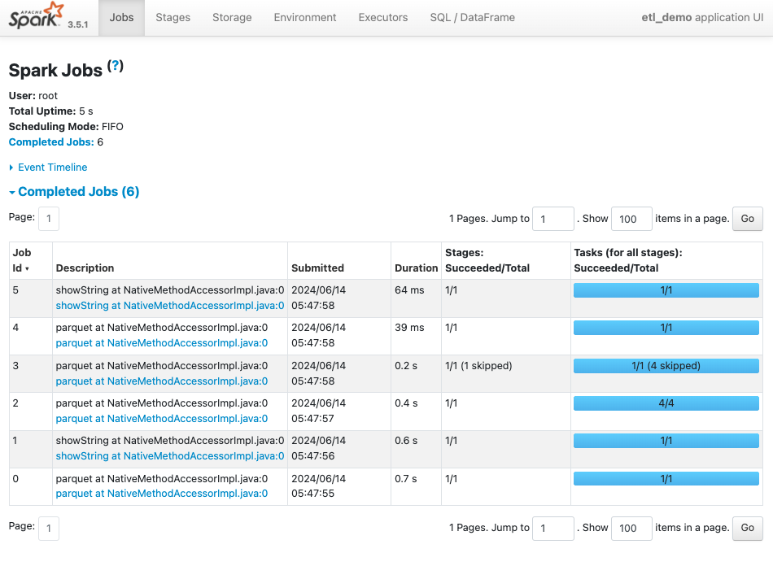
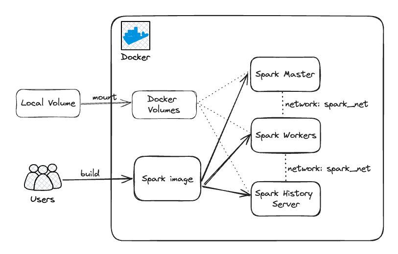
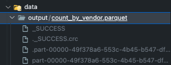

# Running Spark using Docker Compose


For better following this exercise, you should clone the repo `spark-docker`

```bash
git clone git@github.com:karlchris/spark-docker.git
```

## Spark Containers and Components

There are several Spark containers which we need to execute at once and connect them altogether.

```yaml title="docker-compose.yml"
services:
  spark-master:
    container_name: spark-master
    build: .
    image: spark-image
    entrypoint: ['./entrypoint.sh', 'master']
    healthcheck:
      test: [ "CMD", "curl", "-f", "http://localhost:8080" ]
      interval: 5s
      timeout: 3s
      retries: 3
    volumes:
      - ./scripts:/opt/spark/scripts
      - ./data:/opt/spark/data
      - spark-logs:/opt/spark/spark-events
    env_file:
      - .env.spark
    ports:
      - '8080:8080'
      - '7077:7077'

  spark-history-server:
    container_name: spark-history
    image: spark-image
    entrypoint: ['./entrypoint.sh', 'history']
    depends_on:
      - spark-master
    env_file:
      - .env.spark
    volumes:
      - ./scripts:/opt/spark/scripts
      - ./data:/opt/spark/data
      - spark-logs:/opt/spark/spark-events
    ports:
      - '18080:18080'

  spark-worker:
    container_name: spark-worker
    image: spark-image
    entrypoint: ['./entrypoint.sh', 'worker']
    depends_on:
      - spark-master
    env_file:
      - .env.spark
    volumes:
      - ./scripts:/opt/spark/scripts
      - ./data:/opt/spark/data
      - spark-logs:/opt/spark/spark-events

volumes:
  spark-logs:
```

### Spark Master


It is the master control plane where it can define the workers, execute the scripts and sharing the resources among workers.
We can access it through `localhost:8080` as the UI and it's the main controller of everything about this cluster.
Whatever jobs you're submitting and it's still running, you can see the spark jobs logs from here.
And, it's also having the main spark docker image, which we will build.

!!! info

    The three different containers are coming fom the same docker image, but we call them differently.
    
    As to specify `master`, we need to call `./entrypoint.sh master`

### Spark Worker(s)


You can have 1 or more spark worker(s), it is where your spark code are actually being executed. After it's executed, the result are brought back to `spark master`

As the info above, this is coming from same docker image, but to specify it, you just need to call `./entrypoint.sh worker`

### Spark History Server


As its name, it is where your spark jobs have been done executed, you can see the detail of each jobs in this view.

!!! info

    You can access the UI through `localhost:18080`

Example of Spark job view



## Why Docker Compose



**Docker compose** is a tool for defining and running multi-container applications. It is the key to unlocking a streamlined and efficient development and deployment experience.

Compose simplifies the control of your entire application stack, making it easy to manage services, networks, and volumes in a single, comprehensible **YAML** configuration file.

Then, with a single command, you create and start all the services from your configuration file.

### Common use case of Docker compose

- **Development environments**

When you're developing software, the ability to run an application in an isolated environment and interact with it is crucial.
The Compose command line tool can be used to create the environment and interact with it.

with just single command `docker compose up` you can bring up all the containers and orchestrate the application.

and single command `docker compose down` to bring down all the alive containers so it's not exhausting the resources.

- **Automated testing environments**

An important part of any Continuous Deployment or Continuous Integration process is the automated test suite.
Automated end-to-end testing requires an environment in which to run tests. Compose provides a convenient way to create and destroy isolated testing environments for your test suite.

Code example:

```bash
docker compose up -d
./run_tests
docker compose down
```

- **Single host deployments**

Compose has traditionally been focused on development and testing workflows, but with each release we're making progress on more production-oriented features.

## Spark Docker Image

The base of Docker Image is `python:3.10-bullseye`

```Dockerfile
FROM python:3.10-bullseye as spark-base
```

Installing tools that OS will need, such as sudo, openjdk, etc

```Dockerfile
RUN apt-get update && \
    apt-get install -y --no-install-recommends \
      sudo \
      curl \
      vim \
      unzip \
      rsync \
      openjdk-11-jdk \
      build-essential \
      software-properties-common \
      ssh && \
    apt-get clean && \
    rm -rf /var/lib/apt/lists/*
```

We setup some directories and environment variables

```Dockerfile
# Optional env variables
ENV SPARK_HOME=${SPARK_HOME:-"/opt/spark"}
ENV HADOOP_HOME=${HADOOP_HOME:-"/opt/hadoop"}

RUN mkdir -p ${HADOOP_HOME} && mkdir -p ${SPARK_HOME}
WORKDIR ${SPARK_HOME}

ENV SPARK_VERSION=3.5.1
```

Downloading `spark`

```Dockerfile
# Download spark
RUN mkdir -p ${SPARK_HOME} \
    && curl https://dlcdn.apache.org/spark/spark-${SPARK_VERSION}/spark-${SPARK_VERSION}-bin-hadoop3.tgz -o spark-${SPARK_VERSION}-bin-hadoop3.tgz \
    && tar xvzf spark-${SPARK_VERSION}-bin-hadoop3.tgz --directory /opt/spark --strip-components 1 \
    && rm -rf spark-${SPARK_VERSION}-bin-hadoop3.tgz
```

Installing python dependencies in `requirements.txt`

```txt title="requirements.txt"
pyarrow==16.1.0
pyspark==3.5.1
```

```Dockerfile
# Install python deps
COPY requirements.txt .
RUN pip3 install -r requirements.txt
```

Set some environment variables for Spark

```Dockerfile
ENV PATH="/opt/spark/sbin:/opt/spark/bin:${PATH}"
ENV SPARK_HOME="/opt/spark"
ENV SPARK_MASTER="spark://spark-master:7077"
ENV SPARK_MASTER_HOST spark-master
ENV SPARK_MASTER_PORT 7077
ENV PYSPARK_PYTHON python3
```

Copy the spark defaults configuration

```conf title="conf/spark-defaults.conf"
spark.master                           spark://spark-master:7077
spark.eventLog.enabled                 true
spark.eventLog.dir                     /opt/spark/spark-events
spark.history.fs.logDirectory          /opt/spark/spark-events
```

```Dockerfile
COPY conf/spark-defaults.conf "$SPARK_HOME/conf"
```

Here, we’re setting that the spark master will be a standalone cluster with the master on port `7077`.
We’re also enabling the `eventLog`, `eventLog` directory and history filesystem logDirectory.

These three settings are required to use the `Spark history server`. The setting `spark.eventLog.dir` is the base directory where the events are logged. The `spark.history.fs.logDirectory` is the directory from which the filesystem history provider will load the logs.

Make the binaries and scripts executable and set `PYTHONPATH` environment variable to use the python version that comes with spark

```Dockerfile
RUN chmod u+x /opt/spark/sbin/* && \
    chmod u+x /opt/spark/bin/*

ENV PYTHONPATH=$SPARK_HOME/python/:$PYTHONPATH
```

Finally, copy the entrypoint script and set it as image entrypoint

```sh title="entrypoint.sh"
#!/bin/bash

SPARK_WORKLOAD=$1

echo "SPARK_WORKLOAD: $SPARK_WORKLOAD"

if [ "$SPARK_WORKLOAD" == "master" ];
then
  start-master.sh -p 7077
elif [ "$SPARK_WORKLOAD" == "worker" ];
then
  start-worker.sh spark://spark-master:7077
elif [ "$SPARK_WORKLOAD" == "history" ]
then
  start-history-server.sh
fi
```

```Dockerfile
COPY entrypoint.sh .
RUN chmod u+x /opt/spark/entrypoint.sh

ENTRYPOINT ["./entrypoint.sh"]
CMD [ "bash" ]
```

!!! tip

    this `entrypoint.sh` is where we define to execute the spark code either `master`, `worker` or `history server`

## Build and Up Cluster

To build up the image and bring up all the containers, you can just execute this command

```bash
make up
```

Output

```bash
(base) ➜  spark-docker git:(main) make up  
docker compose up -d --build
[+] Running 2/2
 ✘ spark-worker Error         pull access denied for spark-image, repository does not exist or may require 'docker login': denied: requested access to the resource is denied                                                                                                                                      2.8s 
 ✘ spark-history-server Error pull access denied for spark-image, repository does not exist or may require 'docker login': denied: requested access to the resource is denied                                                                                                                                      2.7s 
[+] Building 148.9s (17/17) FINISHED                                                                                                                                                                                                                                                               docker:desktop-linux
 => [spark-master internal] load build definition from Dockerfile                                                                                                                                                                                                                                                  0.0s
 => => transferring dockerfile: 1.63kB                                                                                                                                                                                                                                                                             0.0s
 => [spark-master internal] load metadata for docker.io/library/python:3.10-bullseye                                                                                                                                                                                                                               2.8s
 => [spark-master auth] library/python:pull token for registry-1.docker.io                                                                                                                                                                                                                                         0.0s
 => [spark-master internal] load .dockerignore                                                                                                                                                                                                                                                                     0.0s
 => => transferring context: 2B                                                                                                                                                                                                                                                                                    0.0s
 => [spark-master spark-base 1/5] FROM docker.io/library/python:3.10-bullseye@sha256:a4d9982b391b91d6ffaae6156f2b55ed769d854682d6611c3805c436b1920b72                                                                                                                                                             33.7s
 => => resolve docker.io/library/python:3.10-bullseye@sha256:a4d9982b391b91d6ffaae6156f2b55ed769d854682d6611c3805c436b1920b72                                                                                                                                                                                      0.0s
 => => sha256:a4d9982b391b91d6ffaae6156f2b55ed769d854682d6611c3805c436b1920b72 1.65kB / 1.65kB                                                                                                                                                                                                                     0.0s
 => => sha256:d344660ab716c56ed8760cd05fd6f09d201a7398129ac252241dcae6a8edce6c 7.95kB / 7.95kB                                                                                                                                                                                                                     0.0s
 => => sha256:bbf3ed169027034dd58cdf87bf07f4506ecf971f22a8c5b8167832d2f69c3a6e 2.01kB / 2.01kB                                                                                                                                                                                                                     0.0s
 => => sha256:f975e52008de385eb513258b4912477b214cddf1c8e87877f85028d940bfcdae 53.74MB / 53.74MB                                                                                                                                                                                                                  23.9s
 => => sha256:859b5bb8f5d471015f3add7e778bc507fc4a6f1fce8561c2b0a336734a55a365 15.75MB / 15.75MB                                                                                                                                                                                                                   4.0s
 => => sha256:28a7ca076c1ea04622ddf9f43ff2f138f6c50a40118747a45d2618cc64591d6b 54.70MB / 54.70MB                                                                                                                                                                                                                  20.5s
 => => sha256:315e6e292ef6ca0113f94dbf806ecbea714420b97b385d4138e3cb84616995e3 189.94MB / 189.94MB                                                                                                                                                                                                                30.2s
 => => sha256:fc2e3a8abd9b020e02a6952b9f866f08fd333baf06330ccbb22a1f28ebd1e972 6.41MB / 6.41MB                                                                                                                                                                                                                    22.4s
 => => sha256:3e954bdeb399238cc34f825d4f940e4fe2d4fb1ba1ceecc503d5a0cd03932696 17.22MB / 17.22MB                                                                                                                                                                                                                  25.1s
 => => extracting sha256:f975e52008de385eb513258b4912477b214cddf1c8e87877f85028d940bfcdae                                                                                                                                                                                                                          1.2s
 => => sha256:813820ddecbd5e83f239c09103deb809036a470e0976d4d044f3db994fc70741 245B / 245B                                                                                                                                                                                                                        24.4s
 => => sha256:e6b6c385c0e4d7394694a178278f2fcf3ce8af2e986c85d3e369882020ad96b6 3.08MB / 3.08MB                                                                                                                                                                                                                    25.9s
 => => extracting sha256:859b5bb8f5d471015f3add7e778bc507fc4a6f1fce8561c2b0a336734a55a365                                                                                                                                                                                                                          0.2s
 => => extracting sha256:28a7ca076c1ea04622ddf9f43ff2f138f6c50a40118747a45d2618cc64591d6b                                                                                                                                                                                                                          1.2s
 => => extracting sha256:315e6e292ef6ca0113f94dbf806ecbea714420b97b385d4138e3cb84616995e3                                                                                                                                                                                                                          2.9s
 => => extracting sha256:fc2e3a8abd9b020e02a6952b9f866f08fd333baf06330ccbb22a1f28ebd1e972                                                                                                                                                                                                                          0.1s
 => => extracting sha256:3e954bdeb399238cc34f825d4f940e4fe2d4fb1ba1ceecc503d5a0cd03932696                                                                                                                                                                                                                          0.3s
 => => extracting sha256:813820ddecbd5e83f239c09103deb809036a470e0976d4d044f3db994fc70741                                                                                                                                                                                                                          0.0s
 => => extracting sha256:e6b6c385c0e4d7394694a178278f2fcf3ce8af2e986c85d3e369882020ad96b6                                                                                                                                                                                                                          0.1s
 => [spark-master internal] load build context                                                                                                                                                                                                                                                                     0.0s
 => => transferring context: 984B                                                                                                                                                                                                                                                                                  0.0s
 => [spark-master spark-base 2/5] RUN apt-get update &&     apt-get install -y --no-install-recommends       sudo       curl       vim       unzip       rsync       openjdk-11-jdk       build-essential       software-properties-common       ssh &&     apt-get clean &&     rm -rf /var/lib/apt/lists/*      25.0s
 => [spark-master spark-base 3/5] RUN mkdir -p /opt/hadoop && mkdir -p /opt/spark                                                                                                                                                                                                                                  0.1s 
 => [spark-master spark-base 4/5] WORKDIR /opt/spark                                                                                                                                                                                                                                                               0.0s 
 => [spark-master spark-base 5/5] RUN mkdir -p /opt/spark     && curl https://dlcdn.apache.org/spark/spark-3.5.1/spark-3.5.1-bin-hadoop3.tgz -o spark-3.5.1-bin-hadoop3.tgz     && tar xvzf spark-3.5.1-bin-hadoop3.tgz --directory /opt/spark --strip-components 1     && rm -rf spark-3.5.1-bin-hadoop3.tgz     37.8s 
 => [spark-master pyspark 1/6] COPY requirements.txt .                                                                                                                                                                                                                                                             0.0s 
 => [spark-master pyspark 2/6] RUN pip3 install -r requirements.txt                                                                                                                                                                                                                                               47.5s 
 => [spark-master pyspark 3/6] COPY conf/spark-defaults.conf /opt/spark/conf                                                                                                                                                                                                                                       0.0s 
 => [spark-master pyspark 4/6] RUN chmod u+x /opt/spark/sbin/* &&     chmod u+x /opt/spark/bin/*                                                                                                                                                                                                                   0.1s 
 => [spark-master pyspark 5/6] COPY entrypoint.sh .                                                                                                                                                                                                                                                                0.0s 
 => [spark-master pyspark 6/6] RUN chmod u+x /opt/spark/entrypoint.sh                                                                                                                                                                                                                                              0.1s 
 => [spark-master] exporting to image                                                                                                                                                                                                                                                                              1.5s 
 => => exporting layers                                                                                                                                                                                                                                                                                            1.5s 
 => => writing image sha256:ca5932db9f24372402aa4da122aa71c98abd27140c0738bc68418e2c12bbd4f7                                                                                                                                                                                                                       0.0s
 => => naming to docker.io/library/spark-image                                                                                                                                                                                                                                                                     0.0s
[+] Running 5/5
 ✔ Network spark-docker_default      Created                                                                                                                                                                                                                                                                       0.0s 
 ✔ Volume "spark-docker_spark-logs"  Created                                                                                                                                                                                                                                                                       0.0s 
 ✔ Container spark-master            Started                                                                                                                                                                                                                                                                       0.1s 
 ✔ Container spark-worker            Started                                                                                                                                                                                                                                                                       0.2s 
 ✔ Container spark-history           Started    
```

You can check the running containers by running this command

```bash
docker ps
```

Output

```bash
(base) ➜  spark-docker git:(main) docker ps   
Found existing alias for "docker ps". You should use: "dps"
CONTAINER ID   IMAGE          COMMAND                  CREATED          STATUS                    PORTS                                            NAMES
93e611f3161b   spark-image    "./entrypoint.sh his…"   18 seconds ago   Up 17 seconds             0.0.0.0:18080->18080/tcp                         spark-history
31ca78964798   spark-image    "./entrypoint.sh wor…"   18 seconds ago   Up 17 seconds                                                              spark-worker
73ffa359696b   spark-image    "./entrypoint.sh mas…"   18 seconds ago   Up 17 seconds (healthy)   0.0.0.0:7077->7077/tcp, 0.0.0.0:8080->8080/tcp   spark-master
```

## Submit Jobs

To submit the jobs, you must enter the spark master runtime container.

```bash
make dev
```

Output

```bash
(base) ➜  spark-docker git:(main) make dev
docker exec -it spark-master bash
root@73ffa359696b:/opt/spark# 
```

### Running ML models

I have sample script for ML prediction here.


```python title="scripts/ml.py"
from pyspark.sql import SparkSession
from pyspark.sql.functions import date_format, col
from pyspark.ml.feature import StringIndexer, OneHotEncoder, VectorAssembler
from pyspark.ml import Pipeline
from pyspark.ml.clustering import KMeans
from pyspark.ml.evaluation import ClusteringEvaluator

# Initialize spark session
spark = (
    SparkSession.
    builder.
    appName("ml_demo").
    config("spark.cores.max", "4").
    config("spark.sql.shuffle.partitions", "5").
    getOrCreate()
)

# Loading the data
df = spark.read.options(header=True, inferSchema=True).csv('./data/retail-data/by-day')
df.createOrReplaceTempView("retail_data")
df.show(5)

# Preprocessing
pdf = df.na.fill(0).withColumn("day_of_week", date_format(col("InvoiceDate"), "EEEE")).coalesce(5)

# Split the data
train_df = pdf.where("InvoiceDate < '2011-07-01'")
test_df = pdf.where("InvoiceDate >= '2011-07-01'")

# ML Pipeline
indexer = StringIndexer().setInputCol("day_of_week").setOutputCol("day_of_week_index")
encoder = OneHotEncoder().setInputCol("day_of_week_index").setOutputCol("day_of_week_encoded")
vectorAssembler = VectorAssembler().setInputCols(["UnitPrice", "Quantity", "day_of_week_encoded"]).setOutputCol("features")

tf_pipeline = Pipeline().setStages([indexer, encoder, vectorAssembler])

fitted_pipeline = tf_pipeline.fit(train_df)

# Transform Data
transformed_train = fitted_pipeline.transform(train_df)
transformed_test = fitted_pipeline.transform(test_df)

# building Model
kmeans = KMeans().setK(20).setSeed(1)
kmModel = kmeans.fit(transformed_train)

print(kmModel.summary.trainingCost)

# Predictions
predictions = kmModel.transform(transformed_test)
evaluator = ClusteringEvaluator()

silhouette = evaluator.evaluate(predictions)
print("Silhouette with squared euclidean distance = " + str(silhouette))

centers = kmModel.clusterCenters()
print("Cluster Centers: ")
for center in centers:
    print(center)
```

to execute, once enter the spark-master, run this command below

```bash
spark-submit ./scripts/ml.py
```

Output

```bash
Silhouette with squared euclidean distance = 0.5427938390491535

Cluster Centers: 
[4.09293606 2.73959977 0.18896861 0.19629835 0.18589279 0.16698473
 0.14731972]
[1.0400e+00 7.4215e+04 0.0000e+00 1.0000e+00 0.0000e+00 0.0000e+00
 0.0000e+00]
[ 1.0400e+00 -7.4215e+04  0.0000e+00  1.0000e+00  0.0000e+00  0.0000e+00
  0.0000e+00]
[ 3.897e+04 -1.000e+00  0.000e+00  0.000e+00  0.000e+00  0.000e+00
  1.000e+00]
[ 1.6670865e+04 -1.0000000e+00  0.0000000e+00  0.0000000e+00
  0.0000000e+00  1.0000000e+00  0.0000000e+00]
[ 7.5000e-03 -9.4045e+03  2.5000e-01  7.5000e-01  0.0000e+00  0.0000e+00
  0.0000e+00]
[ 7.385808e+03 -6.000000e-01  0.000000e+00  8.000000e-01  2.000000e-01
  0.000000e+00  0.000000e+00]
[ 1.94092118e+03 -1.76470588e-01  5.88235294e-02  1.76470588e-01
  4.11764706e-01  0.00000000e+00  3.52941176e-01]
[8.407500e-01 1.213475e+03 2.125000e-01 2.500000e-01 1.125000e-01
 2.000000e-01 1.625000e-01]
[ 2.91481481e-01 -1.34285185e+03  1.85185185e-01  2.96296296e-01
  1.85185185e-01  2.59259259e-01  7.40740741e-02]
[  1.41599732 114.6946616    0.20817512   0.24078624   0.12754076
   0.21710967   0.15434443]
[ 1.3524695e+04 -5.0000000e-01  0.0000000e+00  1.0000000e+00
  0.0000000e+00  0.0000000e+00  0.0000000e+00]
[ 5.43415e+03 -1.00000e+00  0.00000e+00  1.25000e-01  3.75000e-01
  0.00000e+00  5.00000e-01]
[ 1.51681407 19.67695062  0.22239997  0.18547297  0.15614466  0.19282409
  0.15604944]
[6.06428571e-01 3.20957143e+03 2.85714286e-01 1.42857143e-01
 1.42857143e-01 1.42857143e-01 2.85714286e-01]
[1.90351052e+02 8.47036329e-01 1.64435946e-01 3.02103250e-01
 2.31357553e-01 1.51051625e-01 1.30019120e-01]
[1.21189516e+00 4.17725806e+02 2.98387097e-01 2.01612903e-01
 1.45161290e-01 1.81451613e-01 1.41129032e-01]
[7.75176053e+02 1.03947368e+00 1.97368421e-01 1.97368421e-01
 3.02631579e-01 1.05263158e-01 1.97368421e-01]
[ 3.50000000e-01 -3.15500000e+03  0.00000000e+00  1.66666667e-01
  3.33333333e-01  5.00000000e-01  0.00000000e+00]
[ 4.08333333e-01 -4.22783333e+02  2.00000000e-01  2.00000000e-01
  2.16666667e-01  1.50000000e-01  2.33333333e-01]
```

### Running ETL

I have sample ETL code


```python title="etl.py"
from pyspark.sql import SparkSession

# Initialize spark session
spark = (
    SparkSession.
    builder.
    appName("etl_demo").
    config("spark.cores.max", "4").
    config("spark.sql.shuffle.partitions", "5").
    getOrCreate()
)

SOURCE_PATH = "./data/yellow_trip_data"
DEST_PATH = "./data/output/count_by_vendor.parquet"

# Loading the data
df = spark.read.options(inferSchema=True).parquet(SOURCE_PATH)
df.createOrReplaceTempView("yellow_trip_data")
df.show(5)

# Transformation: Count
df2 = df.groupBy("VendorID").count()
df2.write.mode("overwrite").parquet(DEST_PATH)

# Viewing Output
df3 = spark.read.options(inferSchema=True).parquet(DEST_PATH)
df3.createOrReplaceTempView("count_by_vendor")
spark.sql("select * from count_by_vendor").show()
```

Source files

```bash
+--------+--------------------+---------------------+---------------+-------------+----------+------------------+------------+------------+------------+-----------+-----+-------+----------+------------+---------------------+------------+--------------------+-----------+
|VendorID|tpep_pickup_datetime|tpep_dropoff_datetime|passenger_count|trip_distance|RatecodeID|store_and_fwd_flag|PULocationID|DOLocationID|payment_type|fare_amount|extra|mta_tax|tip_amount|tolls_amount|improvement_surcharge|total_amount|congestion_surcharge|airport_fee|
+--------+--------------------+---------------------+---------------+-------------+----------+------------------+------------+------------+------------+-----------+-----+-------+----------+------------+---------------------+------------+--------------------+-----------+
|       1| 2022-03-01 00:13:08|  2022-03-01 00:24:35|            1.0|          2.4|       1.0|                 N|          90|         209|           2|       10.0|  3.0|    0.5|       0.0|         0.0|                  0.3|        13.8|                 2.5|        0.0|
|       1| 2022-03-01 00:47:52|  2022-03-01 01:00:08|            1.0|          2.2|       1.0|                 N|         148|         234|           2|       10.5|  3.0|    0.5|       0.0|         0.0|                  0.3|        14.3|                 2.5|        0.0|
|       2| 2022-03-01 00:02:46|  2022-03-01 00:46:43|            1.0|        19.78|       2.0|                 N|         132|         249|           1|       52.0|  0.0|    0.5|     11.06|         0.0|                  0.3|       67.61|                 2.5|       1.25|
|       2| 2022-03-01 00:52:43|  2022-03-01 01:03:40|            2.0|         2.94|       1.0|                 N|         211|          66|           1|       11.0|  0.5|    0.5|      4.44|         0.0|                  0.3|       19.24|                 2.5|        0.0|
|       2| 2022-03-01 00:15:35|  2022-03-01 00:34:13|            1.0|         8.57|       1.0|                 N|         138|         197|           1|       25.0|  0.5|    0.5|      5.51|         0.0|                  0.3|       33.06|                 0.0|       1.25|
+--------+--------------------+---------------------+---------------+-------------+----------+------------------+------------+------------+------------+-----------+-----+-------+----------+------------+---------------------+------------+--------------------+-----------+
```

Output

```bash
+--------+-------+
|VendorID|  count|
+--------+-------+
|       6|  27817|
|       2|8897508|
|       5|     97|
|       1|3745742|
+--------+-------+
```

!!! info

    If you go to your local files, you will find that the output parquets are written to your local, in path `data/output/`

    In next interations, you can try to write into cloud storage instead, such as: Google Cloud Storage or Amazon S3, so you're not dumping everything to your local.



## Bring down the Resources

In order to not exhausting the resources of your local, you can bring down all the alive containers by just 1 command

```bash
make down
```

Output

```bash
(base) ➜  spark-docker git:(main) make down
docker compose down --rmi all
[+] Running 5/3
 ✔ Container spark-history       Removed                                                                                                                                                                                                                                                                          10.2s 
 ✔ Container spark-worker        Removed                                                                                                                                                                                                                                                                          10.2s 
 ✔ Container spark-master        Removed                                                                                                                                                                                                                                                                          10.1s 
 ✔ Image spark-image:latest      Removed                                                                                                                                                                                                                                                                           0.0s 
 ✔ Network spark-docker_default  Removed     
```

## References

- [Setting up a Spark standalone cluster on Docker in Layman terms](https://medium.com/@MarinAgli1/setting-up-a-spark-standalone-cluster-on-docker-in-layman-terms-8cbdc9fdd14b)
- [Docker Spark Iceberg](https://github.com/tabular-io/docker-spark-iceberg/tree/main/spark)
- [How Compose works](https://docs.docker.com/compose/compose-application-model/)
