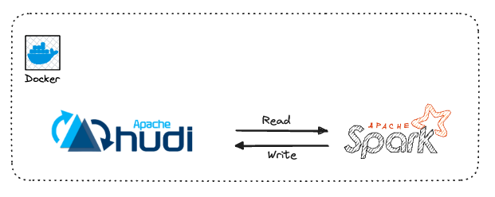
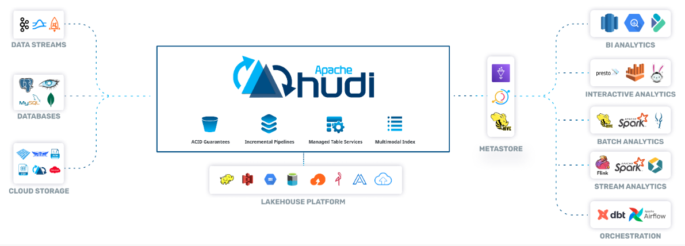
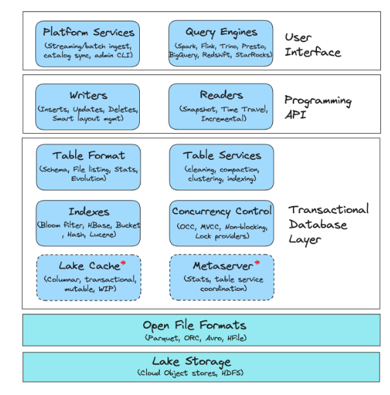
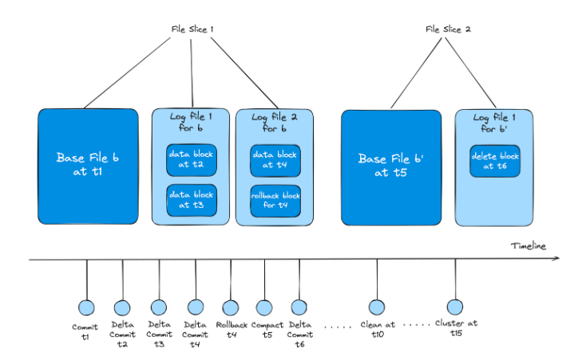
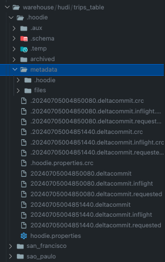
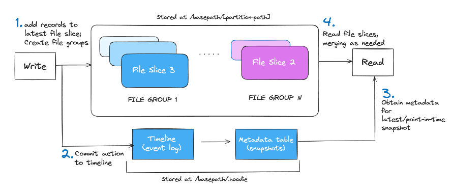
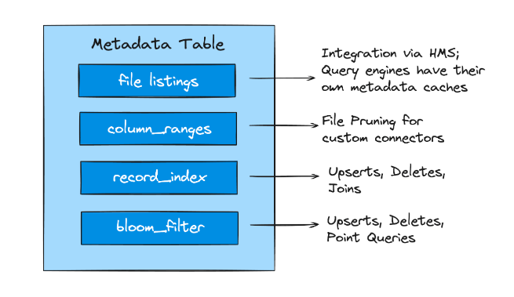
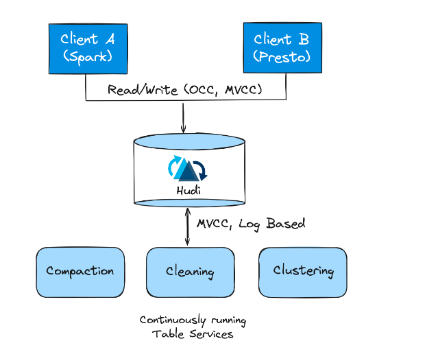

# Apache Hudi and Spark



## What is Hudi

**Apache Hudi** is a transactional data lake platform that brings database and data warehouse capabilities to the data lake.
Hudi reimagines slow old-school batch data processing with a powerful new incremental processing framework for low latency minute-level analytics.



## Hudi Stack



- Apache Hudi is a Transactional Data Lakehouse Platform built around a database kernel.
- It brings core warehouse and database functionality directly to a data lake thereby providing a table-level abstraction over open file formats like Apache Parquet/ORC (more recently known as the lakehouse architecture) and enabling transactional capabilities such as updates/deletes.
- Hudi also incorporates essential table services that are tightly integrated with the database kernel.
- These services can be executed automatically across both ingested and derived data to manage various aspects such as table bookkeeping, metadata, and storage layout.
- This integration along with various platform-specific services extends Hudi's role from being just a 'table format' to a comprehensive and robust data lakehouse platform.

### Lake Storage

The storage layer is where the data files (such as Parquet) are stored. Hudi interacts with the storage layer through the Hadoop FileSystem API, enabling compatibility with various systems including HDFS for fast appends, and various cloud stores such as Amazon S3, Google Cloud Storage (GCS), and Azure Blob Storage.

Additionally, Hudi offers its own storage APIs that can rely on Hadoop-independent file system implementation to simplify the integration of various file systems.

### File Formats



- File formats hold the raw data and are **physically** stored on the lake storage.
- Hudi operates on logical structures of **File Groups** and **File Slices**, which consist of **Base File** and **Log Files**.
- Base Files are **compacted** and **optimized for reads** and are augmented with **Log Files** for efficient append.



## Transactional Database Layer

The transactional database layer of Hudi comprises the core components that are responsible for the fundamental operations and services that enable Hudi to store, retrieve, and manage data efficiently on data lakehouse storages.

### Table Format



There are 3 major components related to Hudi’s table format:

- **Timeline**

Hudi's timeline, stored in the /.hoodie folder, is a crucial event log recording all table actions in an ordered manner, with events kept for a specified period.
Hudi uniquely designs each File Group as a self-contained log, enabling record state reconstruction through delta logs, even after archival of related actions.

- **File Group and File Slice**

Within each partition the data is physically stored as base and Log Files and organized into logical concepts as File groups and File Slices.
File groups contain multiple versions of File Slices and are split into multiple File Slices. A File Slice comprises the Base and Log File.
Each File Slice within the file-group is uniquely identified by the commit's timestamp that created it.

- **Metadata Table**

Implemented as a merge-on-read table, Hudi's metadata table efficiently handles quick updates with low write amplification.
It leverages the HFile format for quick, indexed key lookups, storing vital information like file paths, column statistics, bloom filters, and record indexes.

!!! tips

    Hudi’s approach of recording updates into Log Files is more efficient and involves low merge overhead than systems like Hive ACID, where merging all delta records against all Base Files is required.

### Indexes



- Indexes in Hudi enhance query planning, minimizing I/O, speeding up response times and providing faster writes with low merge costs.
- Hudi’s metadata table brings the benefits of indexes generally to both the readers and writers.
- Compute engines can leverage various indexes in the metadata table, like file listings, column statistics, bloom filters, record-level indexes, and functional indexes to quickly generate optimized query plans and improve read performance.

### Table Services



- Apache Hudi offers various table services to help keep the table storage layout and metadata management performant.
- Hudi was designed with built-in table services that enables running them in inline, semi-asynchronous or full-asynchronous modes.
- Furthermore, Spark and Flink streaming writers can run in continuous mode, and invoke table services asynchronously sharing the underlying executors intelligently with writers.

## Implementation

Let's take a look into executing Hudi spark code.

First, you need to clone this repo.

```bash
git clone git@github.com:karlchris/spark-docker.git
```

### Quickstart

- run below command to execute docker compose

```bash
make up
```

- enter into the container

```bash
make dev
```

- execute the code

```bash
./bin/spark-submit scripts/hudi-demo.py
```

- remove the running containers

```bash
make down
```

### Installing Hudi Package

- add this to the Dockerfile

```Dockerfile
# Download hudi jars
RUN curl https://repo1.maven.org/maven2/org/apache/hudi/hudi-spark3-bundle_2.12/0.15.0/hudi-spark3-bundle_2.12-0.15.0.jar -Lo /opt/spark/jars/hudi-spark3-bundle_2.12-0.15.0.jar
```

- Setup Hudi in spark session

```python
from pyspark.sql import SparkSession
from pyspark import SparkConf
from pyspark.sql.functions import col

jars = 'org.apache.hudi:hudi-spark3-bundle_2.12:0.15.0'

# Setup config
conf = SparkConf().setAppName("hudiDemo") \
    .set("spark.sql.extensions", "org.apache.spark.sql.hudi.HoodieSparkSessionExtension") \
    .set("spark.sql.catalog.spark_catalog", "org.apache.spark.sql.hudi.catalog.HoodieCatalog") \
    .set("spark.serializer", "org.apache.spark.serializer.KryoSerializer") \
    .set("spark.kryo.registrator", "org.apache.spark.HoodieSparkKryoRegistrar") \
    .set('spark.jars.packages', jars)

# Create spark session
spark = SparkSession.builder.config(conf=conf).getOrCreate()
spark.sparkContext.setLogLevel("ERROR")
```

### Create Hudi Table and Insert Data

```python
# Path
HOME = "/opt/spark/"

# Create table
tableName = "trips_table"
basePath = HOME + "warehouse/hudi/trips_table"
print(f"Creating table {tableName} at {basePath}")

# Insert data
print("Inserting data")
columns = ["ts","uuid","rider","driver","fare","city"]
data =[(1695159649087,"334e26e9-8355-45cc-97c6-c31daf0df330","rider-A","driver-K",19.10,"san_francisco"),
    (1695091554788,"e96c4396-3fad-413a-a942-4cb36106d721","rider-C","driver-M",27.70 ,"san_francisco"),
    (1695046462179,"9909a8b1-2d15-4d3d-8ec9-efc48c536a00","rider-D","driver-L",33.90 ,"san_francisco"),
    (1695516137016,"e3cf430c-889d-4015-bc98-59bdce1e530c","rider-F","driver-P",34.15,"sao_paulo"),
    (1695115999911,"c8abbe79-8d89-47ea-b4ce-4d224bae5bfa","rider-J","driver-T",17.85,"chennai")]
inserts = spark.createDataFrame(data).toDF(*columns)

hudi_options = {
    'hoodie.table.name': tableName,
    'hoodie.datasource.write.partitionpath.field': 'city',
    'hoodie.datasource.write.recordkey.field': 'uuid'
}

inserts.write.format("hudi"). \
    options(**hudi_options). \
    mode("overwrite"). \
    save(basePath)
```

It will create `trips_table` and write it within path `/opt/spark/warehouse/hudi/trips_table`.
Then, it will insert data as mentioned above.

!!! info

    Hudi also allows users to specify a record key, which will be used to uniquely identify a record within a Hudi table. This is useful and critical to support features like indexing and clustering, which speed up upserts and queries respectively, in a consistent manner.

    In above example, `'hoodie.datasource.write.recordkey.field': 'uuid'` was set up.

### Query data

```python
print("Querying data")
tripsDF = spark.read.format("hudi").load(basePath)
tripsDF.createOrReplaceTempView("trips_table")

spark.sql("SELECT uuid, fare, ts, rider, driver, city FROM  trips_table WHERE fare > 20.0").show()
spark.sql("SELECT _hoodie_commit_time, _hoodie_record_key, _hoodie_partition_path, rider, driver, fare FROM trips_table").show()
```

It will query the table and get records with `fare more than 20`

Output:

```bash
+--------------------+-----+-------------+-------+--------+-------------+
|                uuid| fare|           ts|  rider|  driver|         city|
+--------------------+-----+-------------+-------+--------+-------------+
|e96c4396-3fad-413...| 27.7|1695091554788|rider-C|driver-M|san_francisco|
|9909a8b1-2d15-4d3...| 33.9|1695046462179|rider-D|driver-L|san_francisco|
|e3cf430c-889d-401...|34.15|1695516137016|rider-F|driver-P|    sao_paulo|
+--------------------+-----+-------------+-------+--------+-------------+

+-------------------+--------------------+----------------------+-------+--------+-----+
|_hoodie_commit_time|  _hoodie_record_key|_hoodie_partition_path|  rider|  driver| fare|
+-------------------+--------------------+----------------------+-------+--------+-----+
|  20240705004838235|334e26e9-8355-45c...|         san_francisco|rider-A|driver-K| 19.1|
|  20240705004838235|e96c4396-3fad-413...|         san_francisco|rider-C|driver-M| 27.7|
|  20240705004838235|9909a8b1-2d15-4d3...|         san_francisco|rider-D|driver-L| 33.9|
|  20240705004838235|e3cf430c-889d-401...|             sao_paulo|rider-F|driver-P|34.15|
|  20240705004838235|c8abbe79-8d89-47e...|               chennai|rider-J|driver-T|17.85|
+-------------------+--------------------+----------------------+-------+--------+-----+
```

### Update data

```python
print("Updating data")
# Lets read data from target Hudi table, modify fare column for rider-D and update it.
updatesDf = spark.read.format("hudi").load(basePath).filter("rider == 'rider-D'").withColumn("fare",col("fare")*10)

updatesDf.write.format("hudi"). \
    options(**hudi_options). \
    mode("append"). \
    save(basePath)
```

It will update the `fare` column where rider is `rider-D`.

Output:

```bash
+-------------------+-----+-------+--------+--------------------+-------------+
|_hoodie_commit_time| fare|  rider|  driver|                uuid|           ts|
+-------------------+-----+-------+--------+--------------------+-------------+
|  20240705004845127|339.0|rider-D|driver-L|9909a8b1-2d15-4d3...|1695046462179|
+-------------------+-----+-------+--------+--------------------+-------------+
```

### Delete data

```python
print("Deleting data")
deletesDF = spark.read.format("hudi").load(basePath).filter("rider == 'rider-F'")

# issue deletes
hudi_hard_delete_options = {
    'hoodie.table.name': tableName,
    'hoodie.datasource.write.partitionpath.field': 'city',
    'hoodie.datasource.write.operation': 'delete',
}

deletesDF.write.format("hudi"). \
    options(**hudi_hard_delete_options). \
    mode("append"). \
    save(basePath)
```

It will delete record where rider is `rider-F`

### Incremental Query

Hudi provides the unique capability to obtain a set of records that changed between a start and end commit time, providing you with the "latest state" for each such record as of the end commit time.

!!! info

    By default, Hudi tables are configured to support incremental queries, using record level metadata tracking.

```python
# reload data
spark.read.format("hudi").load(basePath).createOrReplaceTempView("trips_table")

commits = list(map(lambda row: row[0], spark.sql("SELECT DISTINCT(_hoodie_commit_time) AS commitTime FROM  trips_table ORDER BY commitTime").limit(50).collect()))
beginTime = commits[len(commits) - 2] # commit time we are interested in

print(f"Querying data incrementally from commit time: {beginTime}")
# incrementally query data
incremental_read_options = {
    'hoodie.datasource.query.type': 'incremental',
    'hoodie.datasource.read.begin.instanttime': beginTime,
}

tripsIncrementalDF = spark.read.format("hudi"). \
    options(**incremental_read_options). \
    load(basePath)
tripsIncrementalDF.createOrReplaceTempView("trips_incremental")

spark.sql("SELECT `_hoodie_commit_time`, fare, rider, driver, uuid, ts FROM trips_incremental WHERE fare > 20.0").show()
```

### Change Data Capture Query

Hudi also exposes first-class support for Change Data Capture (CDC) queries.
CDC queries are useful for applications that need to obtain all the changes, along with before/after images of records, given a commit time range.

```python
print("Change Data Capture Query")
# Lets first insert data to a new table with cdc enabled.
columns = ["ts","uuid","rider","driver","fare","city"]
data =[(1695159649087,"334e26e9-8355-45cc-97c6-c31daf0df330","rider-A","driver-K",19.10,"san_francisco"),
    (1695091554788,"e96c4396-3fad-413a-a942-4cb36106d721","rider-B","driver-L",27.70 ,"san_francisco"),
    (1695046462179,"9909a8b1-2d15-4d3d-8ec9-efc48c536a00","rider-C","driver-M",33.90 ,"san_francisco"),
    (1695516137016,"e3cf430c-889d-4015-bc98-59bdce1e530c","rider-C","driver-N",34.15,"sao_paulo")]

inserts = spark.createDataFrame(data).toDF(*columns)

hudi_options = {
    'hoodie.table.name': tableName,
    'hoodie.datasource.write.partitionpath.field': 'city',
    'hoodie.table.cdc.enabled': 'true',
    'hoodie.datasource.write.precombine.field': 'ts',
    'hoodie.datasource.write.recordkey.field': 'uuid'
}
# Insert data
inserts.write.format("hudi"). \
    options(**hudi_options). \
    mode("overwrite"). \
    save(basePath)


#  Update fare for riders: rider-A and rider-B 
updatesDf = spark.read.format("hudi").load(basePath).filter("rider == 'rider-A' or rider == 'rider-B'").withColumn("fare",col("fare")*10)

updatesDf.write.format("hudi"). \
    mode("append"). \
    save(basePath)

# Query CDC data
cdc_read_options = {
    'hoodie.datasource.query.incremental.format': 'cdc',
    'hoodie.datasource.query.type': 'incremental',
    'hoodie.datasource.read.begin.instanttime': 0
}
spark.read.format("hudi"). \
    options(**cdc_read_options). \
    load(basePath).show(10, False)
```

Output:

```bash
Change Data Capture Query
+---+-----------------+---------------------------------------------------------------------------------------------------------------------------------------------------------------------------------------------------------------------------------------------------------------------------------------------------------------------------------------------------------------------------------------------------------------------------------------------------------------+------------------------------------------------------------------------------------------------------------------------------------------------------------------------------------------------------------------------------------------------------------------------------------------------------------------------------------------------------------------------------------------------------------------------------------------+
|op |ts_ms            |before                                                                                                                                                                                                                                                                                                                                                                                                                                                         |after                                                                                                                                                                                                                                                                                                                                                                                                                                     |
+---+-----------------+---------------------------------------------------------------------------------------------------------------------------------------------------------------------------------------------------------------------------------------------------------------------------------------------------------------------------------------------------------------------------------------------------------------------------------------------------------------+------------------------------------------------------------------------------------------------------------------------------------------------------------------------------------------------------------------------------------------------------------------------------------------------------------------------------------------------------------------------------------------------------------------------------------------+
|i  |20240705004850080|NULL                                                                                                                                                                                                                                                                                                                                                                                                                                                           |{"driver":"driver-N","_hoodie_record_key":"e3cf430c-889d-4015-bc98-59bdce1e530c","city":"sao_paulo","_hoodie_partition_path":"sao_paulo","_hoodie_file_name":"1b3061be-e5df-44bb-b234-2da032806851-0_1-146-246_20240705004850080.parquet","_hoodie_commit_seqno":"20240705004850080_1_0","fare":34.15,"rider":"rider-C","_hoodie_commit_time":"20240705004850080","ts":1695516137016,"uuid":"e3cf430c-889d-4015-bc98-59bdce1e530c"}       |
|i  |20240705004850080|NULL                                                                                                                                                                                                                                                                                                                                                                                                                                                           |{"driver":"driver-M","_hoodie_record_key":"9909a8b1-2d15-4d3d-8ec9-efc48c536a00","city":"san_francisco","_hoodie_partition_path":"san_francisco","_hoodie_file_name":"69ea351b-2ce4-4590-97f0-11b4d4d3146d-0_0-146-245_20240705004850080.parquet","_hoodie_commit_seqno":"20240705004850080_0_0","fare":33.9,"rider":"rider-C","_hoodie_commit_time":"20240705004850080","ts":1695046462179,"uuid":"9909a8b1-2d15-4d3d-8ec9-efc48c536a00"}|
|i  |20240705004850080|NULL                                                                                                                                                                                                                                                                                                                                                                                                                                                           |{"driver":"driver-K","_hoodie_record_key":"334e26e9-8355-45cc-97c6-c31daf0df330","city":"san_francisco","_hoodie_partition_path":"san_francisco","_hoodie_file_name":"69ea351b-2ce4-4590-97f0-11b4d4d3146d-0_0-146-245_20240705004850080.parquet","_hoodie_commit_seqno":"20240705004850080_0_1","fare":19.1,"rider":"rider-A","_hoodie_commit_time":"20240705004850080","ts":1695159649087,"uuid":"334e26e9-8355-45cc-97c6-c31daf0df330"}|
|i  |20240705004850080|NULL                                                                                                                                                                                                                                                                                                                                                                                                                                                           |{"driver":"driver-L","_hoodie_record_key":"e96c4396-3fad-413a-a942-4cb36106d721","city":"san_francisco","_hoodie_partition_path":"san_francisco","_hoodie_file_name":"69ea351b-2ce4-4590-97f0-11b4d4d3146d-0_0-146-245_20240705004850080.parquet","_hoodie_commit_seqno":"20240705004850080_0_2","fare":27.7,"rider":"rider-B","_hoodie_commit_time":"20240705004850080","ts":1695091554788,"uuid":"e96c4396-3fad-413a-a942-4cb36106d721"}|
|u  |20240705004851440|{"_hoodie_commit_time": "20240705004850080", "_hoodie_commit_seqno": "20240705004850080_0_1", "_hoodie_record_key": "334e26e9-8355-45cc-97c6-c31daf0df330", "_hoodie_partition_path": "san_francisco", "_hoodie_file_name": "69ea351b-2ce4-4590-97f0-11b4d4d3146d-0_0-146-245_20240705004850080.parquet", "ts": 1695159649087, "uuid": "334e26e9-8355-45cc-97c6-c31daf0df330", "rider": "rider-A", "driver": "driver-K", "fare": 19.1, "city": "san_francisco"}|{"_hoodie_commit_time": "20240705004851440", "_hoodie_commit_seqno": "20240705004851440_0_1", "_hoodie_record_key": "334e26e9-8355-45cc-97c6-c31daf0df330", "_hoodie_partition_path": "san_francisco", "_hoodie_file_name": "69ea351b-2ce4-4590-97f0-11b4d4d3146d-0", "ts": 1695159649087, "uuid": "334e26e9-8355-45cc-97c6-c31daf0df330", "rider": "rider-A", "driver": "driver-K", "fare": 191.0, "city": "san_francisco"}              |
|u  |20240705004851440|{"_hoodie_commit_time": "20240705004850080", "_hoodie_commit_seqno": "20240705004850080_0_2", "_hoodie_record_key": "e96c4396-3fad-413a-a942-4cb36106d721", "_hoodie_partition_path": "san_francisco", "_hoodie_file_name": "69ea351b-2ce4-4590-97f0-11b4d4d3146d-0_0-146-245_20240705004850080.parquet", "ts": 1695091554788, "uuid": "e96c4396-3fad-413a-a942-4cb36106d721", "rider": "rider-B", "driver": "driver-L", "fare": 27.7, "city": "san_francisco"}|{"_hoodie_commit_time": "20240705004851440", "_hoodie_commit_seqno": "20240705004851440_0_2", "_hoodie_record_key": "e96c4396-3fad-413a-a942-4cb36106d721", "_hoodie_partition_path": "san_francisco", "_hoodie_file_name": "69ea351b-2ce4-4590-97f0-11b4d4d3146d-0", "ts": 1695091554788, "uuid": "e96c4396-3fad-413a-a942-4cb36106d721", "rider": "rider-B", "driver": "driver-L", "fare": 277.0, "city": "san_francisco"}              |
+---+-----------------+---------------------------------------------------------------------------------------------------------------------------------------------------------------------------------------------------------------------------------------------------------------------------------------------------------------------------------------------------------------------------------------------------------------------------------------------------------------+------------------------------------------------------------------------------------------------------------------------------------------------------------------------------------------------------------------------------------------------------------------------------------------------------------------------------------------------------------------------------------------------------------------------------------------+
```

!!! warning

    Note that CDC queries are currently only supported on `Copy-on-Write` tables.

## References

- [Apache Hudi Official Documentation](https://hudi.apache.org/docs/overview/)
