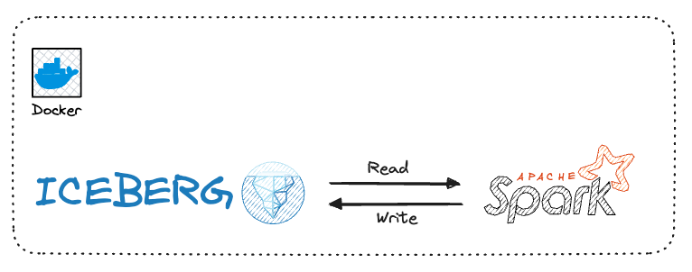
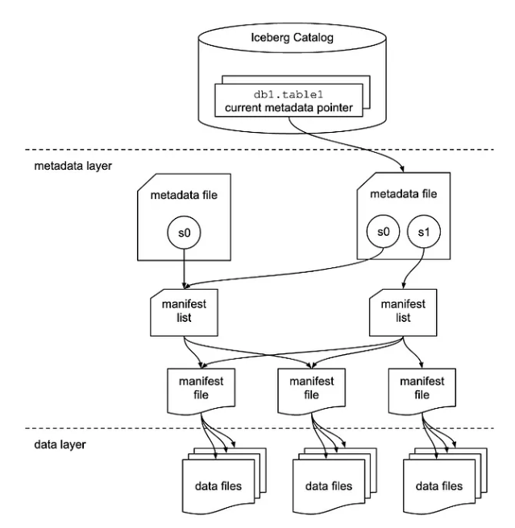

# Apache Iceberg and PySpark



If you've had experiences with data lakes, you likely faced significant challenges related to executing **updates** and **deletes**.

Managing the **concurrency** between multiple readers and writers, addressing **schema evolution** in your data, and managing the **partitions evolution** when data volume or query patterns change.

This is how [Apache Iceberg](#about-apache-iceberg) comes into the picture.

## About Apache Iceberg


Apache Iceberg is an **open table format** designed for extensive analytics datasets.
It is compatible with widely used big data processing engines such as Apache Spark, Trino, Flink, and Hive.

Iceberg tackles several limitations we listed above by acting
as a **metadata** layer on top of the file format like Apache Parquet and Apache ORC.

### Features

- **Schema Evolution**

Allows for seamless schema evolution, overcoming the challenges associated with changes in data structure over time.

- **Transactional Writes**

By supporting transactional writes, Iceberg ensures the atomicity, consistency, isolation, and durability (ACID) properties, enhancing data integrity during write operations.

- **Query Isolation**

Iceberg provides query isolation, preventing interference between concurrent read and write operations, thus improving overall system reliability and performance.

- **Time Travel**

The time travel feature in Iceberg allows users to access historical versions of the data, offering a valuable mechanism for auditing, analysis, and debugging.

- **Partition Pruning**

Iceberg’s partition pruning capability optimizes query performance by selectively scanning only relevant partitions, reducing the amount of data processed and improving query speed.

### Architecture



Apache Iceberg table has three different layers.

#### Data Layer

This is the layer where the actual data for the table is stored and is primarily made of data files. Apache Iceberg is file-format agnostic and it currently supports Apache Parquet, Apache ORC, and Apache Avro. It stores the data by default in Apache Parquet file format.

This file-format agnostic provides the ability for a user to choose the underlying file format based on the use case, for example, Parquet might be used for a large-scale OLAP analytics table, whereas Avro might be used for a low-latency streaming analytics table.

!!! tip

    The data layer is backed by a distributed file system like HDFS or a cloud object storage like AWS S3.

#### Metadata Layer

This layer contains all of the metadata files for an Iceberg table. It has a tree structure that tracks the data files and metadata about them along with the details of the operation that made them.

!!! info

    The files in this layer are immutable files so everytime an insert, merge, upsert or delete operation happens on the table, a new set of files are written.

This layer contains 3 file types

##### Manifest Files

Manifest lists keep track of manifest files, including the location, the partitions it belong to, and the upper and lower bound for partition columns for the data it tracks. It stores all this information in avro file format.

!!! note

    A Manifest list file is a snapshot of an Iceberg Table as it contains the details of the snapshot along with snapshot_id that has added it.

##### Metadata Files

Metadata files keep track of *Manifest Lists*. These files include the information about the metadata of the Iceberg Table at a certain point in time i.e. table’s schema, partition information, snapshots, and which snapshot is the current one.

All this information is stored in a `json` format file.

??? example

    ```json title="v1.metadata.json"
    {
      "format-version" : 2,
      "table-uuid" : "152c11c8-e993-487f-86d3-9603ff8c5b7f",
      "location" : "./warehouse/db/persons",
      "last-sequence-number" : 1,
      "last-updated-ms" : 1718930007854,
      "last-column-id" : 3,
      "current-schema-id" : 0,
      "schemas" : [ {
        "type" : "struct",
        "schema-id" : 0,
        "fields" : [ {
          "id" : 1,
          "name" : "name",
          "required" : false,
          "type" : "string"
        }, {
          "id" : 2,
          "name" : "age",
          "required" : false,
          "type" : "int"
        }, {
          "id" : 3,
          "name" : "job_title",
          "required" : false,
          "type" : "string"
        } ]
      } ],
      "default-spec-id" : 0,
      "partition-specs" : [ {
        "spec-id" : 0,
        "fields" : [ ]
      } ],
      "last-partition-id" : 999,
      "default-sort-order-id" : 0,
      "sort-orders" : [ {
        "order-id" : 0,
        "fields" : [ ]
      } ],
      "properties" : {
        "owner" : "root",
        "write.parquet.compression-codec" : "zstd"
      },
      "current-snapshot-id" : 5317106206696669755,
      "refs" : {
        "main" : {
          "snapshot-id" : 5317106206696669755,
          "type" : "branch"
        }
      },
      "snapshots" : [ {
        "sequence-number" : 1,
        "snapshot-id" : 5317106206696669755,
        "timestamp-ms" : 1718930007854,
        "summary" : {
          "operation" : "append",
          "spark.app.id" : "app-20240621003324-0000",
          "added-data-files" : "2",
          "added-records" : "3",
          "added-files-size" : "1838",
          "changed-partition-count" : "1",
          "total-records" : "3",
          "total-files-size" : "1838",
          "total-data-files" : "2",
          "total-delete-files" : "0",
          "total-position-deletes" : "0",
          "total-equality-deletes" : "0"
        },
        "manifest-list" : "warehouse/db/persons/metadata/snap-5317106206696669755-1-59b1ef61-4e45-4a54-bddf-c89989f2e7ef.avro",
        "schema-id" : 0
      } ],
      "statistics" : [ ],
      "snapshot-log" : [ {
        "timestamp-ms" : 1718930007854,
        "snapshot-id" : 5317106206696669755
      } ],
      "metadata-log" : [ ]
    }
    ```

##### Catalog Layer

Within the Catalog layer, there is a reference or pointer, that points to the current metadata file for that table.

## Installing Apache Iceberg

First, you need to clone this repo

```bash
git clone git@github.com:karlchris/spark-docker.git
```

- Add Iceberg installation in the Dockerfile

```Dockerfile
FROM pyspark

# Download iceberg spark runtime
RUN curl https://repo1.maven.org/maven2/org/apache/iceberg/iceberg-spark-runtime-3.4_2.12/1.4.3/iceberg-spark-runtime-3.4_2.12-1.4.3.jar -Lo /opt/spark/jars/iceberg-spark-runtime-3.4_2.12-1.4.3.jar

# Add iceberg spark runtime jar to IJava classpath
ENV IJAVA_CLASSPATH=/opt/spark/jars/*
```

- Add `warehouse` volume mount for each of containers

```yaml hl_lines="5"
volumes:
  - ./scripts:/opt/spark/scripts
  - ./data:/opt/spark/data
  - spark-logs:/opt/spark/spark-events
  - ./warehouse:/opt/spark/warehouse
```

## Setup Iceberg Session

!!! note

    Starting from here, you better to start up the docker containers by running

    ```bash
    make up
    ```

!!! danger

    Don't forget to clean up your docker resources by running `make down` after you finish this exercise.

To begin working with Iceberg tables in PySpark, it's essential to configure the PySpark session.

In the following steps, we will use a catalog named `demo` for tables located under the path `./warehouse` of the Hadoop type.

!!! warning

    Crucially, ensure compatibility between the Iceberg-Spark-Runtime JAR and the PySpark version in use.

    You can find the necessary JARs in the [Iceberg releases](https://iceberg.apache.org/releases/)

```python
warehouse_path = "./warehouse"
iceberg_spark_jar = 'org.apache.iceberg:iceberg-spark-runtime-3.4_2.12:1.4.3'
iceberg_spark_ext = 'org.apache.iceberg:iceberg-spark-extensions-3.4_2.12:1.4.3'
catalog_name = "demo"

# Setup iceberg config
conf = SparkConf().setAppName("YourAppName") \
    .set("spark.sql.extensions", "org.apache.iceberg.spark.extensions.IcebergSparkSessionExtensions") \
    .set(f"spark.sql.catalog.{catalog_name}", "org.apache.iceberg.spark.SparkCatalog") \
    .set('spark.jars.packages', iceberg_spark_jar) \
    .set('spark.jars.packages', iceberg_spark_ext) \
    .set(f"spark.sql.catalog.{catalog_name}.warehouse", warehouse_path) \
    .set(f"spark.sql.catalog.{catalog_name}.type", "hadoop")\
    .set("spark.sql.defaultCatalog", catalog_name)

# Create spark session
spark = SparkSession.builder.config(conf=conf).getOrCreate()
spark.sparkContext.setLogLevel("ERROR")
```

## Create and Write Iceberg Table with PySpark

```python
# Create a dataframe
schema = StructType([
    StructField('name', StringType(), True),
    StructField('age', IntegerType(), True),
    StructField('job_title', StringType(), True)
])
data = [("person1", 28, "Doctor"), ("person2", 35, "Singer"), ("person3", 42, "Teacher")]
df = spark.createDataFrame(data, schema=schema)

# Create database
spark.sql(f"CREATE DATABASE IF NOT EXISTS db")

# Write and read Iceberg table
table_name = "db.persons"
df.write.format("iceberg").mode("overwrite").saveAsTable(f"{table_name}")
iceberg_df = spark.read.format("iceberg").load(f"{table_name}")
iceberg_df.printSchema()
iceberg_df.show()
```

Output

```bash
root
 |-- name: string (nullable = true)
 |-- age: integer (nullable = true)
 |-- job_title: string (nullable = true)

+-------+---+---------+
|   name|age|job_title|
+-------+---+---------+
|person1| 28|   Doctor|
|person2| 35|   Singer|
|person3| 42|  Teacher|
+-------+---+---------+
```

We create a PySpark DataFrame, write it into an Iceberg table, and subsequently display the data stored in the Iceberg table.

## Schema Evolution

The flexibility of Data Lakes, allowing storage of diverse data formats, can pose challenges in managing schema changes.

Iceberg addresses this by enabling the addition, removal, or modification of table columns **without requiring a complete data rewrite**.

This feature simplifies the process of evolving schemas over time.

```python
# Schema Evolution
spark.sql(f"ALTER TABLE {table_name} RENAME COLUMN job_title TO job")
spark.sql(f"ALTER TABLE {table_name} ALTER COLUMN age TYPE bigint")
spark.sql(f"ALTER TABLE {table_name} ADD COLUMN salary FLOAT AFTER job")
iceberg_df = spark.read.format("iceberg").load(f"{table_name}")
iceberg_df.printSchema()
iceberg_df.show()

spark.sql(f"SELECT * FROM {table_name}.snapshots").show()
```

schema **BEFORE** altering the table

```bash
root
 |-- name: string (nullable = true)
 |-- age: integer (nullable = true)
 |-- job_title: string (nullable = true)
```

schema **AFTER** altering the table

```bash
root
 |-- name: string (nullable = true)
 |-- age: long (nullable = true)
 |-- job: string (nullable = true)
 |-- salary: float (nullable = true)
```

The above code shows schema evolution by `renaming`, `changing` column types, and `adding` a new column.

As you can observe in the schema changes:

- The column `age` type has changed
- The column `job_title` is now renamed to `job`
- The column `salary` has been added

The first time you run the code, in the snapshot table you notice that Iceberg executed all alterations without rewriting the data.
This is indicated by having only 1 snapshot ID and no parents (`parent_id = NULL`), telling us that no data rewriting was performed.

```bash
+--------------------+-------------------+---------+---------+--------------------+--------------------+
|        committed_at|        snapshot_id|parent_id|operation|       manifest_list|             summary|
+--------------------+-------------------+---------+---------+--------------------+--------------------+
|2024-06-21 00:33:...|5317106206696669755|     NULL|   append|warehouse/db/pers...|{spark.app.id -> ...|
+--------------------+-------------------+---------+---------+--------------------+--------------------+
```

## ACID Transactions

Data accuracy and consistency are crucial in data lakes, particularly for business-critical purposes.

Iceberg supports ACID transactions for write operations, ensuring that data remains in a consistent state, and enhancing the reliability of the stored information.

```python
# ACID: add and delete records
spark.sql(f"DELETE FROM {table_name} WHERE age = 42")
spark.sql(f"INSERT INTO {table_name} values ('person4', 50, 'Teacher', 2000)")
spark.sql(f"SELECT * FROM {table_name}.snapshots").show()
```

snapshot table

```bash
+--------------------+-------------------+-------------------+---------+--------------------+--------------------+
|        committed_at|        snapshot_id|          parent_id|operation|       manifest_list|             summary|
+--------------------+-------------------+-------------------+---------+--------------------+--------------------+
|2024-06-21 00:33:...|5317106206696669755|               NULL|   append|warehouse/db/pers...|{spark.app.id -> ...|
|2024-06-21 00:33:...| 333991769332533017|5354326724936052873|overwrite|warehouse/db/pers...|{spark.app.id -> ...|
|2024-06-21 00:33:...|1227170189499516533| 333991769332533017|   append|warehouse/db/pers...|{spark.app.id -> ...|
+--------------------+-------------------+-------------------+---------+--------------------+--------------------+
```

In the snapshots table, we can now observe that Iceberg has added three snapshot IDs, each created from the preceding one.

!!! note

    If, for any reason, one of the actions fails, the transactions will fail, and the snapshot won't be created.

## Table Partitioning

As you may be aware, querying large amounts of data in data lakes can be resource-intensive.

Iceberg supports data partitioning by one or more columns. This significantly improves query performance by reducing the volume of data read during queries.

```python
# Alter Partitions
spark.sql(f"ALTER TABLE {table_name} ADD PARTITION FIELD age")
spark.read.format("iceberg").load(f"{table_name}").where("age = 28").show()
```

Partitioned DataFrame

```bash
+-------+---+------+------+
|   name|age|   job|salary|
+-------+---+------+------+
|person1| 28|Doctor|  NULL|
+-------+---+------+------+
```

The code creates a new partition using the `age` column.

!!! note

    This partition will apply to the **new rows that get inserted moving forward, and old data will not be impacted**

!!! info

    We can also add partitions when we create the Iceberg table

    ```python
    spark.sql(f"""
        CREATE TABLE IF NOT EXISTS {table_name}
        (name STRING, age INT, job STRING, salary INT)
        USING iceberg
        PARTITIONED BY (age)
    """)
    ```

## Time Travel

Analyzing historical trends or tracking changes over time is often essential in a data lake.

Iceberg provides a time-travel API that allows users to query data as it appeared at a specific `version` or `timestamp`, facilitating historical data analysis.

Apache Iceberg gives you the flexibility to load any snapshot or data at a given point in time.

This allows you to examine changes at a given time or roll back to a specific version.

!!! warning

    You need to change the `snapshot-id` as per your code runtime.

```python
spark.sql(f"SELECT * FROM {table_name}.snapshots").show(1, truncate=False)

# Read snapshot by id run
snapshot_id = "333991769332533017"
spark.read.option("snapshot-id", snapshot_id).table(table_name).show()
```

```bash
+-----------------------+-------------------+---------+---------+--------------------------------------------------------------------------------------------------+----------------------------------------------------------------------------------------------------------------------------------------------------------------------------------------------------------------------------------------------------------------------------------------------------+
|committed_at           |snapshot_id        |parent_id|operation|manifest_list                                                                                     |summary                                                                                                                                                                                                                                                                                             |
+-----------------------+-------------------+---------+---------+--------------------------------------------------------------------------------------------------+----------------------------------------------------------------------------------------------------------------------------------------------------------------------------------------------------------------------------------------------------------------------------------------------------+
|2024-06-21 00:33:27.854|5317106206696669755|NULL     |append   |warehouse/db/persons/metadata/snap-5317106206696669755-1-59b1ef61-4e45-4a54-bddf-c89989f2e7ef.avro|{spark.app.id -> app-20240621003324-0000, added-data-files -> 2, added-records -> 3, added-files-size -> 1838, changed-partition-count -> 1, total-records -> 3, total-files-size -> 1838, total-data-files -> 2, total-delete-files -> 0, total-position-deletes -> 0, total-equality-deletes -> 0}|
+-----------------------+-------------------+---------+---------+--------------------------------------------------------------------------------------------------+----------------------------------------------------------------------------------------------------------------------------------------------------------------------------------------------------------------------------------------------------------------------------------------------------+
only showing top 1 row
```

## Load Parquet Files into Iceberg

```python title="scripts/iceberg-load.py"
from pyspark.sql import SparkSession
from pyspark import SparkConf
from pyspark.sql.types import StructType, StructField, StringType, IntegerType

warehouse_path = "./warehouse"
iceberg_spark_jar = 'org.apache.iceberg:iceberg-spark-runtime-3.4_2.12:1.4.3'
iceberg_spark_ext = 'org.apache.iceberg:iceberg-spark-extensions-3.4_2.12:1.4.3'
catalog_name = "demo"

# Setup iceberg config
conf = SparkConf().setAppName("YourAppName") \
    .set("spark.sql.extensions", "org.apache.iceberg.spark.extensions.IcebergSparkSessionExtensions") \
    .set(f"spark.sql.catalog.{catalog_name}", "org.apache.iceberg.spark.SparkCatalog") \
    .set('spark.jars.packages', iceberg_spark_jar) \
    .set('spark.jars.packages', iceberg_spark_ext) \
    .set(f"spark.sql.catalog.{catalog_name}.warehouse", warehouse_path) \
    .set(f"spark.sql.catalog.{catalog_name}.type", "hadoop")\
    .set("spark.sql.defaultCatalog", catalog_name)

# Create spark session
spark = SparkSession.builder.config(conf=conf).getOrCreate()
spark.sparkContext.setLogLevel("ERROR")

SOURCE_PATH = "./data/yellow_trip_data"
DEST_PATH = "./data/output/count_by_vendor.parquet"

# Loading the data
df = spark.read.options(inferSchema=True).parquet(SOURCE_PATH)
df.printSchema()

spark.sql(f"CREATE DATABASE IF NOT EXISTS db")
df.writeTo("db.yellow_trip_data") \
    .createOrReplace()

spark.sql("DESCRIBE TABLE db.yellow_trip_data").show(truncate=False)
spark.sql("SHOW CREATE TABLE db.yellow_trip_data").show(truncate=False)
spark.sql("SELECT * FROM db.yellow_trip_data LIMIT 5").show()
```

Run above code using

```bash
make dev

./bin/spark-submit ./scripts/iceberg-load.py
```

By this exercise, we will learn

- load the parquet files into spark runtime
- write the data into Iceberg table

Schema

```bash
root
 |-- VendorID: long (nullable = true)
 |-- tpep_pickup_datetime: timestamp_ntz (nullable = true)
 |-- tpep_dropoff_datetime: timestamp_ntz (nullable = true)
 |-- passenger_count: double (nullable = true)
 |-- trip_distance: double (nullable = true)
 |-- RatecodeID: double (nullable = true)
 |-- store_and_fwd_flag: string (nullable = true)
 |-- PULocationID: long (nullable = true)
 |-- DOLocationID: long (nullable = true)
 |-- payment_type: long (nullable = true)
 |-- fare_amount: double (nullable = true)
 |-- extra: double (nullable = true)
 |-- mta_tax: double (nullable = true)
 |-- tip_amount: double (nullable = true)
 |-- tolls_amount: double (nullable = true)
 |-- improvement_surcharge: double (nullable = true)
 |-- total_amount: double (nullable = true)
 |-- congestion_surcharge: double (nullable = true)
 |-- airport_fee: double (nullable = true)
```

`CREATE TABLE` statement

```sql
CREATE TABLE demo.db.yellow_trip_data ( 
    VendorID BIGINT,
    tpep_pickup_datetime TIMESTAMP_NTZ,
    tpep_dropoff_datetime TIMESTAMP_NTZ,
    passenger_count DOUBLE,
    trip_distance DOUBLE,
    RatecodeID DOUBLE,
    store_and_fwd_flag STRING,
    PULocationID BIGINT,
    DOLocationID BIGINT,
    payment_type BIGINT,
    fare_amount DOUBLE,
    extra DOUBLE,
    mta_tax DOUBLE,
    tip_amount DOUBLE,
    tolls_amount DOUBLE,
    improvement_surcharge DOUBLE,
    total_amount DOUBLE,
    congestion_surcharge DOUBLE,
    airport_fee DOUBLE)
USING iceberg
LOCATION './warehouse/db/yellow_trip_data'
TBLPROPERTIES (
    'current-snapshot-id' = '3768997006627294211',
    'format' = 'iceberg/parquet',
    'format-version' = '2',
    'write.parquet.compression-codec' = 'zstd')
```

Data overview

```bash
+--------+--------------------+---------------------+---------------+-------------+----------+------------------+------------+------------+------------+-----------+-----+-------+----------+------------+---------------------+------------+--------------------+-----------+
|VendorID|tpep_pickup_datetime|tpep_dropoff_datetime|passenger_count|trip_distance|RatecodeID|store_and_fwd_flag|PULocationID|DOLocationID|payment_type|fare_amount|extra|mta_tax|tip_amount|tolls_amount|improvement_surcharge|total_amount|congestion_surcharge|airport_fee|
+--------+--------------------+---------------------+---------------+-------------+----------+------------------+------------+------------+------------+-----------+-----+-------+----------+------------+---------------------+------------+--------------------+-----------+
|       1| 2022-01-01 00:35:40|  2022-01-01 00:53:29|            2.0|          3.8|       1.0|                 N|         142|         236|           1|       14.5|  3.0|    0.5|      3.65|         0.0|                  0.3|       21.95|                 2.5|        0.0|
|       1| 2022-01-01 00:33:43|  2022-01-01 00:42:07|            1.0|          2.1|       1.0|                 N|         236|          42|           1|        8.0|  0.5|    0.5|       4.0|         0.0|                  0.3|        13.3|                 0.0|        0.0|
|       2| 2022-01-01 00:53:21|  2022-01-01 01:02:19|            1.0|         0.97|       1.0|                 N|         166|         166|           1|        7.5|  0.5|    0.5|      1.76|         0.0|                  0.3|       10.56|                 0.0|        0.0|
|       2| 2022-01-01 00:25:21|  2022-01-01 00:35:23|            1.0|         1.09|       1.0|                 N|         114|          68|           2|        8.0|  0.5|    0.5|       0.0|         0.0|                  0.3|        11.8|                 2.5|        0.0|
|       2| 2022-01-01 00:36:48|  2022-01-01 01:14:20|            1.0|          4.3|       1.0|                 N|          68|         163|           1|       23.5|  0.5|    0.5|       3.0|         0.0|                  0.3|        30.3|                 2.5|        0.0|
+--------+--------------------+---------------------+---------------+-------------+----------+------------------+------------+------------+------------+-----------+-----+-------+----------+------------+---------------------+------------+--------------------+-----------+
```

## Conclusion

Apache Iceberg provides a robust solution for managing big data tables with features like atomic commits, schema evolution, and time travel.

When combined with the power of `PySpark`, you can harness the capabilities of Iceberg while leveraging the flexibility and scalability of `PySpark` for your big data processing needs.

## References

- [Why You Should use Apache Iceberg with PySpark](https://blog.det.life/apache-iceberg-with-pyspark-557ce8930d6d)
- [Apache Iceberg -- Architecture Demystified](https://medium.com/@geekfrosty/apache-iceberg-architecture-demystified-e19b5cae9975)
- [Apache Iceberg Official Documentation](https://iceberg.apache.org/docs/nightly/)
