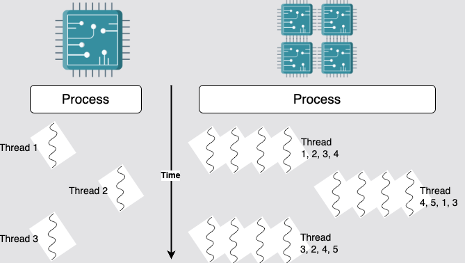
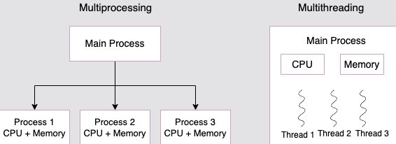

# CPU Scaling

As CPUs are not getting infinitely faster, using multiple CPUs is the best path towards scalability.
That means introducing concurrency and parallelism into your program.

## Threads

Threads in Python are a good way to run a function concurrently with other functions.
If your system does not support multiple processors, the threads will be executed one after another as scheduled by the operating system.
However, if multiple CPUs are available, threads could be scheduled on multiple processing units, once again as determined by the operating system.



```python
import threading

def print_something(something):
    print(something)

t = threading.Thread(target=print_something, args=("hello",))
t.start()
print("thread started")
t.join()
```

### Drawbacks

If you specifically expected any one of the outputs each time, then you forgot that there's no guarantee regarding the order of execution for the threads.
If you do not join all your threads and wait for them to finish, it is possible that the main thread finishes and exits before the other threads.
If this happens, your program will appear to be blocked and will not respond to even a simple `KeyboardInterrupt` signal.

### Threads as `daemons`

To avoid this, and because your program might not be in a position to wait for the threads,
you can configure threads as _daemons_. When a thread is a daemon, it's considered as a **background thread by Python** and is terminated as soon as the main thread exits.

```python
import threading

def print_something(something):
    print(something)

t = threading.Thread(target=print_something, args=("hello",))
t.daemon = True # Specifying as Daemon here
t.start()
print("thread started") # No longer a need to use the JOIN method
```

## Using `Processes`

Since multithreading is not a perfect scalability solution because of GIL,
using `processes` instead of threads is a good alternative.

`multiprocessing` library is a good, higher-level alternative. It provides an interface that starts new processes, whatever your operating system might be.
It also provides a _pool_ mechanism that is useful in more _functional_ manner.

```python
import multiprocessing
import random

def compute(n):
    return sum(
        [random.randint(1, 100) for i in range(1000000)])

if __name__ == "__main__":
    # Start 8 workers
    pool = multiprocessing.Pool(processes=8)
    print("Results: %s" % pool.map(compute, range(8)))
```



## Challenges

- Follow on [Task](task.py) for the problem statement.
- Check [Solution](solution.py) for the solution.

> This challenge is using `threads` as its simplest approach, if you want to challenge yourself further, you can try to use `multiprocessing` library, which I believe, it should be simpler and cleaner code.
